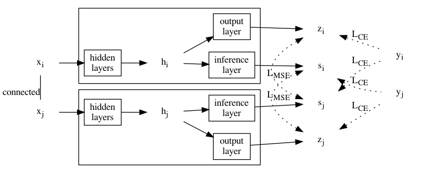
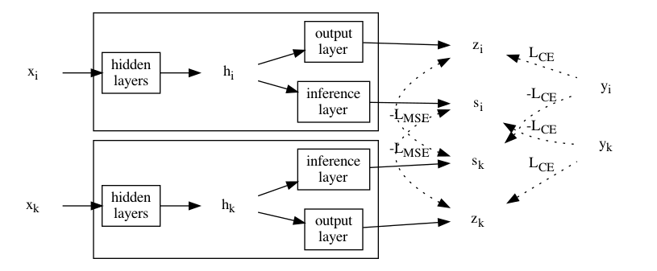
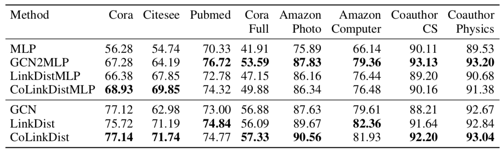
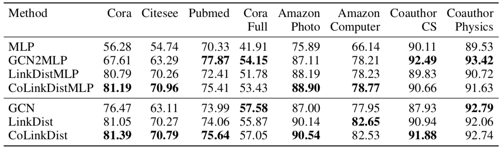
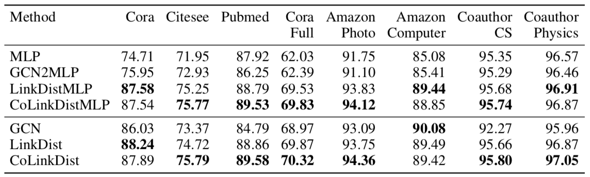
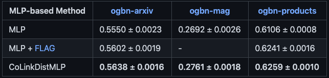

# 从对比链接中蒸馏自知识：非消息传递的图节点分类

这篇文章从图网络的边中蒸馏知识，使 MLP 在图节点分类任务上达到了 GNN 的表现。
不传递消息、不使用邻接矩阵、在边集上训练，因此空间占用低、分类速度快。

此外，作者还从随机点对中蒸馏“逆边”的知识，进一步提升了模型的效果。

## 方法

### 分叉 MLP

通常的图神经网络方法（GNN）基于消息传递模式，使用邻居节点传递来的消息帮助中心节点的分类。
那么反过来说，任一节点中应含有其邻居节点的部分信息。

因此构造分叉 MLP：从 MLP 的倒数第二层分叉出另一个输出层，为与原输出层相区别称为“推理层”。
分叉 MLP 接受一个节点的特征作为输入，输出该节点和它邻居节点的标签分布。

### 边蒸馏（Link Distillation）

设对任一边 $(v_i, v_j)$，节点 $v_i$ 和 $v_j$ 的特征分别为 $x_i$ 和 $x_j$，通过分叉 MLP 得到 $z_i, s_i$ 和 $z_j, s_j$，节点标签为 $y_i$ 和 $y_j$。

则根据分叉 MLP 的设计，可让 $z_i$ 和 $s_j$ 逼近 $y_i$，让 $z_j$ 和 $s_i$ 逼近 $y_j$，最小化它们的交叉熵。
同时，让 $z_i$ 逼近 $s_j$，让 $z_j$ 逼近 $s_i$，最小化它们的误差（MSE）。
前者是常规的监督学习，而后者可以看作是在做自知识蒸馏。

### 随机点对的对比蒸馏

如果随机采样一对节点，这对节点之间就（大概率）不能借助分叉 MLP 相互推导了。
因此用对比学习的思路，最大化一个节点的标签和另一个节点的推理层输出之间的交叉熵，同时最大化一个节点的输出层输出和另一个节点的推理层输出。

## 两种分类模式

分叉 MLP 训练好后，可以将推理层扔掉变回一个经典的 MLP 结构，输入节点特征对节点进行分类。
这种模型根据是否对逆边做对比蒸馏命名为 CoLinkDistMLP 和 LinkDistMLP。

另外，也可以保留推理层，将输出加到邻居节点上，提升邻居节点的分类准确率。
但这样一来，就相当于又用上消息传递模式了。
这种模型根据是否对逆边做对比蒸馏在文章中称为 CoLinkDist 和 LinkDist。

## 实验

做了归纳式、转导式和全监督三种设置下 8 个常用图数据集的节点分类实验，对比的基准除了 MLP 和 GCN 以外，还有 GCN2MLP 代表用训练好的 GCN 模型蒸馏得到的 MLP。

半监督、归纳式：

半监督、转导式：

全监督（转导式）：

实验结果

1. 即使仅仅是 LinkDistMLP，也接近甚至超过了 GCN 的表现，说明这种方式训练出的 MLP 确实能达到 GNN 的效果
2. 用上消息传递和对比蒸馏能进一步提升模型效果
3. GCN2MLP 在半监督时效果比 GCN 还要好，但在全监督时可用于蒸馏的知识不多，最后表现跟 MLP 差不多

此外，还用了 Open Graph Benchmark 的数据集进行节点分类实验

