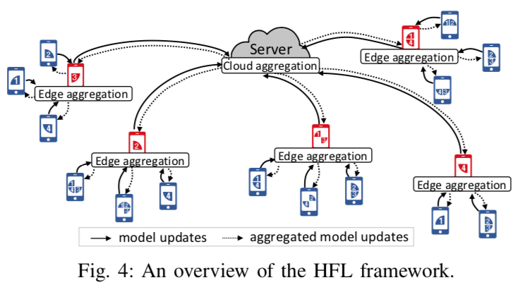
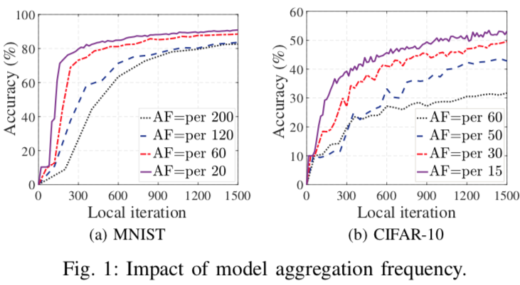
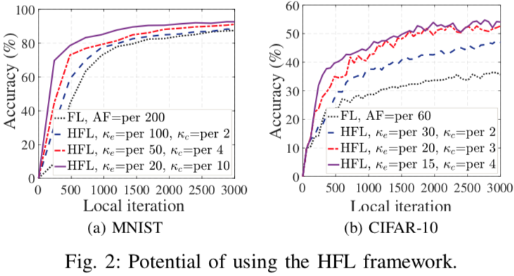
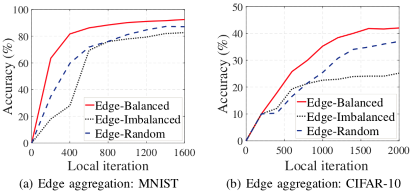
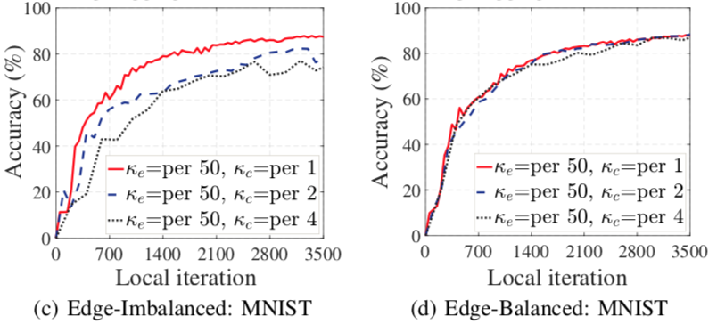

# SHARE: 通过层次化和边缘数据整形减小联邦学习通信开销

> 由清华大学于2021年发表于ICDCS (CCF-B)。

## 背景

在客户端节点多且分布广泛的联邦学习网络中，客户端到云服务器的通信开销不同且通常不可忽略。  
当前的通信优化方案聚焦于Sparsification, Quantization和Sketching等通信量压缩的技术路线，且通常伴随模型效果的损失。

本文改进经典的“一中心、多节点”联邦学习架构，增加用于分层聚合的边缘节点，通过优化网络拓扑结构，在不降低模型效果的前提下减少通信开销（不是通信量）。

本文贡献

* 通过试点实验（Pilot Experiments）证明增加边缘聚合节点（Edge）可在不损害模型效果的前提下降低云上模型聚合的频率，为联邦学习提出了一个新的通信开销优化方向
* 提出了分层联邦学习（Hierarchical Federated Learning, HFL）架构，并公式化了在此架构下的通信成本最小化（Communication Cost Minimization, CCM）问题

* 提出边缘数据整形（SHapping dAta distRibution at Edge, SHARE）算法，将CCM问题转换为可规划的分布感知通信成本最小化（Data Distribution aware Communication Cost Minimization, DD-CCM）问题
* 提出本地搜索（LOcal Search, LoS）算法和基于贪婪的节点联结（Greedy-based nOde Association, GoA）子算法，解决DD-CCM问题

## 试点实验（Pilot Experiments）

经典架构下，聚合频率越低，模型效果越差

HFL架构下，通过分配在云和边缘的聚合频率，可在不增加通信量的情况下提升模型效果（虽然通信量一样，但两处聚合的通信成本不同）

分组时让每组数据接近均匀分布，效果更好、收敛更快

各组数据均匀时模型效果受云处聚合频率的影响更小，可进一步减少聚合频率而不影响模型效果

## CCM问题定义

已知节点集合$N$、可作为边缘的节点集合$N_e \subset N$、节点与边缘节点的通信成本$\\{ c_{ne} | n \in N, e \in N_e \\}$和边缘节点与云服务器的通信成本$\\{ c_{ec} | e \in N_e \\}$，求边缘节点$X \in \\{0, 1\\}^{|N_e|}$和节点到边缘节点的连接$Y \in \\{0, 1\\}^{|N| \times |N_e|}$，

使得总体通信成本
$$k k_c \sum\limits_{n \in N} \sum\limits_{e \in N_e} y_{ne} c_{ne} + k \sum\limits_{e \in N_e} x_e c_{ec}$$
最低，其中$k$为让模型达到目标效果所需的云服务器聚合数, $k_c$为边缘节点聚合频率（超参，达到这数后执行一次云聚合）。

注：此处省略了一些约束条件，详情见论文。

## SHARE: 转化为可规划的DD-CCM问题

CCM问题看起来是整数规划问题，实际不是，因为X和Y的取值会影响k值，无法直接规划。因此作者将CCM问题分解为两部分（这种分解被作者命名为SHARE，转换后的可规划问题命名为DD-CCM）：

子问题一：不考虑k，最小化每一轮通信中的通信量

$$k_c \sum\limits_{n \ in N} \sum\limits_{e \in N_e} y_{ne} c_{ne} + \sum\limits_{e \in N_e} x_e c_{ec}$$

子问题二：根据试点实验得到的规律，最小化每个分组中数据与均匀分布的KL散度，期望这可以减少需要的通信轮数。

$$\frac{1}{|E|} \sum\limits_{e \in E} D_{KL}(P_e || P_u)$$
其中E为选择的边缘节点集合，$P_e$为边缘节点$e$的数据分布（与其连接的节点的数据并集的分布），$P_u$为均匀分布。

补充说明，论文引用了2020年Arxiv文章Towards class imbalance in federated learning的方法用于从共享的模型梯度中估算数据分布。  
大致思路是用一些已知标签的样本去训练共享模型，用梯度跟上传的梯度对比以估计隐私数据的标签分布。

## DD-CCM问题的规划

DD-CCM简化一下认为各客户端数据分布相同就是个Capacitated Facility Location Problem，是NP-hard的，所以DD-CCM优化的复杂度很高。作者提出了LoS和GoA两个轻量级算法去规划DD-CCM。

GoA是个子算法，用于在边缘节点确定（已知X）的情况下选择各个节点与哪个边缘节点连接（确定Y）。算法思路就是贪婪和遍历：每次遍历所有空闲节点，计算其与每个边缘节点连接的通信开销增量和KL散度优化量，选择并应用优化效果最好的那个连接。

LoS算法用于迭代地优化边缘节点集合（已知X，优化X），包含open（增加一个候选的边缘节点）、close（从边缘节点集合中删除一个节点）和swap（用一个候选的边缘节点替代一个已选的边缘节点）三种操作，每个操作都对当前边缘节点集合作出改变，得到一个相邻的集合，保留效果更好的那个（用GoA评估）。

## 读后感

1. 论文引用的通过共享梯度估计隐私数据标签分布方法可能可以应用到其它项目中，但可惜是2020年的Arxiv文章，质量还需要进一步评估
2. 原文的实验和算法都认为每个分组数据均匀分布最好，但“各分组与全局数据同分布”直觉上更合理，即将原文中的均匀分布换成全局数据分布
3. 以上各分组数据均衡的方法能否用在HFL架构之外，即在经典架构中，每一轮选择客户端时尽量让选到的客户端集合有与全局相近的数据分布？不过这想法比较简单，应该已有类似研究
