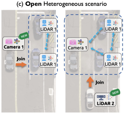
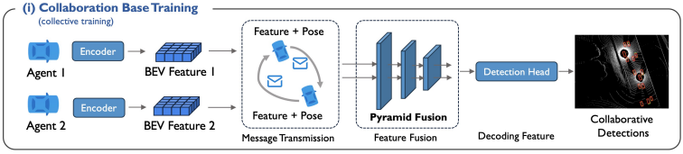
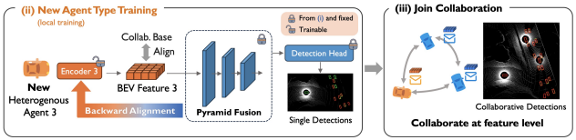
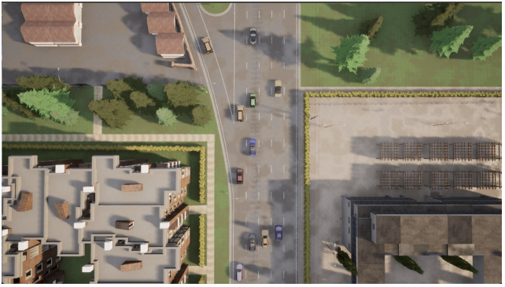
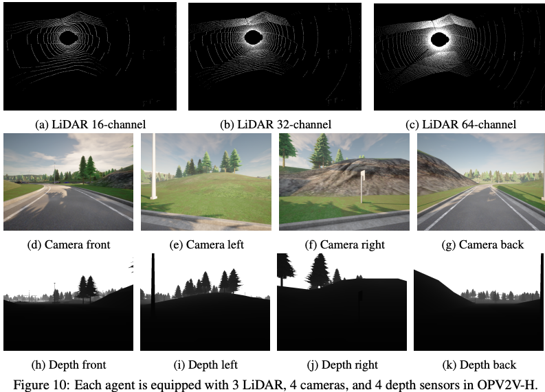

# HEAL: 异质开放场景协同感知

本文研究异质开放场景下协同感知，目标是为已有协同网络持续纳入新出现的异质感知器，进行低耗高质协同感知。

## 同质场景背景

* 各感知器均带一个编码器，将感知数据编码为鸟瞰视角（Bird's Eye View, BEV）特征
* 感知器共享BEV，并变换他人BEV，对齐到自己空间，得到对齐特征
* 对齐特征经融合模型（本文设计了个Pyramid Fusion，略）得到融合特征，再经检测层得到结果
* 使用已有感知器的所有数据训练得到编码器、融合模型、检测层

## 异质开放场景思路

* 新加入节点时，固定融合模型与检测层，训练出新加入节点的编码器，便可接入网络进行协同感知

## 数据集

* OPV2V-H：CARLA与OpenCDA模拟得到的数据集，每个时间帧有2~7个感知器，包括不同分辨率的3种LiDAR和7种摄像头
* DAIR-V2X：从一辆车与一个路边单元收集来的真实数据集，两者都装备了一个LiDAR和一个摄像头

CARLA + OpenCDA共同模拟的环境

装备的感知器

## 需要注意的问题

* 按rebuttal信息，节点加入协同前训练编码器要3小时（参考：初始训练要5小时），因此可能不适用于车联网这种进出频繁的场景
* 从方法本身来看，融合模型与检测层只在初始阶段训练，因此初始化数据充足可能比较重要，实际使用时可配合低频的完整训练
