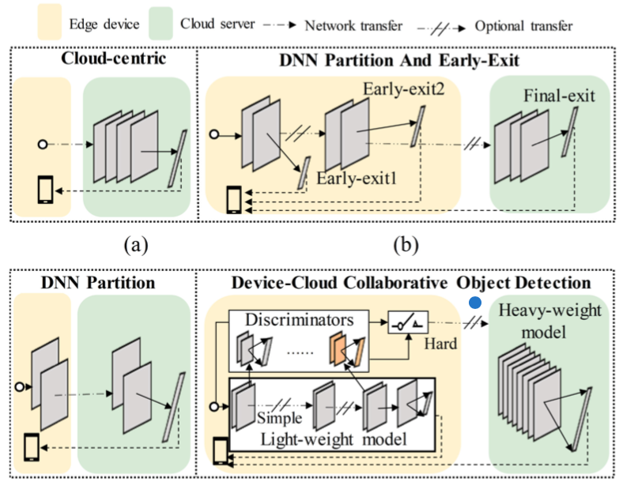
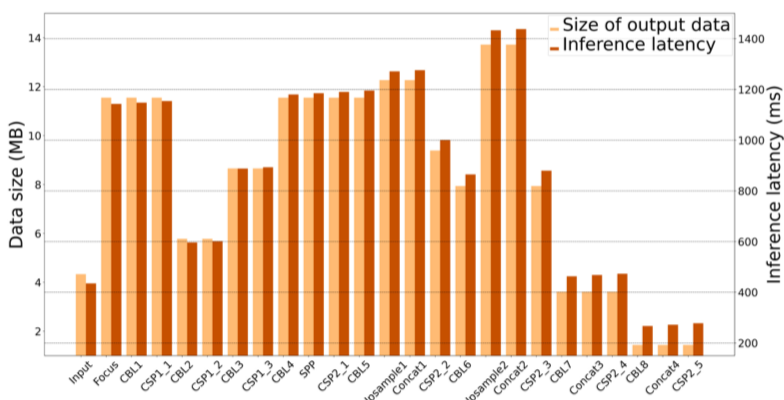
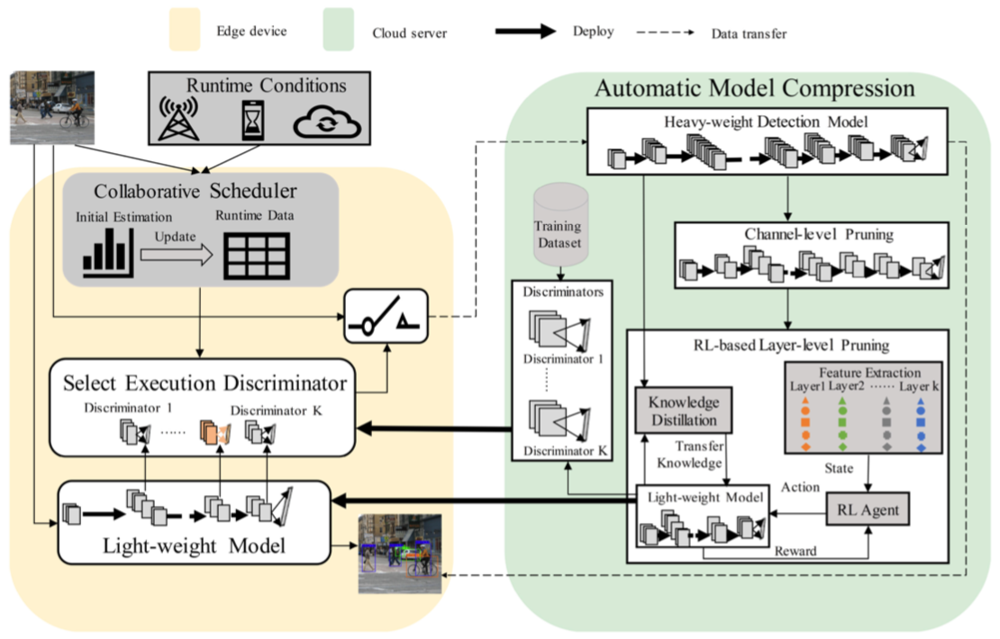

# DCCI: 内容自适应的云端协同目标检测

## 研究动机

算力受限的IoT设备难以运行大型智能模型，所以当前发展出云端协同推理来解决这一问题。

包括如下几种协同模式，后面的改进主要是解决带宽受限时纯云方法推理延迟的问题。

但是，目标检测（object detection, OD）这一业务场景比单纯分类更复杂，因为还需检测目标的位置。  
这使得OD不但算力要求更高，模型中途的多尺度特征图还可能比输入更大，导致当前云端协同方法无法减少传输量和延迟。

比如说YOLOv5s，只有最后几层的输出是比输入小的。

# 本文方法

本文提出面向云端协同推理的OD框架DCCI，可根据输入的待检测图片内容调整需要传输的数据量。

具体而言

1. 云上重模型通过强化学习等方法压缩得到适应端设备的轻模型，同时得到一系列样本难易分辨器
2. 将分辨器与轻模型部署到端设备，端设备通过分辨器辨别对图片执行OD的难易程度，简易的样本使用轻模型处理，困难的样本发送到云上使用重模型处理
3. 由于轻模型的每一层都带有一个分辨器，因此提出调度算法，根据运行时负载和带宽选择在哪一层使用分辨器能达到最快推理速度

### 1. 使用network slimming减少channels

Network slimming方法于2017提出，为每个channel赋一个缩放子，在训练过程中通过正则化项使这些缩放子稀疏化，之后去掉缩放子小的channel，（再精调一番，）得到压缩模型。

### 2. 靠强化学习方法减少层

* 状态：每层以五元组（类型，卷积核size，卷积步长，padding，输出维度）作为状态
* 动作：为去除该层或保留该层（但这个MDP怎么理解？）
* 最终奖励（过程中无奖励）：考虑压缩率、模型准确率和算力是否满足约束

### 3. 样本分辨器

将样本分别输入轻重模型，定义容易样本的两个结果满足以下条件：

1. 检测框相交部分占比超过一个阈值
2. 分类相同

通过为第一个条件设置不同的阈值，可以得到不同级别的样本难易划分。

为轻模型输出前每一层训练一个样本分辨器，越靠近输入端的分辨器使用难样本占比越高的划分，以尽量在早期识别出难样本（感觉没什么逻辑）。

此外，每个分辨器带一个缓存，存储因被鉴定为难而发往云的样本，云处理好后从缓存中删除，这样缓存满了时说明云处理不过来，后续样本就暂时不鉴定为难。

### 4. 协同调度器

目标是根据运行时负载和带宽选择在哪一层使用分辨器能达到最快推理速度。

在云上，使用离线数据统计样本完全由轻、重模型处理的时间$t_l$、$t_h$，以及由轻模型处理到第i层并由分辨器处理的时间$t_i$。

上线后，测算一下线上的$t_i'$（可以只估算少数层的，然后根据云上的对应时间按比例算，包括$t_l'$），那么就可以估计一个样本在第i层上云的时间为
$$t_i' + \frac{d_i + d_o}{B} + t_h$$
其中$d_i, d_o$分别为输入输出的数据大小，B为带宽。
如果完全本地处理，不与云通信，时间就仅是$t_l'$。

系统负载变化后，就重新测算$t_i'$和$t_l'$；网络变化了就重新测算B。
每次有样本来，就估算在每一层上上云的推理延迟，选能让时间最短的那一层启用分辨器。

## 实验

| 基准     | 空间   | 算力    | 传输 | 耗时   | 耗能   |
|----------|--------|---------|------|--------|--------|
| 纯端方法 | -90.0% | -30.87% | -    | -      | -      |
| 纯云方法 | -      | -       | -50% | -      | -      |
| 云端协同 | -      | -       | -    | -16.7% | -23.1% |

## 其它

这论文有不少严重的书写错误，比如对难易样本的定义是反的，还比如从第三章开始所有的lightweight都被误替换为了heavyweight。
