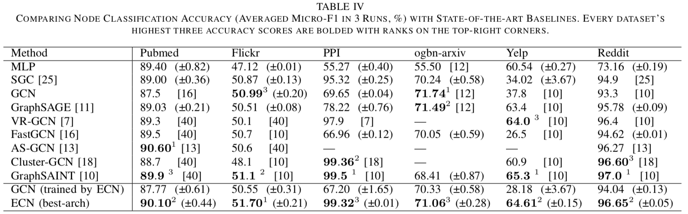

# 边卷积网络：基于独立边采样的GCN高效训练【Neurocom, 2023】

代码地址：[https://github.com/cf020031308/ECN ](https://github.com/cf020031308/ECN)

## 当前基于采样的GCN近似训练方法及其问题分析

GCN被提出并在图网络学习领域流行以来，相当多的改进工作基于采样估计将GCN扩展到大规模图网络的学习上，以克服GCN固有的邻域爆炸问题（计算随卷积层数指数增长）和学习效率低的问题（聚合多阶邻域信息就只为一次梯度下降）。

这些采样方法可进一步细分为如下三种：

1. 节点采样（如GraphSAGE、PinSAGE、SSE、VR-GCN）。对给定的一批节点，每个节点仅采样部分邻居节点，用于在卷积中估计完整邻域的信息；
2. 层采样（如FastGCN、AS-GCN、LADIES）。对给定的一批节点，从他们的邻域的并集里采样，用于下一层卷积的估算；
3. 子图采样（如GraphSAINT、Cluster-GCN、RWK）。给定一批节点，计算节点集合与每个节点的邻域的交集，所有交集的并集作为子图样本的边集。

可以看到，无论哪一种采样方式，都需要在采样过程中索引任意节点的完整邻域，这导致了采样过程的以下问题：

1. 低效。因为节点的邻域大小不同，以上对邻域的采样、求并、求交等操作无法并行，难以利用GPU加速。较近的方法GraphSAINT使用了预编译加速技术和更多的CPU核，才使采样过程的时间消耗与训练过程相当；
2. 额外索引空间占用。当前方法在采样过程中需要索引任意节点的完整邻域，因此普遍使用CSR格式的邻接矩阵，该格式可以根据节点id一次性查询出该节点的全部邻居节点id。然而，通常的图数据集都是以COO格式存储与分发，因此需要将COO转换为CSR，并在图数据集更新时重新转换。显然，图规模越大这个转换的时间成本越高，转换得到的CSR矩阵占用的额外空间越大；
3. 复杂代码实现。随论文开源的代码里以较为一致的风格实现了节点、层、子图三种采样模式，相比论文中提出的边采样模式都复杂得多，这种复杂性会被未来工作一直继承，并可能提高在工业中进行算法移植的成本。

## 本文贡献

本文提出首个基于边采样模式的GCN近似训练方法：边卷积网络（Edge Convolutional Network，ECN）。

### 核心原理

核心原理是将GCN的优化目标由以邻域为单位的损失函数

近似分解为以边为单位的损失函数（简称为边损失）

并证明后者为前者的上界

因此可通过优化边损失优化GCN，并且理论上该近似（称为Postcombine）对模型表达能力造成的损失有理论上限

Postcombine消除了采样过程中对节点完整邻域信息的需求，支持在COO格式数据中对边进行独立采样以优化GCN，因而采样速度快、无需CSR索引、代码实现极致简单。
在多个大规模真实数据集上进行的节点分类实验证明了ECN的分类表现与GCN相当，收敛速度与其它近似训练方法相当（远高于GCN），采样速度比其它方法高1~3个数量级。如下图：

特别地，再结合对AX进行预计算和对边做重要性采样，一个常见的两层GCN可以像训练MLP一样得到训练。如下图：

### 架构扩展

作者围绕ECN架构进行了丰富的扩展，加入GCN近年来的优秀改进，包括跳跃边（JKNet）、恒等映射（GCNII）、嵌入约束（GAE）以及注意力（GAT）。实验证明在这些先进机制加持下，ECN的分类表现能达到甚至超过SotA。

值得注意的是其中嵌入约束和注意力两个扩展。

#### 嵌入约束

嵌入约束通常假设相邻节点的表示比随机点对之间更近。这是一个面向点对的概念，因此在面向节点及其邻域的GCN以及其它近似训练方法中实现会比较别扭，但集成到同样以边为建模对象的ECN中则刚刚好。从这个角度来说，ECN的架构比GCN更灵活，支持更多的拓展设计。

#### 批注意力

图注意力机制依赖于完整的邻域信息进行权重归一化，但在近似训练中样本难以覆盖完整邻域，之前的工作（如GraphSAINT）一般会舍弃归一化。本文提出了批注意力（Batch Attention），通过恰当的估计在不完整样本中归一化注意力分数，将注意力的应用拓展到了采样估计中。

# 未来工作

ECN除了作为首个基于边采样的GCN近似训练方法，极大加速了其采样过程以外，嵌入约束和批注意力等机制的拓展也证明了其作为一种新型图神经网络架构的潜力，未来可融入更新的GCN架构改进，解决更多实际问题。
此外，ECN的采样和训练方式天然支持边集分布式存储的大规模图网络以及边集持续更新的线上业务数据，未来我们将持续探索相关技术在分布式训练、联邦学习、持续学习等方面的应用。

