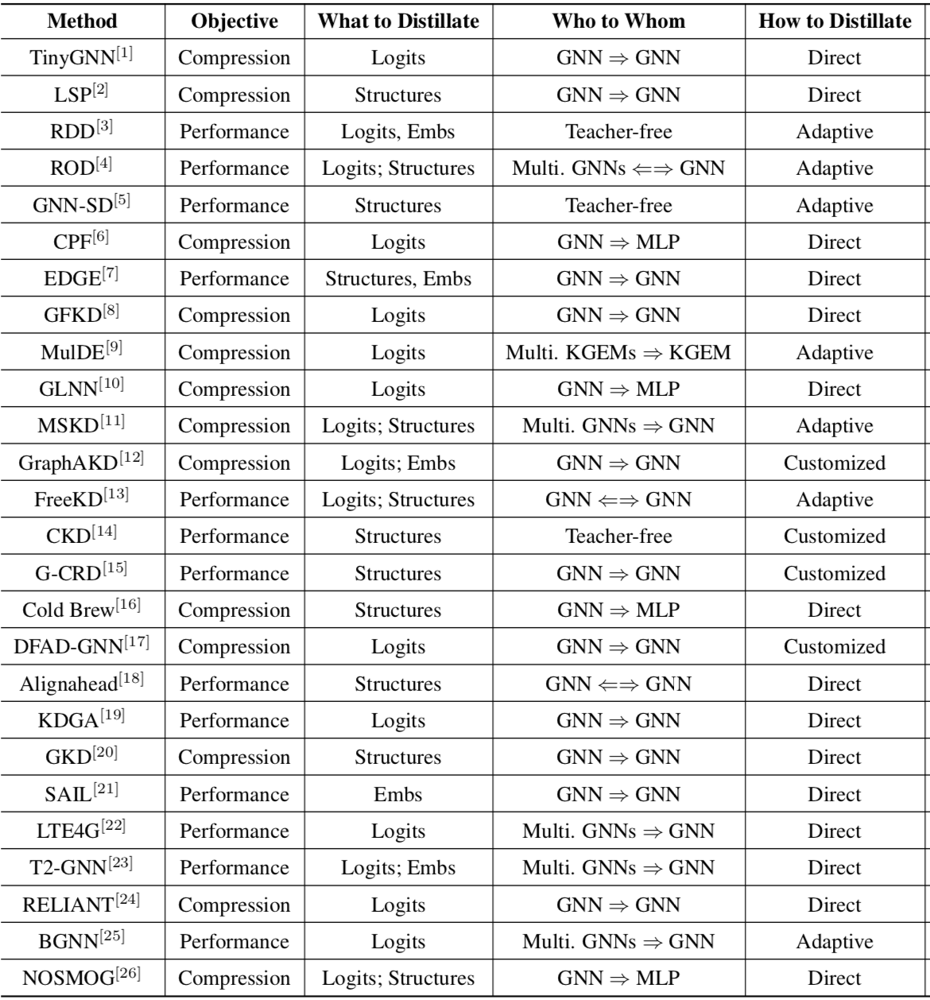

# 图网络知识蒸馏综述

图神经网络（GNN）模型由于依赖多跳邻居的数据，存在扩展性问题，使得大规模的GNN难以部署到资源受限的设备上，因此发展出了图网络知识蒸馏（Knowledge Distillation on Graphs, KDG）来解决这问题。

这篇综述对2020年以来关于KDG的20来篇文章做了概述，分类的维度包括

* 目的：压缩模型或提升表现
* 蒸馏目标：Logits，Structures或Embeddings
* 蒸馏方向：从多个GNN蒸馏到单个GNN，从大的GNN蒸馏到小的GNN，从GNN蒸馏到MLP，或干脆无教师等
* 蒸馏方法：直接蒸馏Direct，选择性蒸馏Adaptive或加入了对抗、对比、协同等其它方式的自定义蒸馏Customize

分类结果如图

去年新做一篇论文，其中部分内容需要调研从GNN到MLP的知识蒸馏，因此也萌生了再总结一篇图网络上知识蒸馏综述的想法，没想到开年就看到预印版。
首先我动作确实太慢，要改进写论文的流程；其次也说明我现在的研究还算前沿且有用，才会有团队跟我想到一起；最后可以对照我当时的想法学习怎么写综述，继续保持状态做好研究，总能出好成果、写出有利于他人研究的综述的。

附上我对这个领域的调研笔记。其中分类里的MLP是指蒸馏结果是个MLP（不一定是从GNN蒸馏过来，也有MLP自蒸馏这种），肯定是出于模型压缩目的；G2G是指从GNN蒸馏到GNN，可能是想压缩模型或提升效果或都想。

| 分类 | 方法 | 问题 | 方案 | 缺陷 |
|-|-|-|-|-|
|      | GraphSAIL (2020) | GNN增量训练不便 | 除了蒸馏LS和GS，就是蒸馏节点嵌入本身，其实是用历史嵌入做个基线，免得灾难遗忘 | |
| MLP  | GLNN (2021) | GNN推理太慢 | 将GNN蒸馏到MLP，部署MLP | |
| MLP  | LinkDist (2021) | GNN推理太慢、消息传递占用空间 | 通过边蒸馏得到MLP | |
| G2G  | TinyGNN (2020) | GNN推理太慢 | 将大GNN蒸馏到一跳的小GNN | |
| G2G  | [LSP](https://www.semanticscholar.org/paper/Distilling-Knowledge-From-Graph-Convolutional-Yang-Qiu/1c449fe4bb3ad1f66372d15ce433a2e818299366) (2020) | KD还只能用于非图 | 蒸馏点对的相似性形成的点的邻域结构 | |
|      | GFKD (2021) | DFKD还只能用于非图 | | |
| G2G  | CPF (2021) | 复杂网络用不好先验知识 | 将复杂网络的结果蒸馏到LPA与GNN结合的学生模型中 | 不能太深。LPA的参数是加在边注意力上，不适合反相关图 |
| G2G  | [FreeKD](https://www.semanticscholar.org/paper/FreeKD%3A-Free-direction-Knowledge-Distillation-for-Feng-Li/f835bcc749f8774ba5b2ae0a57f482aef87c23ac) (2022) | 大教师难得 | 不同模型实例可能在一些节点上有差异化的表现，提出用RL选择两者的蒸馏方向，好的带带差的 | |
| G2G  | [GNN-SD](https://www.semanticscholar.org/paper/On-Self-Distilling-Graph-Neural-Network-Chen-Bian/326156760e2a6c18154be9ac39baf6a1e62df2b8) (2020) | 大教师难得 | 保持邻居差异的自蒸馏 | |
|      | GNN-MLP (2022) | KG中GNN真的必要？ | 使用MLP（相当于邻接矩阵设为单位矩阵），loss的设计（主要考虑负采样的作用）比模型更重要 | 只讨论了KGC |
|      | Cold Brew (2021) | 冷启动问题（不特定于推荐系统） | 蒸馏到MLP，嵌入根据相似性再取若干节点假装是邻居，拿其嵌入来增强，再训练另一个MLP分类 | 方法不是很合理，实验做得也一般，但是提了个好问题 |
| G2G  | [G-CRD](https://www.semanticscholar.org/paper/On-Representation-Knowledge-Distillation-for-Graph-Joshi-Liu/3c3c156f98c7c5723af1009b1f0009898fe85def) (2021) | LSP只考虑局部结构，但完整的全局结构复杂性又太高 | 通过对比学习蒸馏全局结构，并提出若干教师和学生表现差别大的benchmark | |
| MLP  | GSDN (2022) | GNN推理太慢 | 将GNN蒸馏到MLP，部署MLP。实现上等价于 LinkDist + Attention + 归一化 | |
| G2G  | [GKD](https://www.semanticscholar.org/paper/Geometric-Knowledge-Distillation%3A-Topology-for-Yang-Wu/a629e00c2e8021a74b1ef41c1bc936a5150cd714) (2022) | | | |
| MLP  | [也叫GKD](https://www.semanticscholar.org/paper/GKD%3A-Semi-supervised-Graph-Knowledge-Distillation-Ghorbani-Bahrami/337c6c867be3b10675e69d0ebd33e42d6fb06dc8) (2021) | 推理时结构信息不可用则表现很差 | 先用MLP分类，然后用C&S的S处理下，再蒸馏到另一个MLP | |
