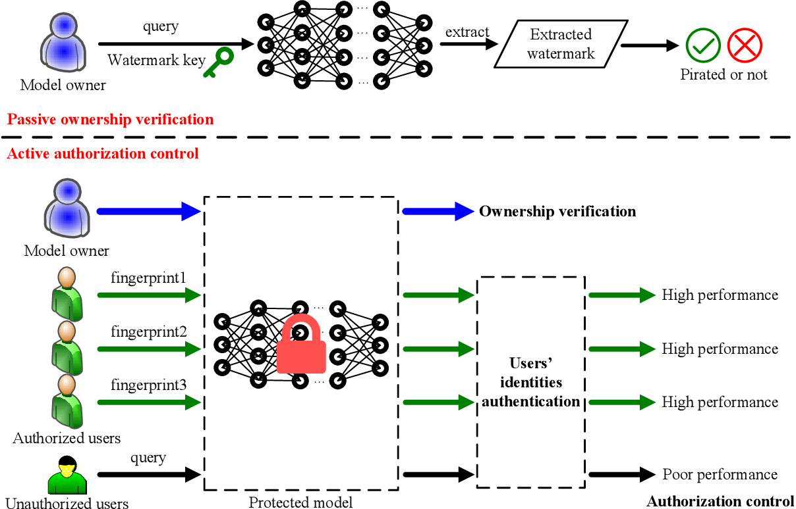
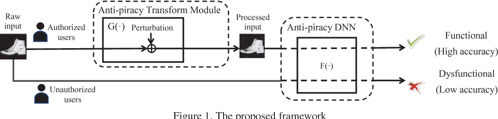
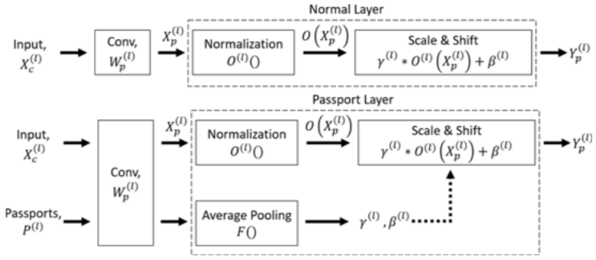
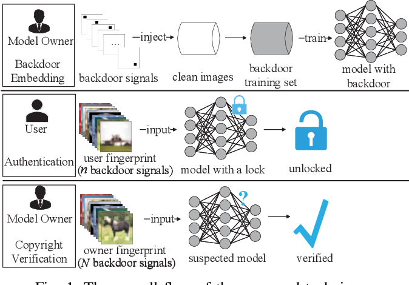
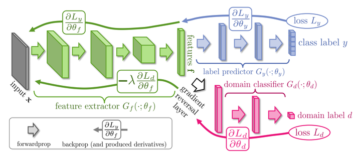
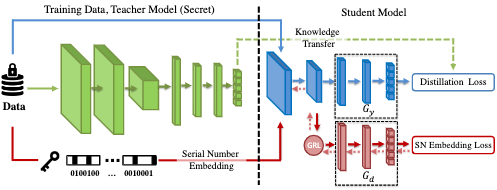
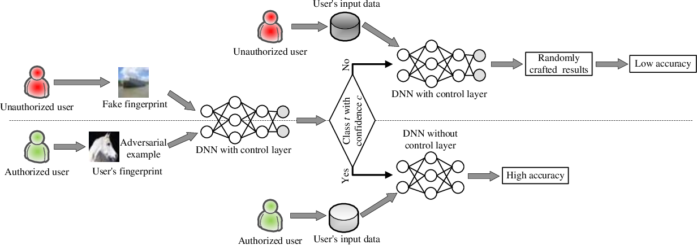
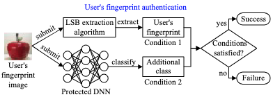
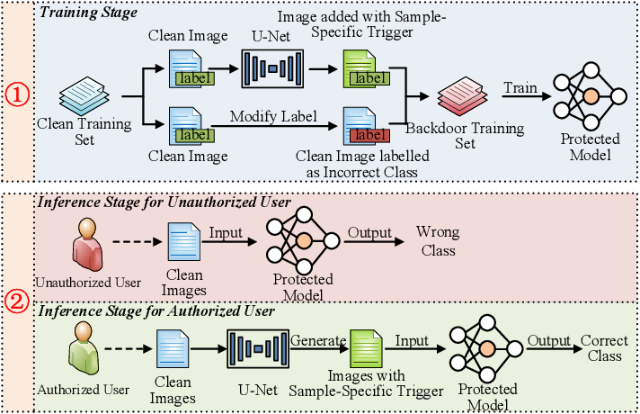
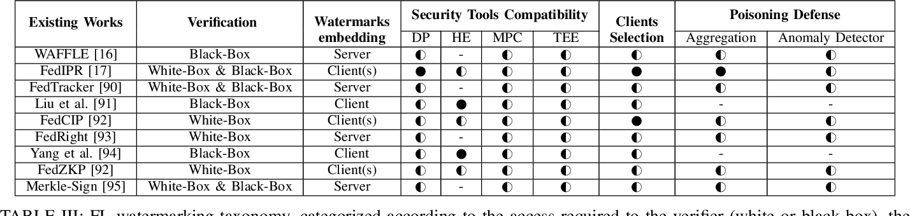

# 综述：深度模型知识产权的积极防护

当前对于深度模型的知识产权保护，主流研究是基于水印的。  
即模型产权拥有者在模型中嵌入水印，当模型疑似被盗后检测嫌疑模型中是否有水印，以主张权利。  
然而，基于水印的模型产权保护只能在模型被盗后辅助维权。

本文调研的方法致力于在模型被盗前进行主动防御，预期的效果是模型拥有者为每个认证用户发放指纹，用户携带指纹可正常使用模型，否则模型表现将极差。

本综述主要考查方法的以下两类功能

1. 模型权限（Autorization Control）
   * 对不同用户提供不同的功能性，比如授权用户模型表现好，未授权则差
2. 用户权限（User's Identities Authentication and Management）
   * 能为不同用户生成不同指纹（fingerprint）
   * 指纹安全，例如防止伪造、派生指纹，防止共谋破解
   * 能验证指纹，即利用模型可以提取指纹、验证正确性并定位用户

## 仅考虑模型权限的方法

### Protect Your Deep Neural Networks from Piracy

> Chen, M., & Wu, M., WIFS 2018（非CCF）

对转换后的特征正向优化，对没转换的特征反向优化。  
同时对Transform Module有如下优化：
* 约束转换前后特征的距离，避免攻击者察觉或提取破解
* 加扰动，避免被攻击者蒸馏去

### DeepIPR: Deep Neural Network Ownership Verification With Passports

> Fan, L., Ng, K.W., Chan, C.S., & Yang, Q., TPAMI 2021（一区）

主要针对Ambiguity Attack，即攻击者拿模型训练出一个自己的水印，那模型属于谁就说不清了（大家都有水印）。  
所以本文提出利用跟模型参数耦合的Passport来鉴权。

打印方式仍是优化模型使在带特定输入（Passport）的情况下表现良好。

本文专门针对卷积层+归一化层这种结构，提出用Passport的卷积结果影响归一化层的$\gamma, \beta$。  
（将信息集中在少量重要的参数上就不容易伪造？）

训练DNN时，对带与不带Passport两种情况都进行优化，同时可通过加约束控制$\gamma, \beta$每一位的符号，隐写上自己的签名。

* 发给用户不带Passport的DNN，用户正常使用
* 需要鉴权时把Passport对应的$\gamma, \beta$装上，验证模型效果仍不降，证明产权
  * 缺点是只能维一次权，Passport就曝光了
  * 可与trigger-based水印结合，先用带后门触发器的图片证明版权，被歧义攻击时再用Passport

方法思路总结：针对少量关键参数，按feature-based的方式训练一组可验证版权的留存参数，同时正常训练出一组常规参数，平时使用常规参数，鉴权时拿出留存参数换上，用模型表现证明权利。  
缺点是维权会曝光Passport，个人认为方法曝光后也会受到针对性歧义攻击。

目前派生出了FedIPR（也是杨强团队）的相关工作。

### Protecting Intellectual Property with Reliable Availability of Learning Models in AI-based Cybersecurity Services

> Ren, G., Wu, J., Li, G., Li, S.T., & Guizani, M., IEEE Transactions on Dependable and Secure Computing 2022（二区）

方法很简单：给数据集中一部分带上token，另一部分的标签换了（均匀分布），最小化前者的输出与标签交叉熵，最大化后者的。

## 同时考虑用户权限的方法

### Active DNN IP Protection: A Novel User Fingerprint Management and DNN Authorization Control Technique

> Xue, M., Wu, Z., He, C., Wang, J., & Liu, W., Trustcom 2020 (CCF-C)

思路比较迷，拿DNN来鉴权。

方法：

1. 给图片插入共有N个信号的后门触发器训练得到模型
2. 对任一用户，选择N个信号中的n个插入10张图片当作他的指纹
3. 模型拥有者将N个信号输入模型，置信度拉满，可证明版权（就跟常规水印一样）
4. 用户用指纹输入模型，置信度适中，可验证权限

### Deep Serial Number: Computational Watermark for DNN Intellectual Property Protection

> Tang, R., Du, M., & Hu, X., ECML-PKDD 2020 (CCF-B)

思路是对目标模型，使用知识蒸馏为每个用户训练一个专用模型，该模型需要输入中带上用户的序列号（Deep Serial Number, DSN）才能正常工作。

其中用到一个梯度反转层（Gradient Reversal Layer, GRL, 2015年提出），可看作简版对抗网络。  
先简单介绍一下。

* 对GRL之后的参数，没区别，优化目标还是提升判别器的判断能力
* 对GRL之前的参数，梯度乘以$-\lambda$相当于损失函数乘以$-\lambda$，优化目标成了不让判别器正确判断

本文方法在训练时，序列号为真就走蓝色路径进行知识蒸馏，随机假序列号就走红色路径做对抗学习。  
是否有序列号会影响GRL之前的特征提取，有序列号就能提取出利于分类的信息，否则提取出无用信息。

### A Buyer-traceable DNN Model IP Protection Method Against Piracy and Misappropriation

> Wang, S., Xu, C., Zheng, Y., & Chang, C., AICAS 2022（非CCF)

先训练模型，再为每个用户加专属水印fine-tune出专属模型。  
还是Passive的防御模式，但因为可以定位到泄露者，比常规的水印保护强一丝。

联邦中已有FedCIP工作，但需要靠客户端加水印来抓泄露的客户端这有点奇怪。

### ActiveGuard: An Active DNN IP Protection Technique via Adversarial Examples

> Xue, M., Sun, S., He, C., Zhang, Y., Wang, J., & Liu, W., IET Comput. Digit. Tech. 2021 （四区）

看了这张图，并且由于还是Mingfu Xue的工作，就没看文章。  
猜测还是继承了之前那个很迷惑的思路：拿Control Layer（另一个DNN）来鉴权，然后根据鉴权结果决定是否使用受保护网络。

### Active intellectual property protection for deep neural networks through stealthy backdoor and users’ identities authentication

> Xue, M., Sun, S., Zhang, Y., Wang, J., & Liu, W., Applied Intelligence 2021 （三区，22年升二区）

Mingfu Xue前面工作的升级版，利用新开一个类别加隐写术的方法抵御query modification attack（利用自编码器去除水印），没细看。

### Sample-Specific Backdoor based Active Intellectual Property Protection for Deep Neural Networks

> Wu, Y., Xue, M., Gu, D., Zhang, Y., & Liu, W., AICAS 2022（非CCF)

## 未来方向

**数据集的Authorization Control**

* 数据集加入后门就可以检验模型是否用到数据集（Passive）
* 还听说有种魔法水印可以让用它训练的模型效果变得很差（Active）

**如何与联邦学习结合**（目前主流也是水印，如图）

* 保护模型独占，或者定位泄漏参数的参与者（如FedCIP），等等
