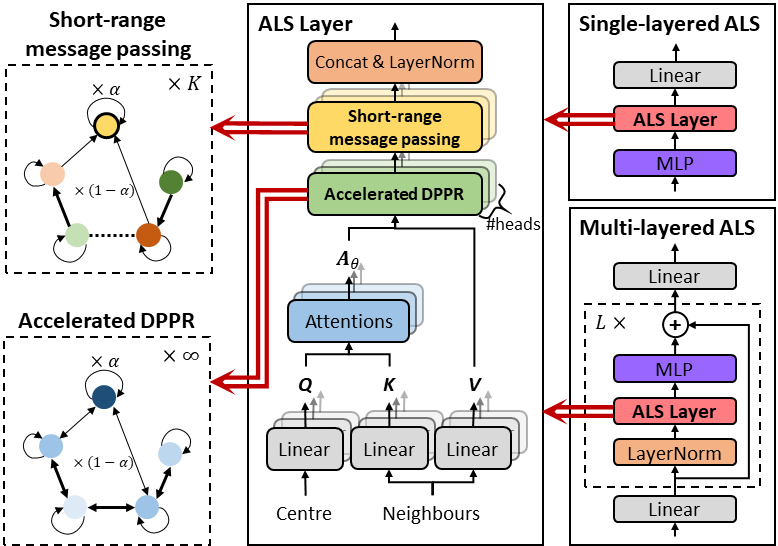

# ALS：注意力长短程消息传递的图表示学习【Pattern Recognition, 2026】

**代码地址：** [https://github.com/cf020031308/ALS](https://github.com/cf020031308/ALS)  
欢迎star和试用，有问题欢迎提issue交流。

## 摘要

图注意力机制（GAT）让节点能够根据相关性动态聚合邻居信息，极大提升了图神经网络的自适应能力。但想捕捉长距离依赖时，传统堆叠堆叠多层GAT的做法会带来内存占用和计算开销随层数线性增长的问题，还容易引发过平滑。

本文提出**注意力长短程消息传递（ALS）**，将GAT与个性化PageRank（PPR）相结合来建模复杂的长距离依赖。核心创新在于：

1. 基于隐式求导的可微PPR（DPPR）算子，实现**O(1)常数内存**占用，支持无限步传播；
2. 三项加速技术，最高减少**89.51%**的计算时间；
3. 短程消息传递模块（SRMP），专门应对异配图场景。

实验表明，ALS在同配图、异配图和长距离图基准上均达到SOTA水平，性能优于包括Graph Transformer和Graph Mamba在内的主流基线。

## 研究背景：GAT的长距离困境

GAT通过为邻居分配动态注意力权重，实现了比GCN更灵活的消息传递，在各种图学习任务中表现出色。但当任务需要捕捉长距离依赖时（比如路网交通预测），问题就来了：

- **内存爆炸**：堆叠$L$层GAT，反向传播时需要保存所有中间激活，内存复杂度是$O(L)$。层数越多，内存涨得越快；
- **计算昂贵**：每多一层就要多做一次消息传递，计算量随层数线性增长；
- **过平滑**：消息反复传递后，节点表示会趋于同质化，反而失去区分度。

于是有人想到了把GAT和PPR结合起来。PPR的好处是传播时会保留一部分初始特征，天然缓解过平滑，而且理论上可以收敛到无限步的稳态。但问题是如果每一步传播都用动态生成的注意力权重，反向传播需要的内存是无限的。现有的方案大多采用截断版PPR，只传播K步就停下。这虽然绕开了内存问题，但也牺牲了长距离传播的能力，本质上还是"有限步"。

我们的目标很明确：**既要无限步的长距离传播，又不能增加内存，还要跑得快**。

## 核心思路：可微的无限步PPR

ALS的核心是一个叫**DPPR（Differentiable Personalized PageRank）**的算子。简单说，我们证明了一件很酷的事：**PPR结果的梯度，本身也可以通过另一次PPR过程算出来。**即定理1（DPPR梯度形式）：如果 Z = PPR(α, Ã, V)，那么损失对Z的梯度满足
$$\nabla_Z = \text{PPR}\left(\alpha, \tilde{A}^T, \frac{1}{\alpha}\cdot\frac{\partial L}{\partial Z}\right)$$

这意味着什么呢？传统的逐跳反向传播需要把每一步的中间结果都存下来，步数越多内存越大。而DPPR不需要存任何中间态，前向跑到收敛，反向再跑一次收敛，**内存占用是常数**，跟传播步数完全无关。

基于这个定理，我们通过链式法则就能算出对输入特征V和注意力矩阵Ã的梯度，整个过程只需要常数内存。

## 三项加速技术：把迭代速度拉满

DPPR解决了内存问题，但PPR迭代本身如果α很小，收敛会很慢。为此我们设计了三项加速技术，组合使用效果拔群。

### 1. 对称化注意力 + 共轭梯度法（SymGAT + CG）

传统Krylov子空间方法（如GMRES）虽然收敛快，但内存开销大，不适合大图。我们的做法是：

- 把注意力矩阵做对称化处理（让$W_q=W_k$，保证$s_{ij} = s_{ji}$）；
- 这样就可以用**共轭梯度法（CG）**来解线性方程组，只需要两份V大小的内存存残差和共轭方向。

对称化会不会损失精度？实验表明：在同配图上略有下降，但在异配图上反而更好，整体几乎没有负面影响，却换来了巨大的速度提升。

### 2. 主特征向量初始化（EigenInit）

默认迭代都是从零开始，但零其实是个"很差"的起点。

我们发现：行归一化注意力矩阵的主特征向量是全1向量，对称化注意力矩阵的主特征向量是(√D₁, √D₂, ..., √Dₙ)。用输入特征在主特征向量上的投影作为迭代起点，初始残差更小，收敛需要的迭代次数自然就少了。

这个技巧在异配图上效果尤其明显。

### 3. 自适应批量终止（AdaTerm）

多头注意力里，每个头、每个通道对应的线性系统其实是独立的，它们收敛速度不一样。有的头几步就收敛了，有的要跑很久。

AdaTerm做的事情很简单：每轮迭代后检查哪些头/通道已经收敛了，下一轮就不再计算它们。

这三项技术叠加起来，相比朴素迭代最高能减少**89.51%**的训练时间，比同类隐式GNN（IGNN）至少快3.67倍。

## 短程消息传递：补齐异配图短板

PPR本质上是个低通滤波器，在同配图上效果很好，但在异配图（相邻节点标签不同）上会吃亏。因为异配图需要区分"自身特征"和"邻居特征"，不能简单地混在一起传播。

为此我们设计了**SRMP（Short-Range Message Passing）**模块：
- 长距离部分交给DPPR处理全局信息；
- 短距离部分用K步截断传播，但每一步用不同的可学习变换矩阵W₁, W₂, ..., $W_K$。

这样设计的好处是：

- **异配图**：不同跳数用不同变换，能精细处理局部的异质信息，性能提升显著；
- **同配图**：各$W_k$会自动趋近于相同的值，相当于"自动关闭"SRMP，不会带来负作用。

而且GAT + skip connection其实是ALS在K=2、W₀=0时的特例，这保证了ALS对GAT的向下兼容。

## 实验亮点：全面SOTA

我们在14个数据集上做了充分实验，覆盖同配图、异配图、大规模图和长距离基准四大类。

16 组对比中，有 9 组统计显著优于最佳基线（$p<0.01$）。此外，实验还有以下亮点。

**1. 内存真的是常数**

在OGB-Arxiv上测试，传统逐跳反向传播的内存随传播步数线性增长，而DPPR从头到尾都是一条平线。步数越多，优势越明显。

**2. 单层就够强了**

消融实验发现：在10个数据集中的6个上，单层ALS和多层ALS没有显著差异。这说明DPPR的无限步传播能力已经足够覆盖大多数场景，堆叠更多层带来的收益有限。当然，少数数据集叠多层还能再涨点，可以作为兜底策略。

**3. 长距离基准上的惊艳表现**

在PascalVOC-SP和COCO-SP这两个长距离基准（平均最短路径>10）上：

- 纯MPNN范畴内，ALS大幅领先GCN、GatedGCN、APPNP等；
- 即使放进GraphGPS框架和Graph Transformer、Graph Mamba对比，ALS作为MPNN模块也能取得最优结果。

这说明基于PPR的长距离建模，在效率和效果上并不输于全局注意力或状态空间模型。

## 总结与展望

ALS这套方案的核心价值可以概括为三点：

1. **DPPR算子**：把可微PPR封装成了一个即插即用的PyTorch算子，其他PPR类方法也可以直接替换，零成本获得无限感受野和常数内存；
2. **三项加速**：对称化CG、主特征初始化、自适应终止，不仅适用于ALS，也能加速各类PPR相关算法；
3. **长短结合**：DPPR管长距离，SRMP管局部异质性，一套框架通吃同配、异配、长距离各种图。

未来有两个值得探索的方向：
- α和K这两个超参数天然对应"远距离/近距离信息的重要程度"，可以用来做模型可解释性；
- 把长短程消息传递的思想扩展到异构图、知识图谱等更复杂的结构上。
