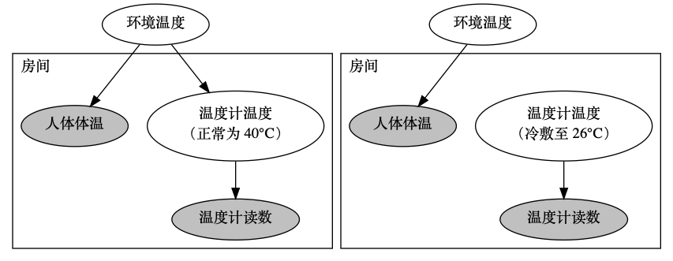
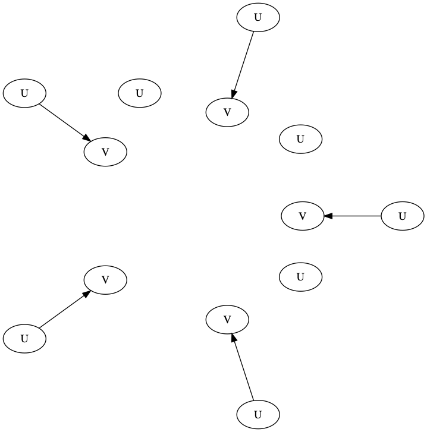

# 因果模型的抽象

* 应用
* 数据
* 方法

## 摘要

我们考虑了一系列逐步严格的因果模型抽象的定义。

1. 首先是 Rubenstein 等人引入的概率因果模型的精确变换
2. 其次是确定因果模型的统一变换，该变换防止了特殊构造的分布掩盖模型的差异；
3. 再次是抽象，通过低层到高层的映射确定了干涉的价值；
4. 最后是强抽象，在可行的干涉之外，还考虑了所有潜在的干涉。

最后我们指出了将微变量组合成宏变量的过程，以及 Rubenstein 等人考虑的所有例子都是强抽象概念的实例。

## 概率因果模型的基础知识

### A signature S: (U, V, R)

* U: 外部变量（exogenous variables）。U 的一组取值 $\vec{u}$ 也称一个环境。
* V: 内部变量（endogenous variables）
* R: 随机变量的取值域

本文限制模型是递归（无环）的，即
$$\forall \vec{u} \exists< \text{ as a partial order } \text{ that Y depends on X in } \vec{u} \text{ if X < Y }$$
如果这个偏序关系独立于 $\vec{u}$，则模型是强递归的 .

### 基本因果模型：(S, F)

* F: 随机变量方程，如 X = Y + U

### 因果模型：(S, F, I) = (M, I)

* I: 可行的干涉（Intervention）的集合

### 干涉

对因果模型施加一个干涉 $\vec{X} \leftarrow \vec{x}$，则 F 中所有的 $\vec{X}$ 被替换为 $\vec{x}$、$\forall Y \notin \vec{X}$ 不变，记为 $F^{\vec{X} \leftarrow \vec{x}}$。因此这是一个新的因果模型 (S, $F^{\vec{X} \leftarrow \vec{x}}$, I)。

*因果命题* $\phi: [\vec{Y} \leftarrow \vec{y}]\varphi$  
其中 $\varphi$ 是一些原始事件的布尔组合，比如 $\varphi = \{X_1 = x_1, X_2 = x_2\}$

该命题表示当 $\vec{Y} \leftarrow \vec{y}$ 时 $\varphi$ 成立。

但这个命题成立与否也是与模型和具体环境有关的，所以进一步用 $(M, \vec{u}) \text{ |= } \phi$ 表示在模型 M 中环境 $\vec{u}$ 下 $\phi$ 成立。

### 概率因果模型：(S, F, I, Pr) = (M, Pr)

* Pr: Contexts 的分布律（A probability on contexts）

概率因果模型中的 (S, F, I) 称为确定因果模型。

### UEV 引理

*UEV*：因果模型的每个内部变量都唯一依赖于一个不同的外部变量，则称这因果模型是带 Unique Exogenous Variables (UEV) 的。

*UEV 引理*：任一概率因果模型都有一个带 UEV 的概率因果模型与之等价。

因为 UEV 引理，本文只考虑带 UEV 的概率因果模型。这样环境变量的分布律 Pr 就可视为所有变量的分布律。

**概率因果模型等价**，即对概率因果模型 M = ((U, V, R), F, I, Pr) 与 M' = ((U', V', R'), F', I', Pr')，有

1. V = V'
2. I = I'
3. $ R(Y) = R'(Y), \forall Y \in V$
4. 任一因果命题在 M 与 M' 中有相同概率成立，

## 因果模型的逐步抽象

### 精确变换（Exact Transformation）

对概率因果模型 $(M_L, Pr_L)$ 和 $(M_H, Pr_H)$
$$ \tau: R_L(V_L) \rightarrow R_H(V_H) $$
$$ \omega: I_L \rightarrow I_H \text{ 是一个保序的满射} $$
$$ Pr^{\omega(\vec{Y} \leftarrow \vec{y})}_H = \tau(Pr^{\vec{Y} \leftarrow \vec{y}}_L) $$
称 $(M_H, Pr_H)$ 为 $(M_L, Pr_L)$ 的 *$(\tau-\omega)$ 精确变换*（Exact $(\tau-\omega)$-transformation）。

例子：宣传与投票

应用：

1. 有边缘变量的模型（可以简化？）；
2. 成组聚合变量，将低层模型转为高层模型（如前面的例子）；
3. 将随时间变化的动态过程转为均衡态。

### 统一变换（Uniform Transformation）

可构造两个彼此为精确变换但无关的模型，说明精确变换这个抽象没触及本质。因此针对分布律，提出了统一变换。

**定义**

对确定因果模型 $M_L$ 和 $M_H$、保序满射 $\omega: I_L \rightarrow I_H$、$\tau: R_L(V_L) \rightarrow R_H(V_H)$，称 $M_H$ 是 $M_L$ 的 *$(\tau-\omega)$ 统一变换*（Uniform $(\tau-\omega)$-transformation），如果 $\forall Pr_L \exists Pr_H \text{ that } (M_H, Pr_H)$ 是 $(M_L, Pr_L)$ 的 $(\tau-\omega)$ 精确变换。

**意义**

既然对特定的 $\omega$，对任意 $Pr_L$ 都能找到对应的 $Pr_H$，使高层模型是低层模型的精确变换，那么两个分布就是函数关系：

**推论**：如果 $M_H$ 是 $M_L$ 的 $(\tau-\omega)$ 统一变换，则有函数 $\tau_U: R(U_L) \rightarrow R(U_H) \text{ that } \forall Pr_L on R(U_L), (M_H, \tau_U(Pr_L))$ 是 $(M_L, Pr_L)$ 的$(\tau-\omega)$ 精确变换。

**判定**

定理：在定义条件下，$M_H$ 是 $M_L$ 的统一变换的充要条件为存在 $R(U_L) \rightarrow R(U_H)$ 的变换与 $\tau$ 兼容。

所谓 $\tau': R(U_L) \rightarrow R(U_H) 与 \tau: R(V_L) \rightarrow R(V_H)$ 兼容，定义为
$$ \forall \vec{Y} \leftarrow \vec{y} \in I_L \text{ and } \vec{u}_L \in R(U_L) $$
$$ \tau(M_L(\vec{u}_L, \vec{Y} \leftarrow \vec{y})) = M_H(\tau'(\vec{u}_L), \omega(\vec{Y} \leftarrow \vec{y})) $$

**性质：可结合**

定理：$M_H$ 是 $M_I$ 的 $(\tau_1-\omega_1)$ 统一变换  
$M_I$ 是 $M_L$ 的 $(\tau_2-\omega_2)$ 统一变换  
则 $M_H$ 是 $M_L$ 的 $((\tau_1 \circ \tau_2)-(\omega_1 \circ \omega_2))$ 统一变换

### 抽象（Abstraction）

因为前面的定义对 $\tau$ 没限制，可以因此构造出反直觉的或者高层模型反而更繁琐的例子，故又针对 $\tau$ 提出了 $\tau$-抽象。

* $\tau$ 是满射
* 存在满射 $\tau_U: R(U_L) \rightarrow R(U_H)$ 与 $\tau$ 兼容
* $I_H = \omega_{\tau}(I_L)$

则 $M_H$ 是 $M_L$ 的 $\tau$-抽象。

不同于精确变换和统一变换，$\tau$-抽象是因果模型之间的一个关系，因为由 $\tau$ 可确定 $\omega$（？），便不再需要指定分布。

### 强抽象（Strong Abstraction）

如果 $(M_H, I^{\tau}_H)$ 是 $(M_L, I^{\tau}_L)$ 的 $\tau$-抽象，且 $I^{\tau}_H$ 包含了所有高层的干涉，则说 $M_H$ 是 $M_L$ 的 $\tau$-强抽象。

这是一个基本因果模型间的关系。

最后提出了 $\tau$-强抽象的一种特殊情况 $\tau$-连续强抽象，作者认为这种抽象可能的用处很广，因为 RW+ 所提的三个应用方向都是 $\tau$-连续强抽象，但相关定理与性质本文还未能证明。
