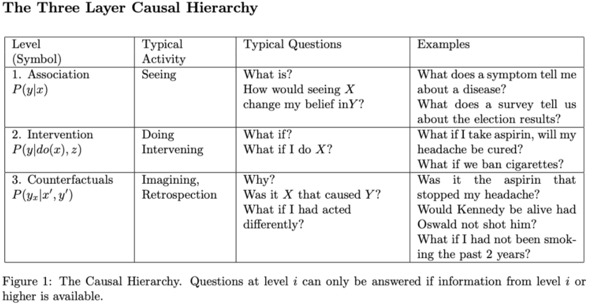
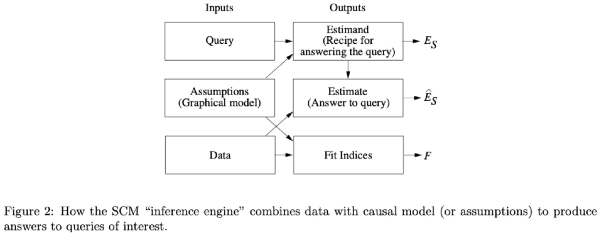
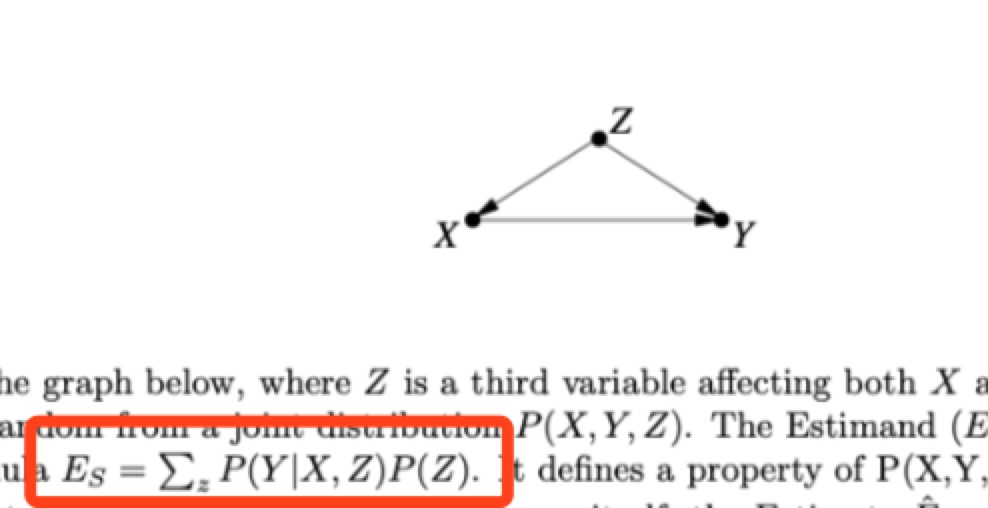
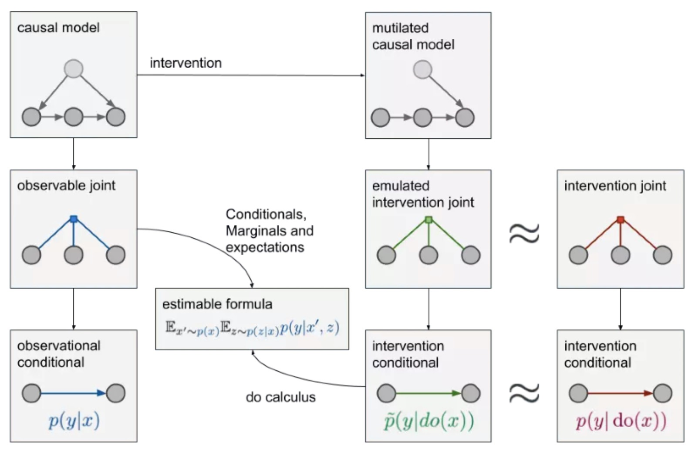

# 《机器学习的理论困境与因果革命的七个启示》

目前几乎所有机器学习都基于统计方法，调整出更好的参数，拟合出更好的曲线。  
但人类的优势在于知识表示、环境建模、自主假设，最终回答“如果……”一类的问题。

## 因果的三个层次与机器学习的理论困境

## 结构性因果模型（Structural Causal Models）与因果革命

* 图形模型
* 结构性方程
* 反事实与干预逻辑

## 因果革命中的七个支柱

-- 因果模型的独到之处

### 1. Encoding Causal Assumptions - Transparency & Testability

* 透明：图形模型
* 可测试：d-separation

### 2. The Control of Confounding

1. back-door

2. do-calculus

### 3. The formalization and Algorithmization of Counterfactuals

* 图形表示
* 结构性方程：右边因，左边果

### 4. Mediation Analysis & the Assessment of Direct and Indirect Effects

* Mediation analysis
* 图形表示

### 5. External Validity & Sample Selection Bias

* Validity & Robustness
* Association: Domain Adaptation, Transfer Learning, Life-long Learning, Explainable AI
* Do-Calculus

### 6. Missing Data

* Probabilistic Relationships

### 7. Causal Discovery

d-separation => Testability => { Infer, Prune } the models
