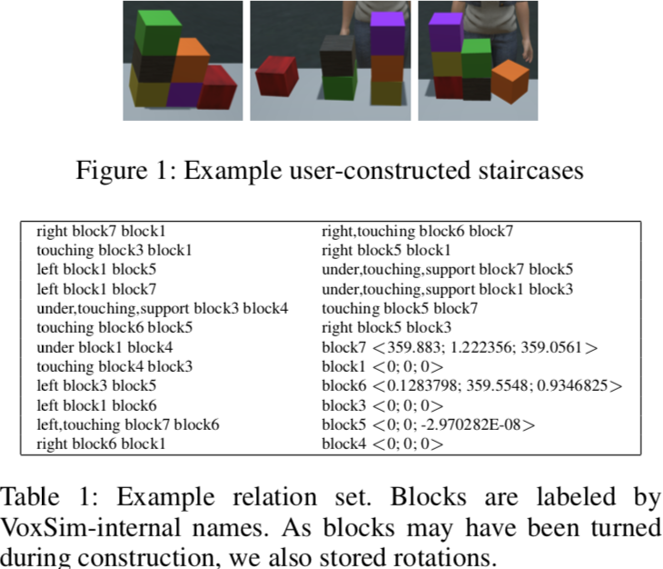
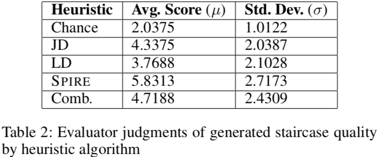
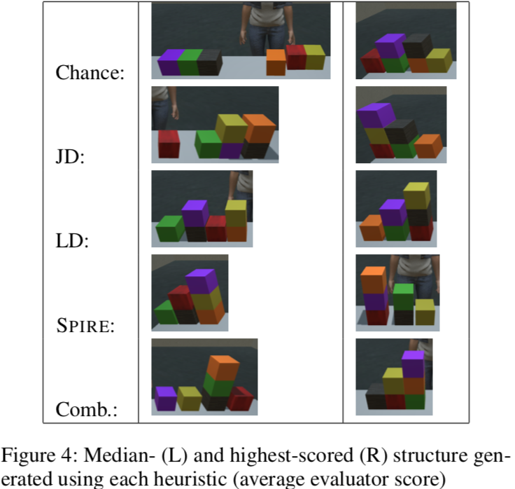

# 结合深度学习与空间定性推理从带噪音的稀疏例子中学习复杂结构

## 问题与数据

## 训练过程

1. 用 17 个例子中的 `(block, block) -> relation` 训练一个 MLP；
2. 用 17 个例子中的 `{(block, block, relation)} -> 例子` 训练一个 CNN，这里作者没细说过程，但输入序列应该只是部分，且有排列爆炸的问题；
3. 每个例子 `{(block, block, relation)} -> 关系补集`训练一个 LSTM，这里也有排列爆炸的问题，耗去了大量的时间；

## 生成过程

1. 随机取两个 block，通过 MLP 得到 relation，组合成初始关系 `(block, block, relation)`；
2. 根据前面采用的关系得到对应的操作，此操作又会添加一系列关系 `{(block, block, relation)}` 得到关系序列 R;
3. 将 R 输入 CNN，得到 17 个例子中最相近的一个，设为 E；
4. 将 R 输入最相近例子对应的 LSTM，得到剩余的关系集 S；
5. 对 $S \cap E$ 中每一个可行的关系 r，选出 R + r 与 R 的距离最短的 r 采用，转到步骤 2.

其中步骤 5 使用了五种算法来衡量两个集合的距离：

1. 随机。这个算法是为了找个基线；
2. Jaccard distance。$ \frac{A \cap B}{A \cup B} $
3. Levenshtein distance。即编辑距离，将 A 转换为 B 所需最少的增删改元素数。
4. Graph matching. 作者提出的方法，反比于公共子图数。
5. LD-pruned graph matching. 4 与 3 的结合。

## 实验

## 感想

1. 有点标题党；
2. 深度学习方法的使用有堆砌之嫌，采用 MLP, CNN, LSTM 也还说得过去，但超参不知道怎么定的；
3. 方法中遇到了排列爆炸的问题，不知道有没有解决方案；
4. [Neural Logic Machines](/ppt/?/papers/cs/2019-neural-logic-machines/readme.md) 高多了。
