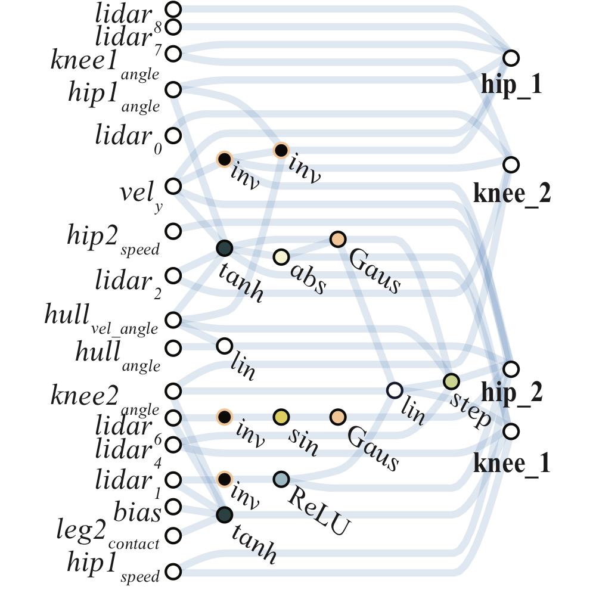
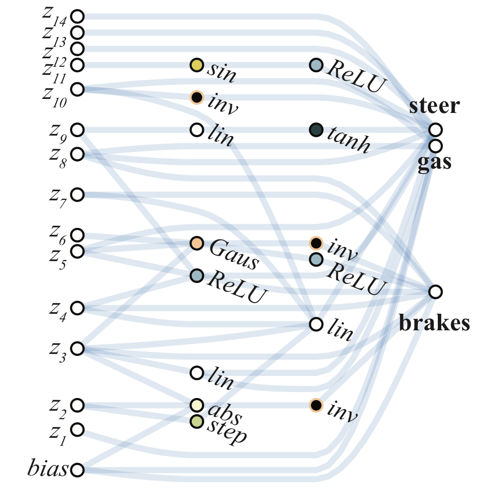
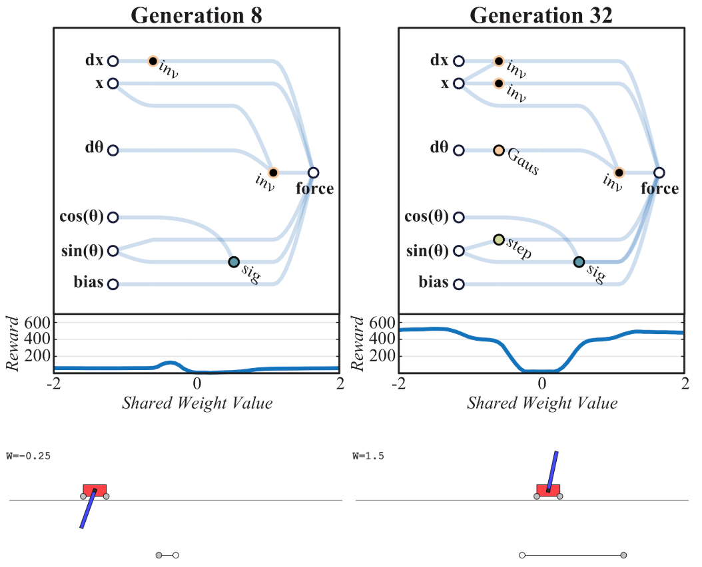
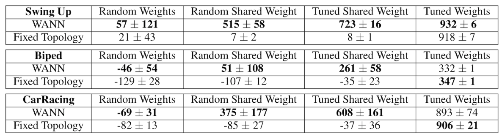

# 权重无关神经网络

**Weight Agnostic Neural Networks, WANNs**

## 摘要

神经网络架构并非生来平等，对于特定任务，某些架构的性能要好于其他。

但是，与神经网络的结构相比，神经网络的权重参数有多重要？  
在这项工作中，我们好奇在不学习任何权重参数的情况下，仅神经网络体系结构可以在多大程度上编码给定任务的解决方案。

我们为神经网络架构提出了一种搜索方法，该方法无需任何明确的权重训练就可以执行任务。  
为了评估这些网络，我们使用从均匀随机分布中采样的单个共享权重参数填充连接，并测量预期的性能。我们证明了我们的方法可以找到最小的神经网络架构，该架构可以执行多个强化学习任务而无需繁重训练。

在有监督的学习领域，我们发现使用随机权重实现的网络架构比 MNIST 的机会准确性要高得多。

## 预备知识

* 神经网络架构搜索（Neural Architecture Search, NAS）<!-- .element: class="fragment" data-fragment-index="1" -->
* 强化学习（Reinforcement Learning）<!-- .element: class="fragment" data-fragment-index="2" -->

### 强化学习的例子

**两足步行者（BipedalWalker-v2）**

  

  

  

    <video
      type="video/mp4"
      autoplay muted data-autoplay loop
      src="https://storage.googleapis.com/quickdraw-models/sketchRNN/wann/mp4/square_biped.mp4"
    ></video>
  

**赛车（CarRacing-v0）**

  

  

  

    <video
      type="video/mp4"
      autoplay muted data-autoplay loop
      src="https://storage.googleapis.com/quickdraw-models/sketchRNN/wann/mp4/square_racer.mp4"
    ></video>
  

**小车撑杆（CartPoleSwingUp）**

## 背景

* 早生物种（Precocial Species）
* 随机初始化权重的 CNN 和 LSTM

Q：归纳偏置可以有多强？

A：强到无需训练权重，架构本身就可以解决问题。<!-- .element: class="fragment" data-fragment-index="1" -->

搜索出一个网络架构，对于几乎任何网络权重，都有较好的表现。

## WANN 的搜索

### WANN 搜索算法

1. 初始化出一些最基本的神经网络拓扑结构；
2. **对每个拓扑结构赋予一个不同的权重做为共享权重；**
3. 按网络的连结数（等价于 L2）、平均表现、极端表现排序；
4. 对效果最好的网络，按简化的 **NEAT 进化算法** 得到下一代结构；
5. 回到第 2 步。

### NEAT 进化算法

三种操作：

1. 在已有边的中间添加结节并随机分配激活函数；
2. 添加边；
3. 随机选一个激活函数进行切换。

可选的激活函数：linear, step, sin, cosine, Gaussian, tanh, sigmoid, inverse, abs, ReLU

## 效果对比

## 总结

1. WANN 具有不同于 NAS 的意义，NAS 仍认为架构只是载体，权重才是解决方案；<!-- .element: class="fragment" data-fragment-index="1" -->
2. 摆脱了传统神经网络对梯度下降算法的依赖，可用于不好求梯度的领域，如离散的问题；<!-- .element: class="fragment" data-fragment-index="2" -->
3. 因为有对网络复杂度的惩罚项，搜到的结构较好，具有一定的可解释性；<!-- .element: class="fragment" data-fragment-index="3" -->
4. 不用训练或者只用很少的训练，可在类似任务上搜索得到网络结构，然后用于 few-shots 任务；<!-- .element: class="fragment" data-fragment-index="4" -->
5. 效果还是比不过 CNN。<!-- .element: class="fragment" data-fragment-index="5" -->

## 感想

1. 从[效果的对比](#/4)来看，引入了无关的偏置：共享权重。作者介绍是因为高维里不好给权重采样，所以使用了共享权重，但我并不明白为何高维空间不好采样；而普通 NAS 使用共享权重是出于性能考虑；

2. 把[神经网络](#/1/3)看作一个函数，则连结数就是激活函数的系数，权重就是激活函数的水平挤压率。因此 WANN 实质上是搜索出了一个几乎无视水平挤压的函数，但这特性对实际问题并无直接帮助，不知与普通的 NAS 方法相比如何？

3. 权重无关之后，函数的效果主要依赖于激活函数的组合，不知道现有激活函数能否覆盖所有场景。

4. 权重无关的实质是用架构统一了架构与权重的表达，可能类似用数组模拟自然数，似乎并无实用价值。

## References

* 浏览原文的交互式版本 [https://weightagnostic.github.io/](https://weightagnostic.github.io/)
