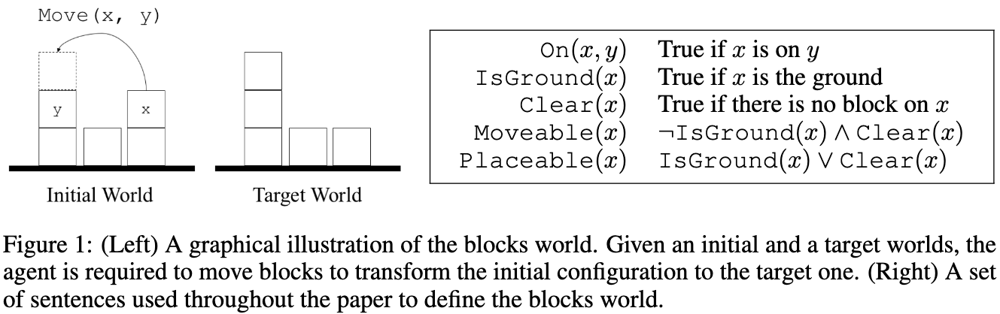
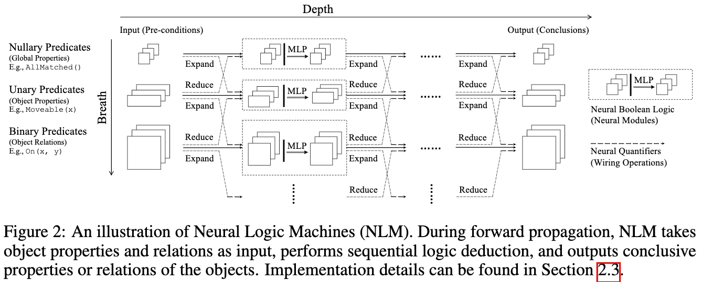
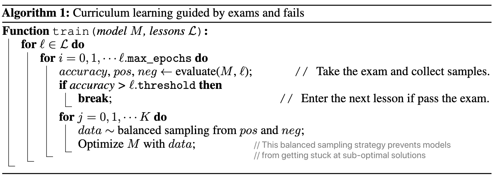

# 《神经逻辑机》

## Four Challenges in the Blocks World Problem

1. Recover a set of lifted rules and generalize to worlds with more blocks;
2. Deal with high-order relational data and quantifiers;
3. Scale up w.r.t. the complexity of the rules;
   * Complexity: O(m^B * D * C^2)
   * Parameters: O(D * C^2)
4. Recover rules based on a minimal set of learning priors.

## Neural Logic Machines

* Logic Predicates as Tensors
* Logic Rules as Neural Operators
  + Boolean Logic Rules: AND, OR, NOT
  + Quantifications: \any, \exists
    - Expansion
    - Reduction

## Curriculum Learning Guided by Exams and Fails

## Pros & Cons

* With polynomial complexity and parameter size NLMs can deal with more complex task which requires using a large number of intermediate predicates.
* NLMs are general neural architectures for learning lifted rules from only input-output pairs without pre-designed rules nor knowledge base.
* The scalability of NLMs to large entity sets in systems of KB reasoning is left as future work.
* NLMs can be plugged into existing convolutional or recurrent neural architectures for logic reasoning.

## 未来方向

1. Adaptively select the right maximum depth for novel problems;
2. Handle vector inputs, not only symbolic inputs;
3. Optimize the training to be effective and simple;
4. Extract human-readable rules from weights.
