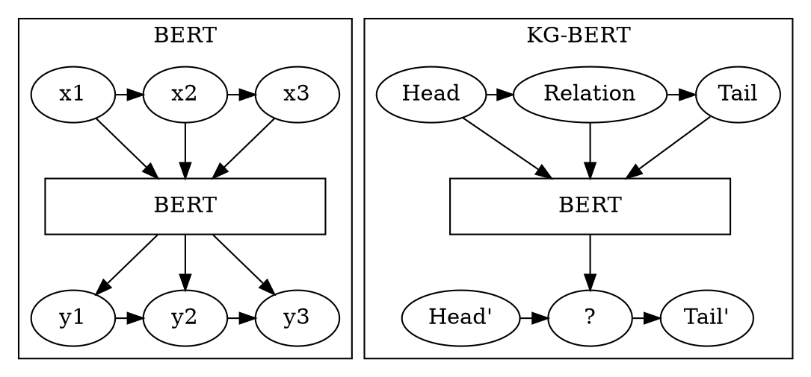

# KG-BERT

```dot
strict digraph {
    layout=dot;
    subgraph cluster_bert {
        label="BERT";
        rankdir=BT;
        BERT [shape=box, width=2.5];
        {
            rank=same;
            x1 -> x2 -> x3;
        } -> BERT -> {
            rank=same;
            y1 -> y2 -> y3;
        }
    }
    subgraph cluster_kgbert {
        label="KG-BERT";
        rankdir=BT;
        BERT2 [shape=box, width=2.5, label="BERT"];
        {
            rank=same;
            Head -> Relation -> Tail;
        } -> BERT2;
        {
            rank=same;
            "Head'" -> "?" -> "Tail'";
        }
        BERT2 -> "?";
    }
}
```
