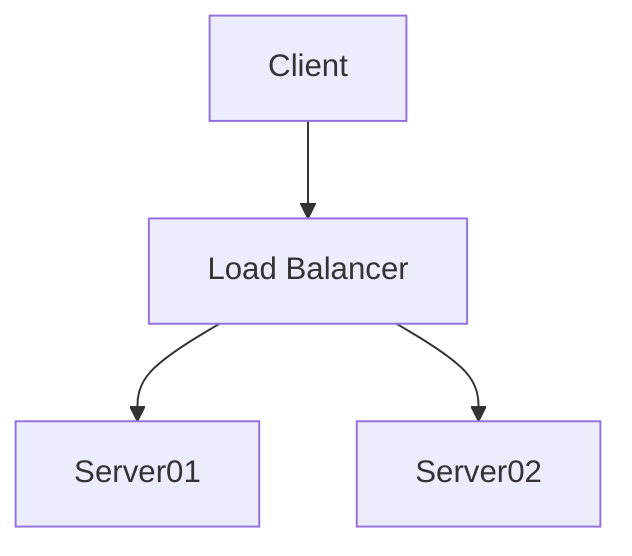
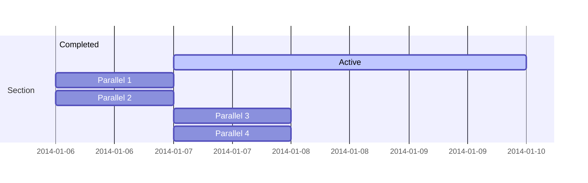

# Data Conversion

## Echarts

<div class="cols">

<div>

You may convert your data into interactive charts by embedding it in a 'echarts' code block like this:

    ```echarts
    Marketing Funnel:Display>Click>Visit>Consult>Order
    ```
Then chart is generated as the right is.

</div>

<div>

```echarts
Marketing Funnel:Display>Click>Visit>Consult>Order
```

By clicking the bottom-right icon you may view the original data we just put in the code block.

</div>


There are five forms of data we may convert to charts:

1. Pyramid
2. Points
3. Table
4. Tree
5. Graph

### 1. Pyramid

With just one line we can generate a funnel chart or a pyramid chart:

<div class="cols">

```echarts
Marketing Funnel:Display>Click>Visit>Consult>Order
```

```echarts
Maslow's Hierarchy of Needs:Self-actualization<Esteem<Love and belonging<Safety needs<Physiological needs
```

</div>

Click the bottom-right icon (it's called DataView) to see the original data.

### 2. Points

```echarts
:x,y
28604,77
31163,77.4
1516,68
13670,74.7
28666,78.1
1777,57.7
29550,79.1

2076,67.9
12087,72
24021,75.4
43296,76.8
10670,67.3
26424,75.7
37062,75.4
```

It is easy to draw some points by supplying the 2-tuple coordinates.


You can also generate something much more complex with size and label extended.

```echarts
Life Expectancy and GDP at 1990 ~ 2000:GDP,Average Life,Population,Country
1990
28604,77,17096869,Australia
31163,77.4,27662440,Canada
1516,68,1154605773,China
13670,74.7,10582082,Cuba
28599,75,4986705,Finland
29476,77.1,56943299,France
1995
31476,75.4,78958237,Germany
28666,78.1,254830,Iceland
1777,57.7,870601776,India
29550,79.1,122249285,Japan
2076,67.9,20194354,North Korea
12087,72,42972254,South Korea
24021,75.4,3397534,New Zealand
2000
43296,76.8,4240375,Norway
10088,70.8,38195258,Poland
19349,69.6,147568552,Russia
10670,67.3,53994605,Turkey
26424,75.7,57110117,United Kingdom
37062,75.4,252847810,United States
```

### 3. Table

Tabled data are easy to be understand, even in plain text.

They can be converted into three kinds of chart:

1. Barline.
2. Radar.
3. Parallel.

#### 3.1 Barline


```echarts
Weekday\Request\Request Trend by Channels:Mail,Moba,Vedio Ads,Direct,Search Engine
Sunday,210,310,410,320,1320
Monday,120,220,150,320,820
Tuesday,132,182,232,332,932
Wednesday,101,191,201,301,901
Thursday,134,234,154,334,934
Friday,90,290,190,390,1290
Saturday,230,330,330,330,1330
```

Click DataView. I hope the headcell `[xAxis]\[yAxis]\[title]` can remind you of the top-left corner of tables which you might always see in daily life.


```echarts
Weekday\Request\Request Trend by Channels:-Mail+-Moba+-Vedio Ads+-Direct,.Search Engine
Sunday,210,310,410,320,1320
Monday,120,220,150,320,820
Tuesday,132,182,232,332,932
Wednesday,101,191,201,301,901
Thursday,134,234,154,334,934
Friday,90,290,190,390,1290
Saturday,230,330,330,330,1330
```

Besides bars, you may represent your data in lines and scatters.  
And you may stack some of them together.


```echarts
Weekday\Request|Request2\Request Trend by Channels:Mail,Moba+Vedio Ads|-Direct,-Search Engine
Sunday,210,310,410,320,1320
Monday,120,220,150,320,820
Tuesday,132,182,232,332,932
Wednesday,101,191,201,301,901
Thursday,134,234,154,334,934
Friday,90,290,190,390,1290
Saturday,230,330,330,330,1330
```

Involving different kinds of series, it is common to have some of them much larger or smaller than others. In this situation you may add another yAxis with a simple `'|'`.


#### 3.2 Radar and Parallel


```echarts
*\\Air Quality:Beijing,Shanghai,Guangzhou,Shenzhen,Hangzhou,Chengdu,Wuhan
AQI,55,25,56,33,82,42,74
PM2.5,9,11,7,7,58,24,49
PM10,56,21,63,29,90,44,77
CO,0.46,0.65,0.3,0.33,1.77,0.76,1.46
NO2,18,34,14,16,68,40,48
SO2,6,9,5,6,33,16,27
```

Sometimes what is layed on xAxis are meaningless to compare with each other that you can only put a `'*'` to sum them up. What's more, `'*'` looks like a radar.


```echarts
*\\Air Quality:Beijing,Shanghai,Guangzhou,Shenzhen,Hangzhou,Chengdu,Wuhan
AQI,55,25,56,33,82,42,74
PM2.5,9,11,7,7,58,24,49
PM10,56,21,63,29,90,44,77
CO,0.46,0.65,0.3,0.33,1.77,0.76,1.46
NO2,18,34,14,16,68,40,48
SO2,6,9,5,6,33,16,27
Level,Good,Excellent,Good,Bad,Medium,Bad,Medium
```

After adding a new row called `'level'` with non-numeric data, radar is not suitable anymore. But a chart with parallel axis is.

### 4. Tree

A data in tree is nothing more than indentations:

    ```echarts
    Request Trend by Channels
     Direct:335
     *Mail:310
     Moba:274
     *Vedio Ads:85
     Search Engine:400
    ```

See what it will become.


<div class="cols">

```echarts
Request Trend by Channels
 Direct:335
 *Mail:310
 Moba:274
 *Vedio Ads:85
 Search Engine:400
```

A tree with only two levels is converted into a  pie chart, with root being used as title.

</div>


<div class="cols">

```echarts
WORLD COFFEE RESEARCH SENSORY LEXICON
    Flora:
        Black Tea: 1
        Floral: 
            Chamomile: 1
            Rose: 1
            Jasmine: 1
    *Fruity:
        Berry:
            Blackberry: 1
            Raspberry: 1
            Blueberry: 1
        Dried Fruit:
            Raisin: 1
            Prune: 1
        Citrus Fruit:
            *Grapefruit: 1
            Orange: 1
            Lime: 1
    Sour Fermented:
        *Sour:
            Sour Aromatics: 1
            Acetic Acid: 1
            Malic Acid: 1
        *Alcohol Fremented:
            Winey: 1
            Fremented: 1
            Overripe: 1
    Green Vegetative:
        Olive Oil: 1
        Raw: 1
        Green Vegetative:
            Dark Green: 1
            Vegetative: 1
            Herb-like: 1
    Other:
        Papery/Musty:
            Animalic: 1
            Meaty Brothy: 1
            Phenolic: 1
        Chemical:
            Medicinal: 1
            Skunky: 1
            Rubber: 1
    Roasted:
        Spices:
            Pungent: 1
            Pepper: 1
            Brown Spice:
                Nutmeg: 1
                Cinnamon: 1
                Clove: 1
        Nutty Cocoa:
            Nutty:
                Peanuts: 1
                Hazelnut: 1
                Almond: 1
            Cocoa:
                Chocolate: 1
                Dark Chocolate: 1
        Sweet:
            Brown Sugar:
                Maple Syrup: 1
                Caramelized: 1
                Honey: 1
            Vanilla: 1
            Vanillin: 1
            Overall Sweet: 1
            Sweet Aromatics: 1
```

A tree with more than two levels is converted into a nested pie chart, with root being used as title.

</div>


<div class="cols">

```echarts
WORLD COFFEE RESEARCH SENSORY LEXICON
    Flora: Comment Me!
        Black Tea
        Floral
            Chamomile
            Rose
            Jasmine
    *Fruity:测试
        Berry
            Blackberry
            Raspberry
            Blueberry
        Dried Fruit
            Raisin:这是什么？
            Prune
        Citrus Fruit
            *Grapefruit
            Orange
            Lime
    Sour Fermented
        *Sour
            Sour Aromatics
            Acetic Acid
            Malic Acid
        Alcohol Fremented
            Winey
            Fremented
            Overripe
    Green Vegetative
        *Olive Oil
        *Raw
        Green Vegetative
            Dark Green
            Vegetative
            Herb-like
    Other
        Papery/Musty
            Animalic
            Meaty Brothy
            Phenolic
        Chemical
            Medicinal
            Skunky
            Rubber
```

With any value that is not numeric, a data is converted into a tree.

</div>

### Graph

<div class="cols">

```graph
node1 -> node2 [10]
node1 -> node3 [20]
node1 -> node4 [1]
node2 -> node4 [1]
```
 
    ```echarts
    node1:10,20,node4
    node2:node4
    node3:
    node4:
    ```

</div>

A graph of the left one may be represented in an adjacency matrix of upper triangle like the right one.

### TODO: Graph

But data representing a graph is always not so readable in plaintext as a table.

And I hope to create a tool only for readable data.

So it is time to check out mermaid now.

## mermaid

Mermaid is used to generate diagrams, charts, graphs or flows from markdown-like text. 
### Flow

<div class="cols">

    ```mermaid
    graph TD
    A[Client] --> B[Load Balancer]
    B --> C[Server01]
    B --> D[Server02]
    ```



</div>


### Gantt



    ```mermaid
    gantt
    section Section
    Completed :done,    des1, 2014-01-06,2014-01-08
    Active        :active,  des2, 2014-01-07, 3d
    Parallel 1   :         des3, after des1, 1d
    Parallel 2   :         des4, after des1, 1d
    Parallel 3   :         des5, after des3, 1d
    Parallel 4   :         des6, after des4, 1d
    ```

### More

Visit [https://mermaid-js.github.io/](https://mermaid-js.github.io/).
