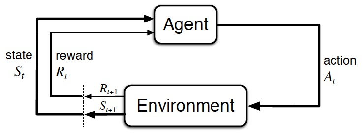
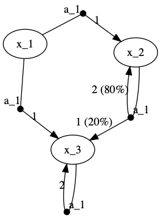
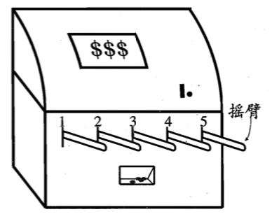
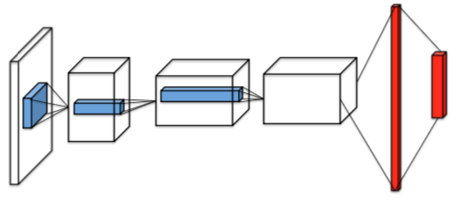
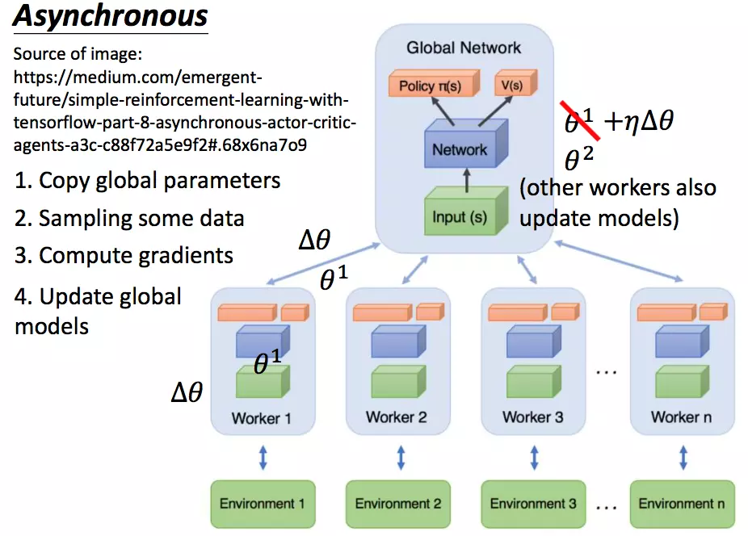
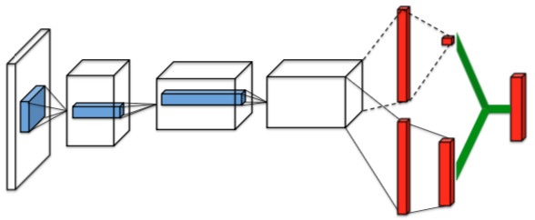
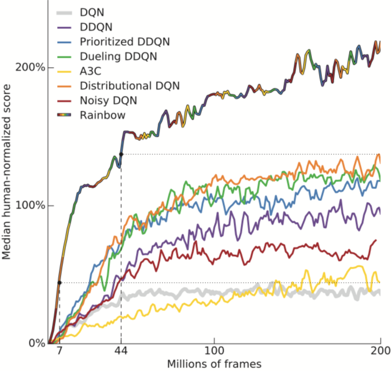

# 深度强化学习

## 强化学习（Reinforcement Learning）

智能体（Agent）按策略 $\pi$ 与环境 E = (S, A, P, R) 不断交互并更新策略，使得累计回报 G 的期望 $E_{\tau}(G)$ 最大。

### 步（Step）与轨迹（Trajectory）

根据当前状态 $s \in S$ 执行动作 $a \in A$ 后，获得由函>数 R 决定的回报 r 并以概率 P 转移到下一个状态 $s' \in S$，此为一步 (s, a, r, s')。连续的>若干步 $<s_0, a_0, r_1, s_1, a_1, r_2, \cdots, s_{T-1}, a_{T-1}, r_T, s_T>$ 称为轨迹，记>为 $\tau$。

### E: 环境（Environment）

通常以马尔可夫决策过程（Markov Decision Process, MDP。将动作和回报考虑在内>的马尔科夫过程）表示。如：

| (state, action) \ (P, R) \ next_state | x_1 | x_2      | x_3      |
|---------------------------------------|-----|----------|----------|
| (x_1, a_1)                            |     | (1, 1)   |          |
| (x_1, a_2)                            |     |          | (1, 1)   |
| (x_2, a_3)                            |     | (0.8, 2) | (0.2, 1) |
| (x_3, a_1)                            |     |          | (1, 2)   |

### E = (S, A, P, R)

* S: 状态空间（State）
  * 回合式任务（Episodic Task）：存在终止状态（Terminal State）的任务。从开始到终止的一轮交互称为一个回合（Episode）。如下棋。
  * 持续式任务（Continuing Task）：如无人驾驶。
* A: 动作空间（Action）
* P: 转移概率（Probability） $S \times A \times S \rightarrow [0, 1]$
* R: 回报函数（Reward） $S \times A \times S \rightarrow [R_{\min}, R_{\max}]$

### $\pi$: 动作的策略（Policy）

1. 确定性策略（Deterministic Policy） $S \rightarrow A$
2. 随机性策略（Stochastic Policy） $S \times A \rightarrow [0, 1]$

### 策略之外的探索

$\epsilon$-贪心：以概率 $\epsilon$ 随机探索，否则按当前策略执行已知的最优动作。

### G: 累计回报（Gain）

这里采用 $\gamma$-折扣累计回报：$$G_{\gamma}(t_0) = \sum\limits_{t=0}^{+\infty} \gamma^t r_{t_0+t} = r_{t_0} + \gamma G_{\gamma}(t_0 + 1)$$
其中 $\gamma$ 称为折扣率

## 深度 Q 网络（DQN）

> Mnih et al. CoRR 2013. Playing atari with deep reinforcement learning.

定义动作值函数 $Q = E(G | s, a)$  
基于此可得最优策略 $\pi(s) = \mathop{\arg\max}\limits_{a \in A} Q(s, a)$

学习 Q 函数的目标是使损失函数 $E[(G - Q)^2 | s, a]$ 最小
如果用神经网络 $Q_{\phi}$ 近似 Q，其权重为 $\phi$，损失函数的梯度就是 $-E(G - Q_{\phi} | s, a) \cdot \frac{\partial{Q_{\phi}}}{\partial{\phi}}$

由当前步的交互已知 $<s, a, r, s'>$，由 s' 按策略又可确定下一步动作 $a' = \pi(s') = \mathop{\arg\max}\limits_{a' \in A} Q(s', a')$  
故 $EG = r + \gamma E(G | s')$  
$= r + \gamma Q(s', \mathop{\arg\max}\limits_{a' \in A} Q(s', a')) = r + \gamma \max\limits_{a' \in A} Q(s', a')$

记 $\delta(s, a) = E[G - Q_{\phi}(s, a) | s, a]$  
$\approx r + \gamma \max\limits_{a' \in A} Q_{\phi}(s', a') - Q_{\phi}(s, a)$

则随机梯度下降法中每一步的权重增量为 $\Delta \phi = \alpha \cdot \delta(s, a) \cdot \frac{\partial{Q_{\phi}(s, a)}}{\partial{\phi}}$

### DQN 算法

1. 执行带探索的策略 $a = \pi(s)$ 得 $<s, a, r, s'>$
2. 计算 $\delta = r + \gamma \max\limits_{a' \in A} Q_{\phi}(s', a') - Q_{\phi}(s, a)$
3. 更新网络参数 $\phi \mathrel{+}= \alpha \delta(s, a) \frac{\partial{Q_{\phi}(s, a)}}{\partial{\phi}}$
4. 更新策略 $\pi(s) = \mathop{\arg\max}\limits_{a \in A} Q(s, a)$

### 端到端架构

### DQN 使用的两个重要技巧

> Mnih et al. Nature 2015. Human-level control through deep reinforcement learning.

1. Freeze Target Network：Q 在尤其一开始的时候很不稳定，所以实际是用冻结的 Q 估计 G；
2. Experience Replay：动一步，反思 n 步。提高数据利用率并并降低数据关联性。

### 对比回顾 Q-learning

* DQN: $\phi \mathrel{+}= \alpha [r + \gamma \max\limits_{a' \in A} Q_{\phi}(s', a') - Q_{\phi}(s, a)] \cdot \frac{\partial{Q_{\phi}(s, a)}}{\partial{\phi}}$
* Q-learning: $Q(s, a) \mathrel{+}= \alpha [r + \gamma \max\limits_{a' \in A} Q(s', a') - Q(s, a)]$

## Actor-Critic 算法（AC）

使用值函数近似解决了连续状态空间的问题，同样地为了解决连续动作空间的问题，可以用神经网络近似 $\pi$，其参数为 $\theta$ 并假设 DQN 估算的 $Q_{\phi}(s, a)$ 与 $\theta$ 无关，下面推导期望回报的梯度：

$\frac{\partial{EG}}{\partial{\theta}}
= \frac{\partial{E_{s \sim s_0} E_{a \sim \pi_{\theta}(s)} G}}{\partial{\theta}}
= \frac{\partial{E_{s \sim s_0} E_{a \sim \pi_{\theta}(s)} [G - Q_{\phi}(s, a)]}}{\partial{\theta}}$

$\approx \frac{\partial{E_{s \sim s_0} E_{a \sim \pi_{\theta}(s)} \delta(s, a)}}{\partial{\theta}}
= E_{s \sim s_0}\int \frac{\partial{\pi(a | s)}}{\partial{\theta}} \delta(s, a) da$

$= E_{s \sim s_0}\int \pi(s | a) \frac{\partial{\log\pi(a | s)}}{\partial{\theta}} \delta(s, a) da$

$= E_{s \sim s_0} E_{a \sim \pi_{\theta}(s)}[\frac{\partial{\log\pi(a | s)}}{\partial{\theta}} \delta(s, a)]$

按梯度上升方向更新策略就能使期望回报更高。

### AC 算法：

1. 执行带探索的策略 $a = \pi(s)$ 得 $<s, a, r, s'>$
2. 计算 $\delta = r + \gamma \max\limits_{a' \in A} Q_{\phi}(s', a') - Q_{\phi}(s, a)$
3. 更新 Critic 网络参数 $\phi \mathrel{+}= \alpha \delta(s, a) \frac{\partial{Q_{\phi}(s, a)}}{\partial{\phi}}$
4. 更新 Actor 网络参数 $\theta \mathrel{+}= \beta \delta(s, a) \frac{\partial{\log \pi_{\theta}(s, a)}}{\partial{\theta}}$

### Deep Deterministic Policy Gradient (DDPG)

> Timothy et al. ICLR 2016. Continuous control with deep reinforcement learning.

DDPG = AC + Freeze Target Network + Experience Replay

### Asynchronous Advantage Actor-Critic (A3C)

> Mnih et al. ICML 2016. Asynchronous methods for deep reinforcement learning.

#### Asynchronous

<!-- .element style="width: 80%" -->

#### Advantage

优势函数：A(s, a) = Q(s, a) - V(s) = E(G | s, a) - E(G | s)

策略梯度：$\frac{\partial{EG}}{\partial{\theta}}
= E_{s \sim s_0} E_{a \sim \pi_{\theta}(s)}[\frac{\partial{\log\pi(a | s)}}{\partial{\theta}} A(s, a)]$

**Dueling Network**

> Wang et al. ICML 2016. Dueling network architectures for deep reinforcement learning.

#### n-step

* 1-step: $\delta = r + \gamma \max\limits_{a' \in A} Q_{\phi}(s', a') - Q_{\phi}(s, a)$
* n-step: $\delta = \sum\limits_{t=0}^{n-1} \gamma^t r + \gamma^n \max\limits_{a^{(n)} \in A} Q_{\phi}(s^{(n)}, a^{(n)}) - Q_{\phi}(s, a)$

## 其它改进

### Double Q-learning

> van Hasselt, H. NIPS 2010. Double Q-learning.  
> van Hasselt et al. AAAI 2016. Deep reinforcement learning with double Q-learning.

解藕选择与评估，降低最大化偏差

* Single Q: $Q(s, a) \mathrel{+}= \alpha [r + \gamma Q(s', \mathop{\arg\max}\limits_{a \in A} Q(s', a)) - Q(s, a)]$
* Double Q: $Q_i(s, a) \mathrel{+}= \alpha [r + \gamma Q_{1-i}(s', \mathop{\arg\max}\limits_{a \in A} Q_i(s', a)) - Q_i(s, a)]$ $i \in \{0, 1\}$

### Prioritized Replay

> Schaul et al. ICLR 2015. Prioritized experience replay.

改进数据效率：使用优先队列，经验的回放概率正比于误差 $$(|\delta| + e)^a, a \in [0, 1]$$
e, a 的作用分别是提升小误差样本和抑制大误差样本，使取样不极端。

### Distributional Q-learning

> Bellemare et al. ICML 2017. A distributional perspective on reinforcement learning.

* $E[(G - Q)^2 | s, a]$
* $D_{\text{KL}}(Q \| G | s, a)$

### Noisy DQN

> Fortunato et al. CoRR 2017. Noisy networks for exploration.

* Policy Net: $ a = \phi (s, 1) $
* Noisy Policy Net: $ a = \phi \odot \epsilon (s, 1), \epsilon \sim N(0, 1) $

## Rainbow

> Matteo et al. AAAI 2018. Rainbow: Combining Improvements in Deep Reinforcement Learning.

<!-- .element style="width: 60%" -->

## 逆强化学习用于预测
