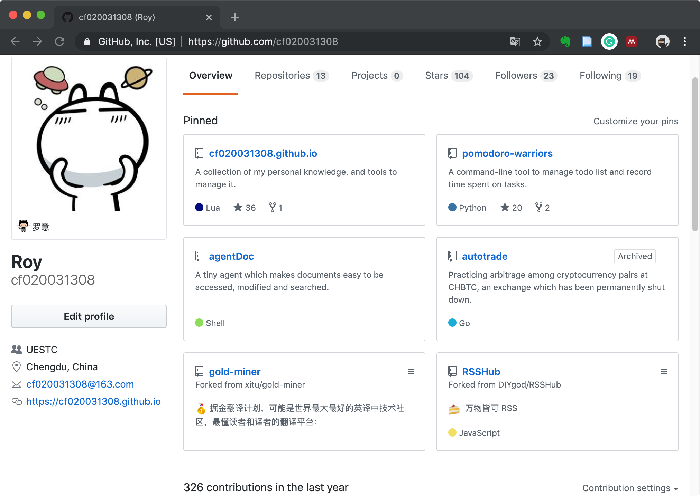
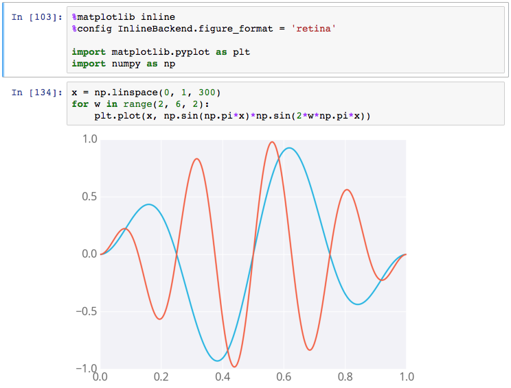

# Python on Linux


## About me

[](https://github.com/cf020031308)


## Q &


## Python


### Why Python

* Easy to Learn
* Useful
* Huge Amount of Wheels
  1. Built-in Features
  2. Built-in Libraries
     + [devdocs.io](https://devdocs.io/python~3.6/) 
     + (*) IPython + help
  3. 3rd Party Libraries
     + (!) pip3 search
     + Search via Github


### IPython

Jupytor Notebook

[](https://github.com/bokeh/bokeh-notebooks/blob/master/tutorial/06%20-%20Linking%20and%20Interactions.ipynb)


### Built-in Features


#### Data Type and Conversion

| type    | description           | example              |
|---------|-----------------------|----------------------|
| bool    | boolean               | False                |
| int     | integer               | 117                  |
| float   | floating point number | 1.78                 |
| complex | complex number        | 0.5 + 2.0j           |
| str     | string                | 'abc'                |
| tuple   | tuple                 | (1, 'hmm', 2.0)      |
| list    | list                  | [1, 'hmm', 2.0]      |
| dict    | dictionary            | {'a': 7.0, 23: True} |


#### Loop: For and While

```python
for i in range(10, 8, -1):
    pass

for el in lst:
    continue

for k, v in dct.items():
    break

while 1:
    pass
```


#### Function

```python
def func(foo):
    print('hello world')
    return 'bar'
```


#### ~The Construction of List and Dict~

```python
dct = {'x': 'a', 'y': 'b'}
[k + ':' + v for k, v in dct.items()]
{v: k for k, v in dct.items()}
```


#### ~The Missing Else~

```python
def print_first_one_larger_than(lst, n):
    for i in lst:
        if i > n:
            print(i)
            break
    else:
        print('None')

print_num_larger_than(range(10), 5)
print_num_larger_than(range(10), 15)
```


#### ~Class~

```python
class A:
    b = 3

    def __init__(self, a):
        self.a = a

    def printa(self):
        print(self.a)

    @classmethod
    def printb(cls):
        print(cls.b)

    @staticmethod
    def printc():
        print('c')
```


#### ~Decorator: Functional Programming~


```python
def f(x):
    print(x)

def deco(func):
    return lambda x: func(x + 1)

g = deco(f)

@deco
def h(x):
    print(2 * x)
```


#### I/O

1. From User: input
2. From Files: open, read, write, close
3. From Internet: ~urllib~, requests


## Vim


### Why Vim

1. Easy to get
2. Powerful
3. ~Design It Yourself~
4. ~Lots of Plugins~


### Learn Vim the Hard Way


#### 1. Learn it once in a while like you didn't.


#### 2. Use it before you master it.

* Modes: i, ESC
  + :w, :q, :q!
* Navigate: ~hjkl, c-f, c-b~
* Undo & Redo: u, c-r
* Cut & Paste: dd, p


#### 3. Know what you don't so you can search for it.


* Navigate like an expert
  + gg, G, 15G
  + H, M, L
  + zz, z-, zEnter
  + Ww, Bb, Ee
  + Ff, Tt
  + ^, `$`
  + A, I
  + %
  + #, *


* Edit like an expert
  + cdy: change/delete/yank
    - cw, dw, yw
    - dj, 3dd, d15G
  + v, C-v
    - I, `$A`
  + `<<, >>` tab & untab


* Reply like an expert
  + ;, .
  + qa, q, @a, 8@a


* Even an expert is afraid of sed
  + `:s/x/y/`
  + man sed & curl cheat.sh/sed
  + `:%s text rpl gc`


#### Vim Challenge

```
type	description	example
bool	boolean	False
int	integer	117
float	floating point number	1.78
complex	complex number	0.5 + 2.0j
str	string	'abc'
tuple	tuple	(1, 'hmm', 2.0)
list	list	[1, 'hmm', 2.0]
dict	dictionary	{'a': 7.0, 23: True}
```


## Q & A


## [Comments](https://github.com/cf020031308/cf020031308.github.io/issues/30)
