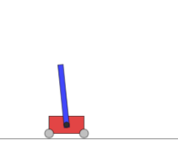
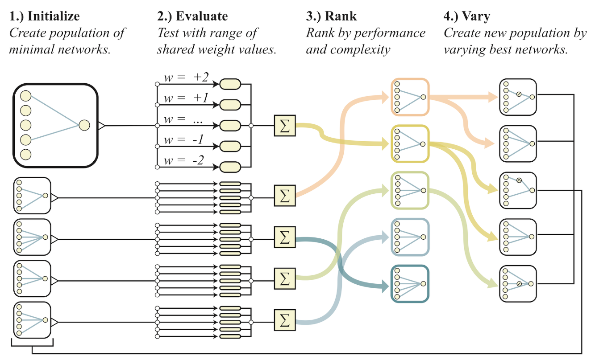
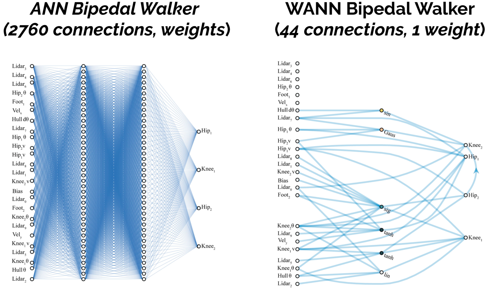

### Weight Agnostic Neural Networks

Luo Yi  
Dec. 12, 2019
<!-- .element style="text-align: right" -->


## Pros & Cons of WANNs


**Experiments with Reinforcement Learning Tasks**

<div class="cols">

<div class="fragment" data-fragment-index="1" style="width: 300px">



1. Swing Up

</div>

<div class="fragment" data-fragment-index="2" style="width: 200px">
<video
  type="video/mp4"
  autoplay muted data-autoplay loop
  src="https://storage.googleapis.com/quickdraw-models/sketchRNN/wann/mp4/square_biped.mp4"
></video>

2. Biped

</div>

<div class="fragment" data-fragment-index="3" style="width: 200px">
<video
  type="video/mp4"
  autoplay muted data-autoplay loop
  src="https://storage.googleapis.com/quickdraw-models/sketchRNN/wann/mp4/square_racer.mp4"
></video>

3. CarRacing

</div>

</div>


**Performance Along with Fixed Topology**


<div class="cols">


```echarts
Weights\score\Swing Up:WANN,Fixed Topology
Random,57,21
Random Shared,515,7
Tuned Shared,723,8
Tuned,932,918
```

</div>


<div class="cols">

<div><video
  type="video/mp4"
  autoplay muted data-autoplay loop
  src="https://storage.googleapis.com/quickdraw-models/sketchRNN/wann/mp4/square_biped.mp4"
></video></div>

```echarts
Weights\score\Biped:WANN,Fixed Topology
Random,-46,-129
Random Shared,51,-107
Tuned Shared,261,-35
Tuned,332,347
```
</div>


<div class="cols">

<div><video
  type="video/mp4"
  autoplay muted data-autoplay loop
  src="https://storage.googleapis.com/quickdraw-models/sketchRNN/wann/mp4/square_racer.mp4"
></video></div>

```echarts
Weights\score\CarRacing:WANN,Fixed Topology
Random,-69,-82
Random Shared,375,-85
Tuned Shared,608,-37
Tuned,893,906
```

</div>


Why?


WANNs' weights are trained to be so.




* Without training,<span class="fragment" data-fragment-index="1"> it can do.</span>
* With little training,<span class="fragment" data-fragment-index="2"> it's near optimal.</span>


**Parameters and HyperParameters**




But it is unfair.<!-- .element class="fragment" data-fragment-index="1" -->


WANNs' architectures are shrunk to be so.


Can WANN beat NAS? 
<span class="fragment" data-fragment-index="1">I wonder.</span>
