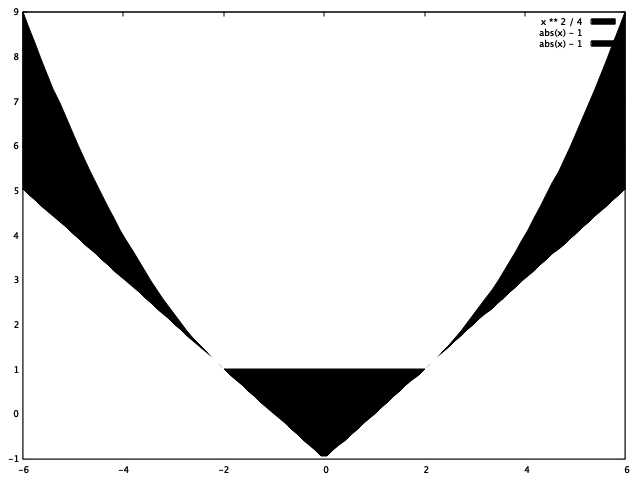

# 时间序列分析第三次作业

## 1. 证明函数 $h_t^{(j)} = t^j z^{-t}, j = 0, 1, \cdots, k-1$ 是差分方程 $(1 - z^{-1} B)^k h_t = 0$ 的 k 个线性无关解。

首先，因为 t 的次数各不相同，所以 $h_t^{(j)}$ 是线性无关的。

下面用数学归纳法证明他们是该差分方程的解：

1. 当 k := 1 时，$(1 - z^{-1}B) z^{-t} = z^{-t} - z^{-1}Bz^{-t} = z^{-t} - z^{-1}z^{-t+1} = z^{-t} - z^{-t} = 0$ 成立；
2. 假设 k := k 时，$(1 - z^{-1} B)^k h_t^{(j)} = 0, j = 0, 1, \cdots, k-1$ 成立；
3. 则当 k := k + 1，$j = 0, 1, \cdots, k$ 时，$$\begin{aligned}
& (1 - z^{-1} B)^{k+1} h_t^{(j)} \\\\
=& (1 - z^{-1} B)^k (1 - z^{-1} B) t^j z^{-t} \\\\
=& (1 - z^{-1} B)^k [t^j z^{-t} - z^{-1} B(t^j z^{-t})] \\\\
=& (1 - z^{-1} B)^k [t^j z^{-t} - (t-1)^j z^{-t}] \\\\
=& (1 - z^{-1} B)^k [t^j - (t-1)^j] z^{-t} \\\\
=& (1 - z^{-1} B)^k P^{(k-1)}(t) z^{-t} \\\\
\end{aligned}$$ 其中 $P^{(k-1)}(t)$ 是 t 的 k-1 次多项式，也是 $h_t^{(j)}, j = 0, 1, \cdots, ..., k-1$ 的线性组合，于是由假设 (2) 知上式为 0，成立。

综上：$h_t^{(j)} = t^j z^{-t}, j = 0, 1, \cdots, k-1$ 是 $(1 - z^{-1} B)^k h_t = 0$ 的 k 个线性无关解。


## 2. 设 {$\epsilon_t$} 是正态白噪声 WN($\mu, \sigma^2$)，$X_t = \epsilon_t - 2 \epsilon_{t-1}$。证明存在正态白噪声{$\eta_t$} 使得 $X_t = \eta_t - 0.5 \eta_{t-1}, t \in Z$。

由
$$(1 - 0.5B) \eta_t = X_t = (1 - 2B) \epsilon_t$$
左边差分方程 $1 - 0.5 z = 0$ 的根为 z = 2 在单位圆外，且与右边差分方程没有公共根，于是知 {$\eta_t$} 是 {$\epsilon_t$} 的因果函数。且有
$$\eta_t = \frac{1 - 2B}{1 - 0.5B} \epsilon_t = (1 - 2B) [\sum\limits_{k=0}^{\infty} (0.5B)^k] \epsilon_t = \epsilon_t - \sum\limits_{k=1}^{\infty} \frac{3}{2^k} \cdot \epsilon_{t-k}$$
所以 {$\eta_t$} 可以看作一系列正态白噪声的平稳的线性组合，仍是正态白噪声。且这样的 {$\eta_t$} 满足
$$X_t = \eta_t - 0.5 \eta_{t-1}$$

## 3. 计算 ARMA(2, 2) 的因果域，平稳域、可逆域，并画出相应区域的图形。

ARMA(2, 2): $$(1 + \phi_1 B + \phi_2 B^2) X_t = (1 + \theta_1 B + \theta_2 B^2) \epsilon_t$$
自回归部分的差分方程 $$1 + \phi_1 z + \phi_2 z^2 = 0$$
根 $$z = |\frac{-\phi_1 \pm \sqrt{\phi_1^2 - 4\phi_2}}{2\phi_2}|$$

1. 当 $\phi_1^2 - 4\phi_2 < 0$ 时 $$\begin{aligned}
& |z| > 1 \\\\
\Leftrightarrow& 4\phi_2^2 < \phi_1^2 + |\phi_1^2 - 4\phi_2| = 4\phi_2 \\\\
\Leftrightarrow& 0 < \phi_2 < 1 \\\\
\end{aligned}$$ 有 $$\begin{cases}
\frac{\phi_1^2}{4} < \phi_2 < 1 \\\\
\phi_1 \in (-2, 2)
\end{cases}$$
2. 当 $\phi_1^2 - 4\phi_2 \ge 0$ 时 $$\begin{aligned}
& |z| > 1 \\\\
\Leftrightarrow& |2\phi_2| < | |\phi_1| - \sqrt{\phi_1^2 - 4\phi_2} | = \frac{|4\phi_2|}{|\phi_1| + \sqrt{\phi_1^2 - 4\phi_2}} \\\\
\Leftrightarrow& |\phi_1| + \sqrt{\phi_1^2 - 4\phi_2} < 2 \\\\
\Leftrightarrow& \phi_2 > |\phi_1| - 1
\end{aligned}$$ 有 $$\begin{cases}
|\phi_1| - 1 < \phi_2 \le \frac{\phi_1^2}{4} \\\\
\phi_1 \ne 2
\end{cases}$$

综上：AR(2) 或 ARMA(2, q) 的平稳域为 $$S_\Phi(2) = \\{(\phi_1, \phi_2): |\phi_1| - 1 < \phi_2 < \text{max}\\{\frac{\phi_1^2}{4}, 1 \\} \\}$$ 即下图黑色部分（横轴 $\phi_1$，纵轴 $\phi_2$）：



```gnuplot
plot [x=-6:6]\
x ** 2 / 4 with filledcurves above x fillcolor "black",\
abs(x) - 1 with filledcurves above x fillcolor "white", abs(x) - 1, \
abs(x) - 1 with filledcurves below y=1 fillcolor "black"
```

同理得 MA(2) 或 ARMA(p, 2) 的可逆域为 $$S_\Theta(2) = \\{(\theta_1, \theta_2): |\theta_1| - 1 < \theta_2 < \text{max}\\{\frac{\theta_1^2}{4}, 1 \\} \\}$$ 作图与上图相同（横轴 $\theta_1$，纵轴 $\theta_2$）

## 4. 求二阶差分方程 $(1 + B - 6B^2) X_t = \epsilon_t, t \in Z$ 的通解与平稳解。

因为特征多项式 $1 + z - 6z^2 = (1 + 3z)(1 - 2z)$ 的根为 z = -1/3 或 z = 1/2，所以通解为
$$ X_t = X_t^{(0)} + u_1 \cdot (-3)^t + u_2 \cdot 2^t$$
其中 $X_t^{(0)}$ 为特解。

因为两个根都在单位圆外，所以不存在平稳解。
