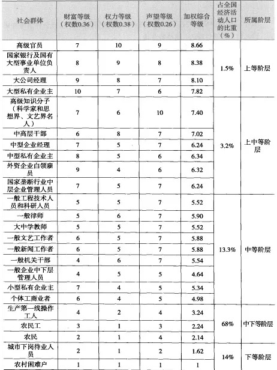

据最新发表在《国际心理健康与成瘾杂志》上的一项研究，自拍成瘾（即在手机上自拍的强迫性行为），已被证实是一种真正的精神障碍。 每天不停地自拍，且在社交媒体上晒照6次以上的，属于病入膏肓的慢性患者。
___
太古里旁边有大慈寺，是一千多年前唐僧出家的地方。
___
他找了北京回龙观医院的自杀研究者，研究表明，冲动型自杀的人想自杀的时间周期为13秒。「如果拖过了这13秒，他很可能就不会死。过了13秒，打死他也不会自杀。」
___
百草枯是一种极具革命性的农药。济南绿霸农药公司的经理张衡昌，学植物保护出身，研究的就是庄稼病虫害防治，他在《人物》记者的本子上细细画出了百草枯的分子结构，描述它是如何高效，如何环保——百草枯出现前，中国农民除草靠的是一把锄头、一双手。出现后，15块钱、600毫升的百草枯，1个小时喷1亩地，植物当场死亡，第二天可直接播种，极大解放了生产力。 百草枯的特性，还决定了它对环境友好。百草枯对植物有触杀作用，沾上百草枯，杂草迅速枯萎，但它遇到土壤立刻失活，因此不污染土地，反而因为植物的根留在了土里而保持了水土。 绿霸的董事长赵焱曾在一个论坛上抛出两个反问句：「哪家百草枯企业爆炸过？哪家草铵膦企业没爆炸过？」百草枯生产过程安全，是整个农药行业的共识。 百草枯大量应用的15年，正是中国国民经济结构转型的15年。农村大量青壮年劳动力进城，百草枯恰逢其时，免除了除草、耕地等繁重的体力劳动，使留守农村的老人、妇女的耕种成为可能。
___
他认为绝大多数的百草枯自杀者，都属于「一过性冲动」（一过性是指持续时间较短而消失）。「突然受到了很大的委屈，脑子里一片空白，我怎么去解决这个问题？不行干脆死了算了。一个矛盾无法解决，个别人会去攻击别人，但是绝大多数人，是消灭自己。」 精神医学界的研究者们也对人们自杀的原因孜孜以求。北京心理危机研究与干预中心发现，37％的人考虑自杀的时间不超过5分钟，60％的人考虑自杀的时间不超过2小时。人在极致绝望之时，他们靠近左眼上方的脑皮层和脑干部位，血清素系统会出现故障。血清素，专业名称为5-经色胺(5-HT)，这种调节人类情绪的神经传导物质，给人幸福感的物质，在那一刻失灵了。最后那个时刻，人们丢光了活着的理由。
___
文献综述通常有五种套路：

1. 把相同观点以及相互竞争的观点分别讨论
2. 叙述理论发展的历程(和线性时间不一定吻合)
3. 把观点按照主题分类
4. 以理论/经验/方法三个部分论述观点
5. 把理论从一般到特定来加以组织
___
本文主要从四个方面论述了文献综述高逼格之要义：

1. 引用要点  
   文献综述需要好的引用，从期刊、引用率、该领域核心作者三个方面来考量。  
   要与自己的研究有相关性，不能为了逼格而逼格。
2. 写作套路  
   在文中主要列举了 5 种方法，需要自行找论文对应理解。
3. 批判性思维  
   文献综述不要写成读书摘抄的拼凑，要体现出批判性思维。至于怎么体现，具体可以参考本文列出来的语句格式。值得注意的是，它们只是一个形式。核心还是需要你自己的「思考」与「批判」。
4. 创新点  
   需要论述一下你论文的原创贡献，通常是在文献综述结尾，（当然，不同学科情况不同，可以参考对应学科的大佬文献）。
___
框架效应的分类

1. 风险选择框架，当某一冒险行动的潜在结果用积极或消极的框架呈现时会产生不同的风险偏好，例如“亚洲疾病问题”。
2. 特性框架，它会影响对于事物特征的评价，当某一事物被置于积极框架下时，就会产生特性框架效应。一般而言，人们更喜爱用积极框架描述的事物。例如，将牛肉分别用７５％瘦肉和２５％肥肉来描述时，人们更喜爱有７５％瘦肉的牛肉（即用积极框架描述的牛肉）。
3. 目的框架，它会影响交流信息的说服力，个人为了达到自己的目的，而采用积极或消极框架，从而产生了目的框架效应。

研究表明，老年人更容易受到语言框架的影响，表现出比年轻人更强烈的框架效应。女性也更容易受到框架效应的影响。
___
1. 除了按照学科来分类知识外，按照思维模型来分类知识同样重要甚至更重要。因为思维模型是将不同学科连接起来的底层基础。
2. 大部分学习都是在学校之外完成的，在获得成功的过程中，自主学习能力是比成绩和学位更重要的因素。
3. 在当前的知识经济中，学习掌握了至少三个领域的知识并能将它们整合到一个技能组合中的现代型通才将会有更大的优势，这能够使他们成为自己所在领域中前1%的顶尖人才。
___
群体不善推理，却急于采取行动。
___
《重来》里有这样一段话让我印象深刻: “如果你要从一堆人中决定出一个职位的合适人选，雇那个写作最厉害的人。这个人不在乎是不是营销人员、推销员、设计师、程序员，无论是谁；他们的写作技巧会对此有益。 因为一个好的写手不单是有根好的笔杆子。清晰的写作体现其清晰的思路。优秀的写手懂得沟通。他们让事情易于理解。他们会站在别人的立场想事情。他们知道什么该省略。那是你在任何求职者中都想看到的品质。”
___
火车铁轨的间距是 1435 毫米，这一数值继承于电车车轨，而电车车轨复用了马车的轮距，马车则起始于罗马帝国的战车，战车的轮距取决于两马并驾时马屁股的距离，据说这个距离会继续被使用在航天火箭的推进器上。这就是路径依赖。
___
在做读书笔记时，不该以做出「全书内容梳理列表」为目的，而应该主要记录自己学到了什么。
___
读书不必读完。

读书要读完，是大多数人的执念。但如果不是为了丰富自己而读书，大可不必把书从头到尾地读完。 这与前面的选书理由也颇一致，作者写道： 閱讀商業書就像在挖掘鑽石，只要挖到鑽石，其他砂石都不重要。 而读一些技巧性更强的书（比如本书），则完全可以把它当成工具书去读。你想知道作者眼中选书的 11 个方法？直接跳到那个位置看就可以了。 一些书甚至可以翻了目录，知道里面大概内容之后就放下，等到用得到的时候再看不迟。
___
学习方法

1. 知识面覆盖
2. 快速反馈的练习
3. 自省：费曼技巧建立联系（类比、可视化、简化）
___
Learning comes from repetition, but books are long and verbose and not designed with this in mind.
___
Always reading books interactively with a pen to underline, mark, rephrase, annotate, question and summarize.
___
读书时要注重交互性，例如时常拿笔批注。

需要符号：
1. 五角星与下划线，要加入 anki 的材料
2. 雪花与下划线，用于总结的材料
3. X，标记打断，帮助下次快速开始，再阅读时打断处应连贯阅读
4. 下划线，其它

页旁批注
1. 圆圈，原文用自己语言重组
2. 惊叹号，想法
3. 问号，疑问。但不需立即开始思考，有可能后面会解答。在一本书看完后可以再花时间解决疑问。

每一章节后浏览笔记，总结大意。
看完后完整整理：总结，引用（含页码），想法，问题。

可以考虑实践在软件上，以不同颜色代替不同符号。
___
雪球速读法的核心思想就是： 利用极短的时间快速“看”完一本书，积累这本书的杂学资料库，然后再重复阅读一遍，这样又在短时间内积累了更多资料，然后再重复阅读，周而复始。
___
Long-term memory, the Bjorks said, can be characterized by two components, which they named retrieval strength and storage strength.  
One of the problems is that the amount of storage strength you gain from practice is inversely correlated with the current retrieval strength.
___
I find myself thinking of a checklist Wozniak wrote a few years ago describing how to become a genius. His advice was straightforward yet strangely terrible: You must clarify your goals, gain knowledge through spaced repetition, preserve health, work steadily, minimize stress, refuse interruption, and never resist sleep when tired. This should lead to radically improved intelligence and creativity. The only cost: turning your back on every convention of social life.
___
开发者在海外推广自己的产品，我认为以下几点比较重要：

* 软件内部对英文和其它语言的良好支持；
* 学会在各种新产品社区发布自己的产品，并通过邮件联系新闻媒体进行报导；
* 建立新用户邀请奖励以及社交网络分享机制，能够对产品首发后用户的自然增长带来良好的效应。

-- Knotes 专访
___
耶鲁大学的 Lisa Kahn 的研究表明，在一个人的职业生涯早期，劳动力市场的状况具有惊人的重要性。简而言之，假设有两名同等水平的大学毕业生，一个在经济衰退期毕业，一个在经济繁荣期毕业，平均来说，第一个毕业生直到二十年后,他的工资仍会更低一些。
___

-- 《中国当代社会阶层分析》
___
每次给孩子玩具不超过2个
___
看电视最好有家长的陪伴，在观看后和孩子一起讨论电视内容，这样有利于孩子对电视内容进行加工，增加思维活动。
___
My research depicts how the present reading brain enables the development of some of our most important intellectual and affective processes: internalized knowledge, analogical reasoning, and inference; perspective-taking and empathy; critical analysis and the generation of insight.
___
正如美国养育革命先锋人物、斯坦福大学前新生教务长朱莉•利思科特－海姆斯指出的，孩子的问题根源不在孩子身上，而在于父母错误的养育方式。 无论我们是否意识到，孩子的问题、亲子关系问题根本上都是父母的问题，需要检讨的是父母。
___
父母之所以需要孩子惧怕自己，无非是为了便于管理。我们想象，因为孩子惧怕自己，就容易做到令行禁止，无须花时间了解孩子“不正确的”想法、体会孩子“幼稚的”情绪，不需要解释、沟通、协商以至于达成共识，甚至根本不需要达成共识；如果孩子犯了“错误”，也就是说言行不符合家长的意志，施以言语打压、暴力处罚，就可以达到纠正的目的。 这是一种专制主义的养育方式。
___
“叛逆”之说弄错了亲子冲突的根源，打错了板子，误导了父母，是典型的父母生病，孩子吃药。实际上，没有叛逆，只有父母不适当地对孩子空间的介入、干扰，不尊重孩子的主体性，压抑孩子的权利、压制自由、天性，不讲公平、正义，孩子才会不服从，进而反抗。
___
view Anki as triggering thoughts, awakening whole networks of experiences and associations
___
工作日志的主要作用就是安放杂念，只要写下来，就不致于主动中断自己正在进行的任务。
___
就算不读，单单是纸质书的存在，都有意义。  
美国的研究者曾连续三个假期给贫穷家庭里的孩子发放免费的书籍，结果，收到书的孩子的阅读能力要优于没收到书的孩子。研究者并没有调查收到书的孩子有没有真的读那些书。是否拥有书是研究者唯一考虑的变量。  
另一项在27个国家进行、涉及7万名以上观察对象的研究显示，相比家里有藏书的孩子，家里没有藏书的孩子会较早走入社会；家中的藏书量越高，父母本身的受教育程度对孩子的受教育水平影响越小；家里有500本藏书的孩子待在学校念书的时间要比没书的孩子平均长出三年。无论是在资本主义国家，还是在种族隔离的国家，结论一致。而家庭是否拥有藏书对孩子影响最明显的国家，是中国。  
同样，这个研究没有调查学生是否读过家里的藏书。当然，不是说阅读一本书不重要，关键在于，有书——甚至都不用读——会让孩子产生一种自我认知，让孩子认为自己也是一个“读书人”。
___
“剧场效应”，当前排观众站起来的时候后排观众也不得不这样做。
___
They found that the principal requirement for what is called "global cascades" - the widespread propagation of influence through networks - is the presence not of a few influentials but, rather, of a critical mass of easily influenced people.
___
个人知识如何分类管理：把对职业生涯有帮助的分为一类，出于好奇的分为一类。严格控制时间的分配，尽量减少好奇心阅读。在有帮助的中间把来源靠谱的分为一类，来源不明的分为一类。显然靠谱品牌渠道，筛选成本更低。在来源靠谱的中间把切实可行的分为一类，高端大气的分为一类。可能性再美也没有可行性重要。在切实可行的中间把近期会用的分为一类，暂时不用的分为一类。未来远着呢，到时候怎么样谁知道。从长期来看，我们都会死。在近期会用的中间，找到看完明天就能把活干的更好的。从看完明天就能把活干的，就是知识，其他都是信息。
___
管理学的每一股新潮流都会引起人们对一种或另一种美德的关注——首先是效率，然后是质量，接着是客户满意度，然后是供应商满意度，再就是自我满意度，最后，在某种程度上，又从效率重来一遍。如果这让你联想起鸡汤文学里老掉牙的句子，那是因为管理理论很大程度上也是鸡汤文学的一个子类型。
___
员工效率监测公司DeskTime通过对用户数量分析之后，发现了一个工作时间和休息时间的黄金分割比例，即高效能者一般工作52分钟，休息17分钟。
-- 《时机管理》
___
1. 生产用于管理
2. 搜索胜于分类
___
什么是时间？如果没有人问我，我知道。如果我要向发问者解释，我则一无所知。

-- 奥古斯丁，《忏悔录》，卷十一
___
每个人都有自己的优点，但是在这个社会上或者说在这个舞台上，聪明这个优点被我们放大了，聪明这件事情好像比别的优点都高级。你以后每次有这种想法的时候，你就告诉自己黄执中聪明有什么了不起的，我就是比他会交朋友，比他活泼。
___
在柏拉图的《斐多篇》里，苏格拉底哀叹了书写的发展。他担心当人们会逐渐依赖书写下来的文字，取代此前存于脑中的知识，他们将会 “停止记忆，变得容易遗忘。”而且，由于他们将会“接受大量信息却没有得到适当的引导，”所以他们将“被认为知识丰富，实际上非常无知。”他们将会“自负智慧，却不拥有真正的智慧。”
___
一棵树摇动一棵树，一朵云推动一朵云，一个灵魂唤醒一个灵魂。

——亚蒂斯贝尔《什么是教育》
___
开花的蝴蝶， 公鸡的啼叫和石匠们的敲打。
___
《前世》  
陈先发

要逃，就干脆逃到蝴蝶的体内去  
不必再咬着牙，打翻父母的阴谋和药汁  
不必等到血都吐尽了。  
要为敌，就干脆与整个人类为敌。  
他哗地一下脱掉了蘸墨的青袍  
脱掉了一层皮  
脱掉了内心朝飞暮倦的长亭短亭。  
脱掉了云和水  
这情节确实令人震悚：他如此轻易地  
又脱掉了自已的骨头！  
我无限眷恋的最后一幕是：他们纵身一跃  
在枝头等了亿年的蝴蝶浑身一颤  
暗叫道：来了！  
这一夜明月低于屋檐  
碧溪潮生两岸  
只有一句尚未忘记  
她忍住百感交集的泪水  
把左翅朝下压了压，往前一伸  
说：梁兄，请了  
请了——
___
一想到为人父母居然不用经过考试,就觉得真是太可怕了。

——日本作家伊坂幸太郎
___
曾为临摹一组记忆，从方块、锥体  
之间拂过
___
"如夏目漱石在小说《心》写：“往日跪在其人脚前的记忆，必使你下一步骑在其人头上。”或许网络狂欢只因为我们跪了太久。"
___
杂诗三首·其二

[ 唐·王维 ]

君自故乡来，应知故乡事。  
来日绮窗前，寒梅著花未？
___
四愁诗

两汉：张衡

我所思兮在太山。  
欲往从之梁父艰，侧身东望涕沾翰。  
美人赠我金错刀，何以报之英琼瑶。  
路远莫致倚逍遥，何为怀忧心烦劳。  

我所思兮在桂林。  
欲往从之湘水深，侧身南望涕沾襟。  
美人赠我琴琅玕，何以报之双玉盘。  
路远莫致倚惆怅，何为怀忧心烦伤。  

我所思兮在汉阳。  
欲往从之陇阪长，侧身西望涕沾裳。  
美人赠我貂襜褕，何以报之明月珠。  
路远莫致倚踟蹰，何为怀忧心烦纡。  

我所思兮在雁门。  
欲往从之雪雰雰，侧身北望涕沾巾。  
美人赠我锦绣段，何以报之青玉案。  
路远莫致倚增叹，何为怀忧心烦惋。
___
问刘十九

[ 唐·白居易 ]

绿蚁新醅酒，红泥小火炉。  
晚来天欲雪，能饮一杯无？
___
《纽约客》作家亚当·戈普尼克（Adam Gopnik），他说你觉得自己写不出来，要把它变成体力活：换算成坐多少个钟头、看多少材料、写多少个字，努力完成它，你会发现脑子比你聪明，到时就写出来了。
___
国际泡面组织WINA(一个听起来很无厘头，实际上致力于用泡面消除饥饿的正经组织)
___
A witty saying proves nothing.

-- Voltaire
___
Doctors and lawyers must go to school for years and years, often with little sleep and with great sacrifice to their first wives.

-- Roy G. Blount, Jr.
___
Murphy's Laws:

1. If anything can go wrong, it will.
2. Nothing is as easy as it looks.
3. Everything takes longer than you think it will.
___
Tart words make no friends; a spoonful of honey will catch more flies than a gallon of vinegar.

-- B. Franklin
___
Love thy neighbor as thyself, but choose your neighborhood.

-- Louise Beal
___
If I should see you，after long year.  
How should I greet, with tears, with silence.

—— George Gordon Byron
___
If rabbits' feet are so lucky, what happened to the rabbit?
___
Give a man a fish, and you feed him for a day.  
Teach a man to fish, and he'll invite himself over for dinner.

-- Calvin Keegan
___
Arguing that you don't care about the right to privacy because you have nothing to hide is no different from saying you don't care about free speech because you have nothing to say.

-– Edward Snowden
___
We are what we pretend to be.

-- Kurt Vonnegut, Jr.
___
I don’t even know what I am accused of, but I must accept their judgment. I have no choice. Where there is no freedom, there is tension. Where there is tension there are incidents. Where there are incidents there are police. Where there are police there is no freedom.
___
If he must know the ebb of your tide, let him know its flood also.

-- On Friendship
___
Rome. By all means, Rome.

-- Roman Holiday
___
The best things in life are free. The second best are very expensive.
___
You are the bows from which your children as living arrows are sent forth.  
The archer sees the mark upon the path of the infinite, and He bends you with His might that His arrows may go swift and far.  
Let your bending in the archer's hand be for gladness; For even as He loves the arrow that flies, so He loves also the bow that is stable.

-- On Children
