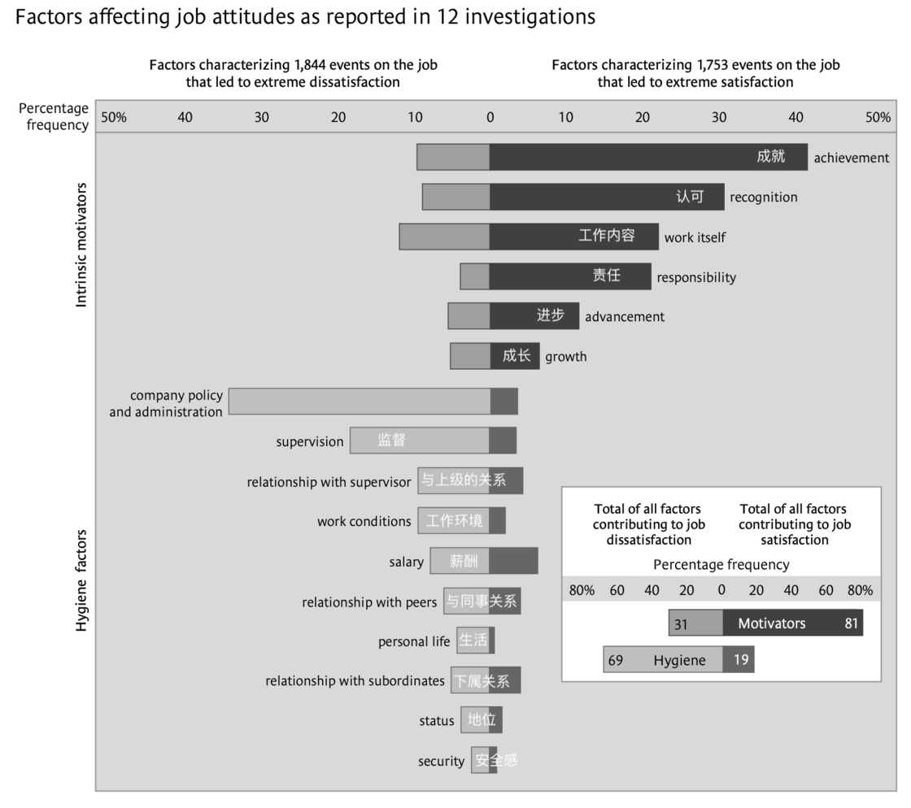
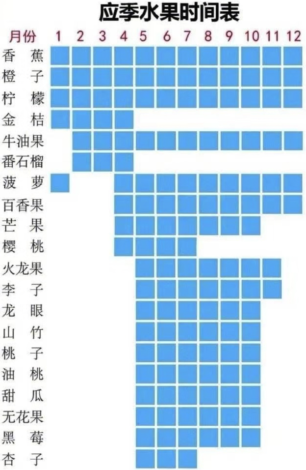
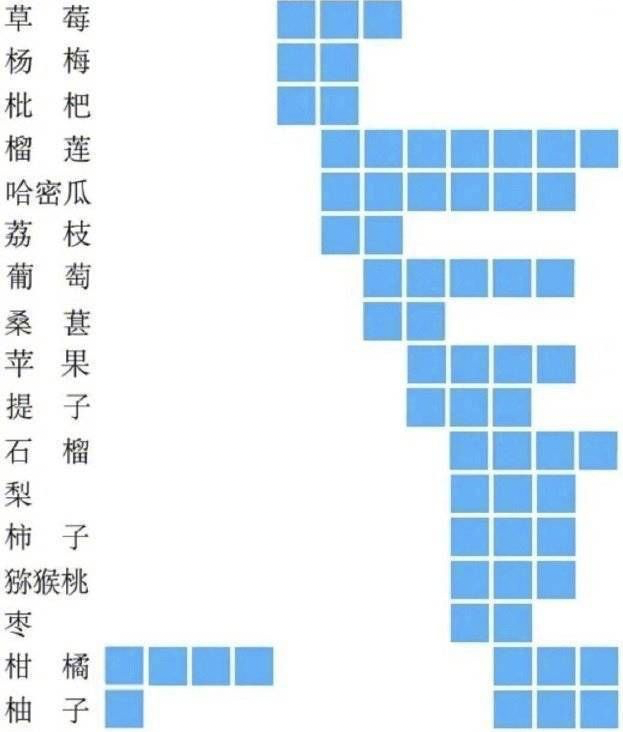
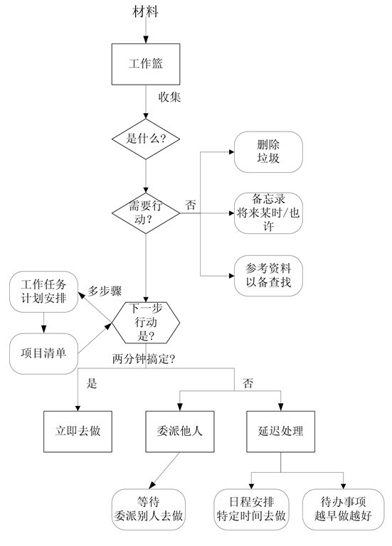

职业作家像小卖店老板，你每天早上要做的事是把门打开，有可能客人络绎不绝，也有可能一个客人也没有——他认可爱尔兰作家科尔姆·托宾的这个比喻。
___
结果在 Literary Review 上发现了一篇文章（Where Does It All Go? by Helen Pearson），里面讲到 BBC 为了更好地安排他们的广播和视频节目，曾经对英国人使用时间的情况做了一些采集，最新的一次采集完成于 2015 年，针对这些数据，一些学者做了相关的分析。在其中一个分析当中，作者把时间使用情况分成了九种不同的类别，原文为英文，我试译如下：

1. 带薪工作及教育
2. 无偿的烹饪工作、清洁工作及DIY
3. 外出休闲及娱乐
4. 锻炼
5. 电视、音频节目及阅读
6. 居家休闲
7. 购物
8. 照顾孩子
9. 睡觉、个人护理及吃饭
___
隐居在瓦尔登湖旁的梭罗，他怎么可能告诉你，每周都会穿过小树林回妈妈家吃饼干，以及每周也都会有穿过小树林的姐姐来帮他洗衣服。
___
一名自由职业者，必须掌握以下技能才能很好的生存下去：

* 写作
* 营销
* 连接（网络）
* 英语
* 财务管理
* 精力管理
___
弗雷德里克·赫茨伯格的双因素理论也对工作场景下人的满意度影响因素有着深入的研究，这虽然属于人力资源管理的范畴，但对我们找到工作中不开心的源头非常有帮助。下图是相关调查结果的数据统计，下半部分为「保健」因素，上半部分为「激励」因素。


___
三名话聊透管理

* 自我提升
  1. 以身作则，传递企业价值观
  2. 提升领导技能
     * 培养胜任新职位所需要的能力，千万不要出现管理错位！
       1. 经理级别需要实现从管理自我到管理他人的跨越，这一层级管理者要克服自己攻坚的冲动，需要开始担任普通员工的职业教练
       2. 总监级别需要实现从管理他人到管理经理人员的跨越，这一层级管理者要开始具备更广阔的视野，要对业务有更深入的理解，并且要肩负培养和教练一线经理的职责
       3. 高级总监/事业部总经理需要实现从管理经理人员到管理职能部门的跨越，这一层级的管理者要开始关注商业/业务/财务，并培养制定长期战略的能力
       4. VP/CXO需要拥有优秀跨部门沟通整合能力，优秀的战略洞察能力以及对商业/业务/财务的深度理解
     * 管理者共同的领导技能：
       1. 充分的授权和关键节点的检查
       2. 能担任下属的职业教练
       3. 制定团队计划的能力
       4. 目标管理的能力
       5. 优秀的沟通协调能力
  3. 学会时间管理。各个管理层级的时间分配：
     1. 经理级别需要将更多的时间放到管理人上面，帮助他人完成任务。这个阶段可以有个人贡献，但不能分配大量时间
     2. 总监级别需要将大部分时间用于管理、沟通、协调资源，同时需要花时间深度理解业务，并且要开始学习更多新知识
     3. 高级总监/事业部总经理需要花更多的时间分析、思考、平衡长期目标和短期目标，并要开始具备一定的战略规划能力
     4. VP/CXO需要花大量时间和事业部班子成员沟通，花大量时间学习新领域，规划新业务，参与制定公司战略
* 向上管理
  1. 影响老板而不是服从老板
     * 理解业务，理解老板意图；
     * 取得老板信任，多沟通多汇报让信息变得透明。
  2. 管理好老板的预期
     * 反复跟老板确认他对你的期望是什么，达成共识。
  3. 只提建设性意见，不要单纯的只反对。
  4. 及时反馈
     * 推动老板去完成目标，不必担心提交的版本不够完美。
     * 能用数据做反馈的一定带上数据。
  5. 尽最大努力争取资源
     * 包括人、钱、时间，甚至老板的时间。
* 向下负责
  1. 对下属的成长负责
     * 发现下属的短板并想办法提升。
  2. 对下属的工作结果负责
     * 检查过程、点拨关键节点、协调资源
     * 关注下属的产出和你的预期是否一致，上下对齐
     * 出事故首先反思自己的团队管理，建立机制和措施避免再犯
  3. 对团队目标负责
     * 给团队提供清晰的目标和努力的方向
     * 时刻审视检查，确保团队朝着目标坚定前行
  4. 对团队文化负责
     * 正直、诚信是基本
     * 打造透明、开放、包容、学习型组织
     * 仪式感的庆祝活动非常必要
     * 组织定期内部分享和外部专家分享，让大家养成学习成长的习惯
     * 团队成员之间不是冷冰冰的工作关系，也是战友，好朋友关系
___
练习需要走出舒适区。练习要有目的，有针对性。练习需要得到反馈，要能够客观的评价练习的成绩。练习需要保持专注。刻意练习推荐最快捷的方法是向领域的杰出人物学习。
___
那《乌合之众》到底是怎样一本书呢？这本作品，和《狂热分子》《群氓之族》，成为了解群体心理学三部曲。三部曲中，评价相对高的是探讨群众运动共有特征（尤其是陷入狂热的乌合之众人格）的《狂热分子》。 放在今日看，《乌合之众》这部作品里头有的观点不免偏颇，作者的叙述也有重复唠叨之处，但仍不失其闪光之处，不过时。
___
1943年，作家秦牧便写过一篇题为《私刑·人市·血的赏玩》的文章，抨击私刑的普遍存在，指出“中国民间的私刑真多”。他举例说，有的地方在捉到通奸的男女后，把两人绑在一起，装入竹笼，和石头一起沉到河底。这种惩罚和雷明远的枪杀，并没有什么实质的区别。在某些偏僻地方，甚至还有吃仇敌心肝之风俗。秦牧幼年时，曾亲眼看见乡民杀了强盗，把他的心肝炒熟下酒。他还讲了其他一些例子，有的地方捉到深夜在菜园偷菜的人，便割断其脚筋，使之终身残废。其实偷菜的多是饿极了的穷人，但是遭窃的也是穷人，承受不了损失，不得不下狠手。在北方的妓院，惩罚犯事的女孩时，用所谓“雨打梨花”的刑罚，即把猫放进稚妓的裤裆里，束住裤管，然后鞭打，让猫儿抓破稚妓的周身皮肉。
___
The one thing I do try to follow is to go on streaks of reading a lot of books on a particular topic around the same time. Doing this is useful because it means I don’t have to just trust one author’s perspective on a particular topic — and helps me connect a lot of facts together, so I can understand things better.
___
XXX（我的名字），研究生阶段最重要的任务是科研。科研会有产出，比如paper。我跟你讲几个原则。

第一，凡是项目中的数据，你在使用之前，需要跟我商量，因为这不是你个人的数据；  
第二，如果你发论文，凡是我没有作出实质贡献的，不能署我的名——因为这对你不公平；  
第三，我俩合作的论文，如何署名，我俩商量着来，按贡献的大小署名。  
第四，学术需要合作。我鼓励你与不同的人合作，这些论文发表不需要经过我同意，但必须遵守学术道德！
___
我们的注意力系统，可以大致分为三个网络，分别叫做「警觉网络」「定向网络」和「执行网络」。这其中，前两者和后者，起着互相拮抗的作用。
警觉网络让我们「注意」到外部刺激，并转移注意力；而执行网络「抑制」外部刺激，让我们得以专注在眼前的任务上。
___
纽约摄影杂志中定义的关于一张好照片具有的三个特点：

1. 需要一个鲜明的主题
2. 必须要能够把注意力引向被摄主体
3. 必须简洁
___
我爸爸下巴垂着一团饭粒，饭粒粘在他黄泥一般的脸上，我大伯觉得，这些饭粒很像是直接从他脸上长出来的，秧苗插在他脸上相同的这抹黄泥上，稻子在他脸上这抹黄泥地上长了稻穗，稻谷曝晒在他脸上这抹黄泥地上，稻米在他脸上这抹黄泥地上去壳，米饭在这抹黄泥所砌成的灶上闷熟，他们一家人吃了下去，然后再在这抹黄泥地上插秧，我大伯这样想着，然后他招招手，唤我爸爸进来。  -- 童伟格《王考》
___
白天压着我们工作，夜里压着我们睡觉。
___
有个朋友说如果他染上这病而又没有地方收治的话，他就自杀，据我对他的了解，他是很有可能说到做到的，当年 SARS 流行期间，我也有过这样的想法，我明白对于长期抑郁的人来说，一场不需要自担责任的意外意味着什么。但问题是，自我的女儿出生之后，我不再抑郁了，我想看我的孩子一天天长大，有一天夜里失眠，我忽然意识到我可能再也不会有自杀的念头了，就在那一瞬间，我感到我获得了某种新生。养育孩子是自我消解的过程，没有那么多“自我”之后，反而感觉松了一口气。  -- 远子《黄冈封城之后》
___
They that sow in tears shall reap in joy.
___
《没有你》宇向

``` 
没有你
阳光照旧
向日葵从不随处见
造物歇息。柏树是柏树。燃烧是燃烧
世态炎凉。众生也方便
即使狂风扭曲每根枝叶       
丝柏仍安于树的秩序
不溅出一滴星火        
没什么要离开什么
我只是，走出我的黄房子
像我未曾拥有你那样没有你
像从未有过你那样没有你

没有你
星月当空是完美无瑕夜
无情是从善如流的教育
紫色不蓝。田野不蓝。万物从不像海洋
黄金稀释于空，流落世间
乌鸦善变“黑”（好极。坏极。坏极。好极。）
狂风扬起这群死鸟看它们飞
我曾埋下无名，不断埋着
它止不住的形容词
独自，退向黄房子
像我未曾见过你那样没有你
像什么也没有留下那样没有你   

没有你
我自把阵风引入星空
用视力，用挥手。引入
不安之外的不安撼动之余的撼动
被其他被大意被麻木被落下的   
别的橙、黄别的硫磺
绿的墨。以及关于相系的分辨
我埋着“我也”
躲闪着那些指认疯癫的指头
但你是，选中的你装点出发点
一座现实街角的黄房子
 
那时我沿山路落泪
走回我们的黄房子
没有你
没有你
我有确切的感受：
你曾与我一起
沿路哭
               
*纪念18900729。
```

20190729
___
《如何》张定浩 

```
如何可以在，无人走过的深雪之上
轻快奔跑，如你一般，被来自天空的
洁白晶体托住，轻盈得无须翅膀的帮助。
如何可以不
通过写诗就摆脱那些重负，
如你一般，
回头看着泥足深陷的我大笑，
并一再怂恿我，努力向上跃起。
我因此一层层地坠入
你所不知道的，被掩盖的冬天。
在雪中漂浮的异乡的枫树和杉树
裹住我，将我指认成它们中的一员。
我伸手把你举起来，像树枝举起鸟儿。
```
___
布鲁姆一生打过四次笔仗。第一次是反对“新批评主义”，第二次反对解构主义，第三次是反对女权主义，第四次是反对哈利·波特文学。因为挑起一次次的论争，他被称为“抬杠批评家”。但是，四次战争他都失败了。他现在不想跟任何人打仗。
为什么反对哈利·波特文学和斯蒂芬·金？哈罗德·布鲁姆的理由是，你读了这些三流作品，就没有时间读一流作品了。劣书会挤占好书的时间。在他眼里，厄普代克、卡佛、门罗都是二流作家。
___
南方周末：你说，你一生有四个敌人，打过四次仗。为什么要打这四次仗？现在你又为什么不打算争论了？  
哈罗德·布鲁姆：没有什么可争的了。我已经打了半个世纪的仗，输了。我不想再和任何人争执，不想再挑起任何辩论。我只想教书，写书，感谢那些最富想象力的文学作品。我已经对争论不感兴趣了，我太老了，也累了。我觉得过去那些争论大多都是个错误，因为这些事情你拦不住，人们就像旅鼠，它们冲进海里。据我所知，是有些赞同我的人的，包括世界各地的一些学生。西方世界基本上已经毁掉了对伟大文学作品在人性、美学及认知意义上的研究，转向一种不成熟的社会学，我对那些东西没有兴趣。

南方周末：要是打第五仗，你会反对谁？  
哈罗德·布鲁姆：无知、物质主义、以及简化主义。我们站在荷马、但丁、莎士比亚、弥尔顿、托尔斯泰、李白、杜甫、孔子、孟子的这一边战斗。
___
尽管讨论政治或社会问题可能有助我们理解和欣赏但丁、品达、埃斯库罗斯、歌德、陀思妥耶夫斯基或李白，但这又有什么意义？政治和社会问题不会像莎士比亚那样长存。谁关心政治呢？我们关心的是那些能扩充人生的，能让我们更聪明的东西。
___
有氧运动必须做，低强度长时间运动耗时又耗肌肉，高强度间歇训练（通常称为HIIT），就更加适合时间不多，想要提升体力人士。  
冲刺，快速骑自行车，跑楼梯…只要很强烈，就都是HIIT。  
同样可锻炼心肺，但和慢跑不同，HIIT通过短时间高耗能运动加上短暂歇息来进行减脂，高强度运动会让身体肌肉感到疲惫，耗氧量达到运动时可以消耗的氧气量最大值，即便停下来，身体还在继续耗氧，发挥「后燃效应」，运动后热量开始消耗。  
而在这时主要消耗脂肪，避免了长时间有氧运动损耗肌肉。

HIIT在多个方面都很有效，它会提高耐力，并补充力量。  
给无数名人当过私教的健身专家Rob Sulaver说，「运动都可以通过燃烧卡路里燃烧脂肪，但更激烈的运动会燃烧更多脂肪，这也是HIIT受欢迎的部分原因。」  
与许多其他有氧运动相比，HIIT可以成为更有效的锻炼方式。例如壶铃，药球或哑铃，将在刺激心率时调整肌肉。

对初学者而言，运动与休息比例为1:2，随着进步，转换到1:1。  
为了保住肌肉，做HIIT时每次最好不要超过30分钟。  
每周做两次HIIT，放在无氧运动以后，这时身体会优先消耗脂肪。每两次HIIT最好隔一段时间，有利于肌糖原恢复，更能保住肌肉。

举个例子，假如要用跑步做HIIT，可以这样：  
先从从轻快步行开始，一路轻松慢跑10分钟，然后快跑1分钟，走2分钟，快跑1分钟，走2分钟…这样进行7个循环，如果觉得挑战不够，就让跑步机向上倾斜，做爬坡，最后走5分钟，做拉伸并和大量喝水。
___
应季水果时间表




___
幸福的共同特点之一是与当地当时的价值观基本匹配。
___
好的亲子关系基本具有三个特点：

* 从内心感受上来看，是稳定安全且灵活开放的；
* 从相处模式上看，是和善又界限分明的；
* 从对外界的态度上看，是富有启发性又能共同成长的。
___
一个简单的原则是，会麻烦到他人、给他人带来不快、给自己带来危险的行为是越界的行为，应该被规范。
___
为什么其他人带都挺好，去幼儿园也很好，回家后妈妈带就不好了呢？因为孩子在“惩罚”我们的离开。
___
根据著名心理学家、哈佛大学医学博士丹尼尔·西格尔在《全脑教养法》中的理论：3岁以前的孩子，主要是由右脑，即主管感性情绪的大脑控制。故孩子情绪很强烈、很敏感，但做事情仍旧缺乏逻辑性。在孩子年龄较小的时候，因其左脑发育尚不成熟，讲道理其实是一种无用的行为。

第一步，积极地倾听和共情；
第二步，帮助孩子冷静下来；
第三步，引导他们关注解决方案。
___
这段夸奖之所以夸得好，是因为它遵循了三个原则，描述性夸奖、夸可改变的品质和总结成一个词
___
当人们正在做一件对他来说有一定乐趣的事情的时候，给他提供奖励反而会减少他对这项活动对他的内在动力。这就是所谓的“德西效应”。

德西推荐了一个三步法来解决怎么让孩子投入到没兴趣做的事情上：
第一步，坦诚地承认这件事情确实无聊、或者看起来没意思。
第二步，和孩子聊聊做这件事长期的意义。
第三步，在具体怎么完成这件事情上，尽可能地给孩子一些自主权。

当这种奖励是惊喜的时候，对孩子而言，是没有负面作用的。
___
On Marriage

You were born together, and together you shall be forevermore. You shall be together when white wings of death scatter your days Aye, you shall be together even in the silent memory of God. But let there be spaces in your togetherness,  
And let the winds of the heavens dance between you.  
Love one another but make not a bond of love:  
Let it rather be a moving sea between the shores of your souls. Fill each other's cup but drink not from one cup.  
Give one another of your bread but eat not from the same loaf. Sing and dance together and be joyous, but let each one of you be alone,  
Even as the strings of a lute are alone though they quiver with the same music.  
Give your hearts, but not into each other's keeping.  
For only the hand of Life can contain your hearts.  
And stand together, yet not too near together:  
For the pillars of the temple stand apart,  
And the oak tree and the cypress grow not in each other's shadow
___
Our deepest fear is not that we are inadequate.  
Our deepest fear is that we are powerful beyond measure.  
It is our light, not our darkness that most frightens us.  
Your playing small does not serve the world.  
There's nothing enlightened about shrinking so that other people won't feel insecure around you.  
We are all meant to shine, as children do.  
It's not just in some of us; it's in everyone.  
And as we let our own light shine we unconsciously give other people permission to do the same.  
As we're liberated from our own fear, our presence automatically liberates others.
___
On Children

And a woman who held a babe against her bosom said, Speak to us of children.  
And he said:  
Your children are not your children.  
They are the sons and daughters of Life's longing for itself.  
They come through you but not from you,  
And though they are with you yet they belong not to you.  
You may give them your love but not your thoughts,  
For they have their own thoughts.  
You may house their bodies but not their souls,  
For their souls dwell in the house of tomorrow,  
which you cannot visit, not even in your dreams.  
You may strive to be like them,  
but seek not to make them like you.  
For life goes not backward nor tarries with yesterday.  
You are the bows from which your children  
as living arrows are sent forth.  
The archer sees the mark upon the path of the infinite,  
and He bends you with His might  
that His arrows may go swift and far.  
Let your bending in the archer's hand be for gladness;  
For even as He loves the arrow that flies,  
so He loves also the bow that is stable.
___
Long-term memory, the Bjorks said, can be characterized by two components, which they named retrieval strength and storage strength.

One of the problems is that the amount of storage strength you gain from practice is inversely correlated with the current retrieval strength.

I find myself thinking of a checklist Wozniak wrote a few years ago describing how to become a genius. His advice was straightforward yet strangely terrible: You must clarify your goals, gain knowledge through spaced repetition, preserve health, work steadily, minimize stress, refuse interruption, and never resist sleep when tired. This should lead to radically improved intelligence and creativity. The only cost: turning your back on every convention of social life.
___
DevOps信条：越是困难的事，越要更频繁地进行。

1. 小块拆解后相对容易；
2. 反馈频率更高，利于学习调整；
3. 推动自动化。
___
Roguelike 的 Berlin Interpretation ：

1. 随机生成的环境，游戏世界是以某种方式随机生成的，或者世界中的某些部分是随机生成的。这里可以包括地形，物品和怪物出现的位置等。随机生成物品和怪物如果有的话当然更好啦。随机生成的好处就是可以提高重复游戏性，所以显然的固定的谜题和剧情在这方面不是太管用。
2. 永久死亡，一个游戏角色只有一条命。如果死掉的话这个角色就到此为止了，你只能以另一个角色的身份来重新开始游戏。对应的思路就是你必须为你的选择和失误付出代价，就像现实生活一样，哟。
3. 回合制，与回合制相对的应该就是实时制了。回合制的游戏不应该对现实时间的流逝有反应，游戏中的世界是按照一回合一回合来运转的。这样再回合之间你可以有无限的时间进行思考。事实上，需要你停下来想上个一会儿的情况在优秀的 Roguelike 中是会经常出现的。
4. 统一的游戏模式 (Non Modal) ，这个也是从反面讲比较容易理解。像最终幻想那样在大地图上走，遇敌切换到战斗界面的游戏就是 "Modal" 的。Roguelike 要求所有操作都是在统一的一个界面上完成的，这个界面一般就是一个 2D 的地图。
5. 复杂度，游戏允许以多种多样的方式来完成同一个目标。一个例子就是你不论选择近战或者远程还是法术路线，都可以玩的下去。
6. 打怪练级，探索世界每个人都喜欢这一套。我猜这里想表达的应该是游戏还是得有一个能够承载上面那些特性的主体内容。显然大部分情况下打怪练级，探索世界都是最管用的一套。
___
Getting Things Done (GTD): 把所有事情都从你的脑袋里弄出来。在事情出现就做好相关行动的一系列决定，而不是在事情爆发的时候。以合适的类别组织好你的项目的各种提醒以及下一步行动。保持你的系统更新和完整，及时进行回顾，使你在任何时候都能信任你的系统和对任务的处理。


___
新闻值得阅读，但是只读新闻的标题就够了。大多数新闻的确毫无用处，过眼即忘。但是，大量的新闻之中，往往会隐藏着一些不起眼的趋势，它们可能不会现身在热门内容或你的社交时间流上，它们也不会自行串联起来，它们甚至是你无法理性描述的一种洞见。你的大脑可能会捕获到它们，也可能完全忽略了它们，但是它们真的就藏在不起眼的新闻里。

所有的阅读，尽量都收集到一处再开始，这样以后找寻资料时，能够很方便地搜索。对我来说，这个地方就是 Instapaper。

阅读电子书的工作流，其实非常简单，就是勤标注。标例子更重要，并且就随心所欲地大段大段地标。
