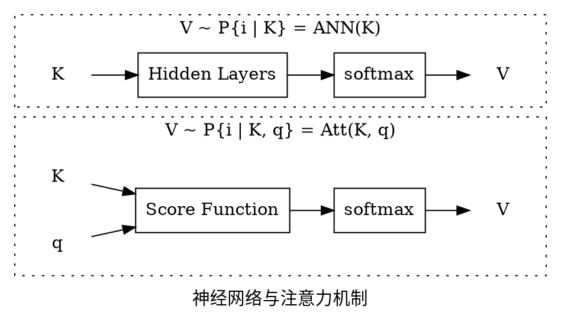

# 注意力机制

从输入输出考虑，注意力机制相对一般的神经网络多了一个查询变量 q 作为输入：

所以可能叫“条件神经网络”更合适。

其中注意力的打分函数可以是

* 加性模型：$R^T \tanh(W \cdot K + U \cdot q \cdot 1^T)$
* 点积模型：$K^T \cdot q$
* 缩放点积模型：$\frac{K^T \cdot q}{\sqrt{d}}$
* 双线性模型：$K^T \cdot W \cdot q$

甚至构造个神经网络来打分也可以。

## 自注意力模型

自注意力模型用同一组输入生成 Q, K, V，并使用缩放点积模型进行打分：

$$\begin{cases}
(Q, K, V) = (W_1, W_2, W_3) \cdot X \\\\
H = V \cdot \text{softmax} (\frac{K^T \cdot q}{\sqrt{d}})
\end{cases}$$

其中 $W_1, W_2, W_3$ 是可学习的参数，H 是输出的隐状态。

## 多头注意力

同一组键值在多个条件下期望的拼接
$$\text{Att}((K, V), Q) = \oplus_i \text{Att}((K, V), q_i)$$

## 一个问题

注意力输出的是索引的分布，实际的监督数据是一个确定的标签，所以这里需要取一个最可能的索引才能计算误差。  
如果用采样或 argmax 这类不可微的 hard-max 方法，就无法利用 Back-Propagation 算法学习参数。  
因此使用该分布的期望值作为输出。  
但如果分布是多峰的，这就会有问题，比如如下分布的期望是概率为 0 的 2：

| i    | 1   | 2 | 3   |
|------|-----|---|-----|
| P(i) | 0.5 | 0 | 0.5 |
