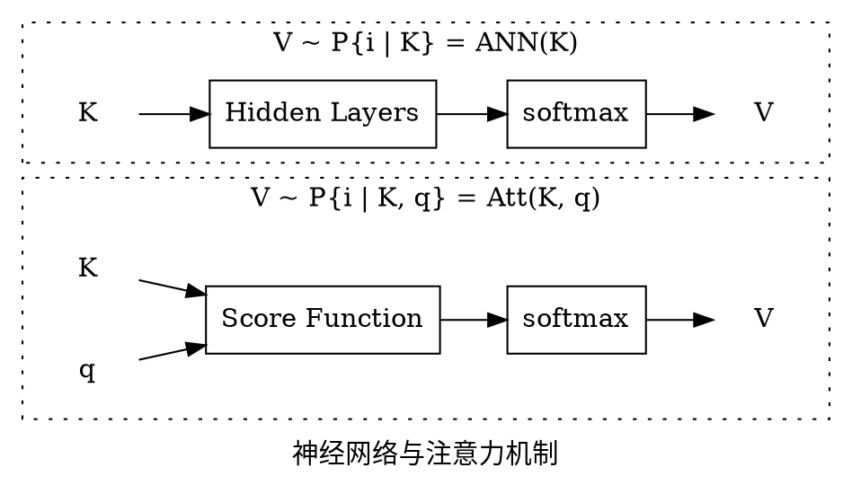

# 注意力机制

从输入输出考虑，注意力机制相对一般的神经网络多了一个查询变量 q 作为输入：

所以可能叫“条件神经网络”更合适。

其中注意力的打分函数可以是

* 加性模型：$R^T \tanh(W \cdot K + U \cdot q \cdot 1^T)$
* 点积模型：$K^T \cdot q$
* 缩放点积模型：$\frac{K^T \cdot q}{\sqrt{d}}$
* 双线性模型：$K^T \cdot W \cdot q$

甚至构造个神经网络来打分也可以。

其中两个点积模型因为不含可训练参数，所以通常用在自注意力模型中，由一个可训练的模型通过输入得到 K、Q。

## 自注意力模型

自注意力模型用同一组输入生成 Q, K, V，并使用缩放点积模型进行打分：

$$\begin{cases}
(Q, K, V) = (W_1, W_2, W_3) \cdot X \\\\
H = V \cdot \text{softmax} (\frac{K^T \cdot Q}{\sqrt{d}})
\end{cases}$$

其中 $W_1, W_2, W_3$ 是可学习的参数，H 是输出的隐状态。

## 多头注意力

多份 X 各自经过一个自注意力模块后拼接起来，再乘以一个矩阵变换为目标形状。

## Transformer

Encoder-Decoder 架构，在 Encoder 中是自注意力模块，输出作为 Decoder 中的 Q 或 K（所以 Decoder 中是他注意力模块）
