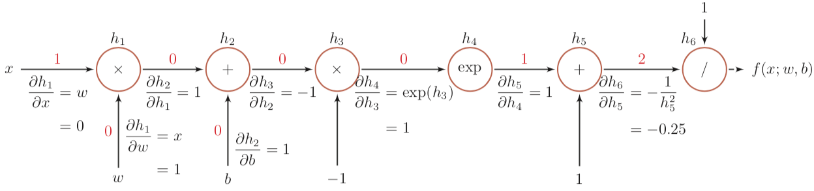
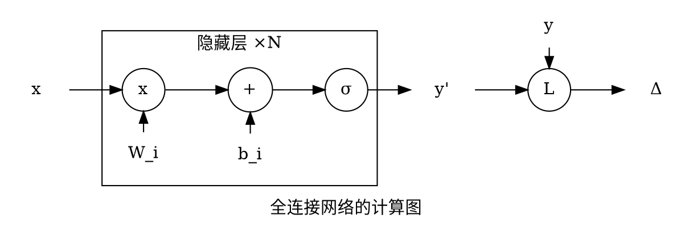
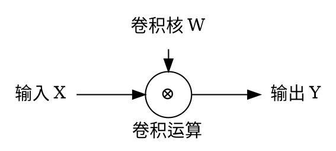
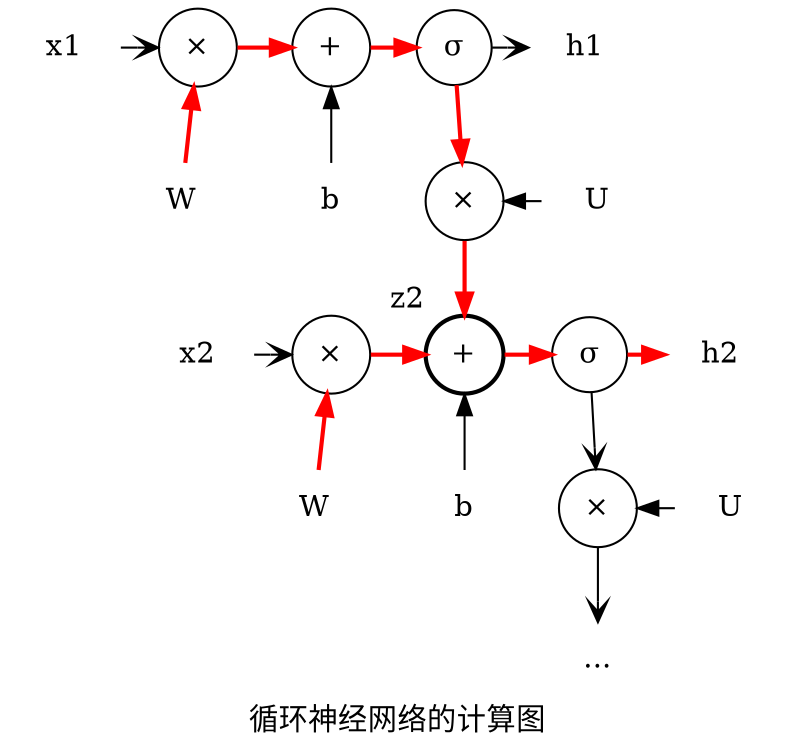

# 神经网络中的自动微分与反向传播

## 自动微分（Automatic Differentiation, AD）

自动微分是将复合函数分解为输出量（根节点）和一系列的输入量（叶子节点）及基本函数（中间节点），构成一个计算图（Computational Graph），并以此计算任意两个节点间的梯度：

* 加法法则：任意两个节点间的梯度为它们两节点之间所有路径的偏微分之和；
* 链式法则：一条路径的偏微分为路径上各相邻节点间偏微分的连乘。

### 一个例子

举个[邱锡鹏《神经网络与深度学习》](https://nndl.github.io/)中的例子，函数 $$f(x; w, b) = \frac{1}{\exp{(-(wx + b))} + 1}$$ 当 (x, w, b) = (1, 0, 0) 时计算图如下：

其中每条边上标记有前向计算时的结果（红色数字）与尾节点（上层节点）对头节点（下层节点）的偏微分。

因为任意两个节点间的梯度为它们两节点之间所有路径的偏微分之和（这个例子没体现出来），其中每条路径的偏微分为路径各边上偏微分的乘积。有：

$$\frac{\partial{f(x; w, b)}}{\partial{h_2}} = \frac{\partial{f(x; w, b)}}{\partial{h_6}} \cdot \frac{\partial{h_6}}{\partial{h_5}} \cdot \frac{\partial{h_5}}{\partial{h_4}} \cdot \frac{\partial{h_4}}{\partial{h_3}} \cdot \frac{\partial{h_3}}{\partial{h_2}} = 1 \times -0.25 \times 1 \times 1 \times -1 = 0.25$$
$$\frac{\partial{f(x; w, b)}}{\partial{b}} = \frac{\partial{f(x; w, b)}}{\partial{h_2}} \cdot \frac{\partial{h_2}}{\partial{b}} = 0.25 \times 1 = 0.25$$
$$\frac{\partial{f(x; w, b)}}{\partial{x}} = \frac{\partial{f(x; w, b)}}{\partial{h_2}} \cdot \frac{\partial{h_2}}{\partial{h_1}} \cdot \frac{\partial{h_1}}{\partial{x}} = 0.25 \times 1 \times 0 = 0$$

后面两式用到了第一个式子的结果，这从计算图中也可以看出：计算根节点对其它节点的梯度时，路径中越上层的边的梯度被复用得越多。  
所以如果计算图复杂（路径多）或需要计算偏导的变量较多，从上层开始计算边的梯度并缓存起来辅助计算根节点对更下层节点的偏导能降低计算量。这也就是反向传播算法了。

## 反向传播（Back Propagation, BP）算法

神经网络中，只要各个组件以及损失函数都是可微的，那么损失函数就是关于各个输入量的可微的复合函数。  
就可以用自动微分计算梯度，从而使用梯度下降算法减小误差。

所以 BP 算法其实就是自动微分，只不过根节点为度量误差的损失函数，因而把节点间的偏导称为误差项。

## 全连接神经网络 FNN

图中的 $x, b_i, y, y'$ 都是向量，$W_i$ 是矩阵，x 是矩阵乘法，$\sigma$ 是激活函数，y 是实际结果，L 是可微分的损失函数。  
全连接体现在矩阵乘法 $W^Tx$ 中。

## 卷积神经网络 CNN

卷积神经网络就是在全连接网络中添加了卷积层和池化层。

### 卷积层（Convolution Layer）

卷积运算 $Y = W \otimes X$ 是乘法和加法的复合，易对每组分量逐个考查偏导，得到：

$$ \frac{\partial{f(Y)}}{\partial{W}} = \frac{\partial{f(Y)}}{\partial{Y}} \otimes X$$
$$ \frac{\partial{f(Y)}}{\partial{X}} = \frac{\partial{f(Y)}}{\partial{Y}} \tilde{\otimes} W $$

其中 $\otimes$ 是卷积运算、$\tilde{\otimes}$ 是翻转宽卷积运算，$f(Y)$ 是一个标量函数。  
需要注意的是 $\frac{\partial{f(Y)}}{\partial{?}}$ 在这里并非矩阵微积分，而是逐元素（element-wise）求偏导。

所以卷积运算可以视为一种基本函数，放入计算图中进行自动微分。

另外，如果将卷积运算视为一种乘法，CNN 的计算图与 FNN 是一样的。  
更泛化的情况是 $x, W, b, y$ 都是张量（W 是卷积核组），且在做矩阵乘法 × 时，元素相乘使用卷积运算（元素是矩阵）。

### 池化层（Pooling Layer）

* 最大池化（Max Pooling）：上层节点仅对池化区域内的最大节点有梯度 1，对其它节点的梯度为 0；
* 平均池化（Mean Pooling）：假设池化面积为 n，则上层节点对每个元素的梯度为 1/n。

Max 运算的导数并不连续，所以这里的梯度只能算是一种近似。

## 循环神经网络 RNN

设 RNN 的模型为：$$h_t = \sigma(U \cdot h_{t-1} + W \cdot x_t + b)$$ 则计算图如下：

其中所有的 W 是同一个矩阵，可以看作是同一个节点经过恒等变换分发到图中各 W 节点的。b、U 同理。  
$h_1, h_2, \cdots, h_n$ 只是个中间结果，可以经过其它可微变换输出 $y$ 然后接损失函数得到误差，这一部分跟 FNN 是一样的所以省略了。

### 梯度计算

例如要计算 $\frac{\partial{h_2}}{\partial{W}}$，将图中连接 W 和 $h_2$ 的路径（加红加粗的两条）梯度汇总就可以，这就是随时间反向传播（Back-Propagation Through Time, BPTT）算法。

实际上，如果随着前向计算时，把需要的梯度缓存起来，在之后反向传播误差项时就只需要传播到缓存处就可以结束。例如图中计算出 $h_1$ 后，同时计算出 $\frac{\partial{z_2}}{\partial{W}}, \frac{\partial{z_2}}{\partial{b}}, \frac{\partial{z_2}}{\partial{U}}$，在计算 $\frac{\partial{h_2}}{\partial{W}}$ 时，便无需像 BPTT 一样回溯到前面每一层。这就是实时循环学习（Real-Time Recurrent Learning, RTRL）算法。
