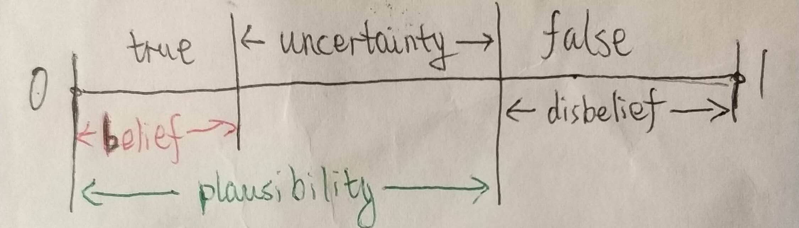
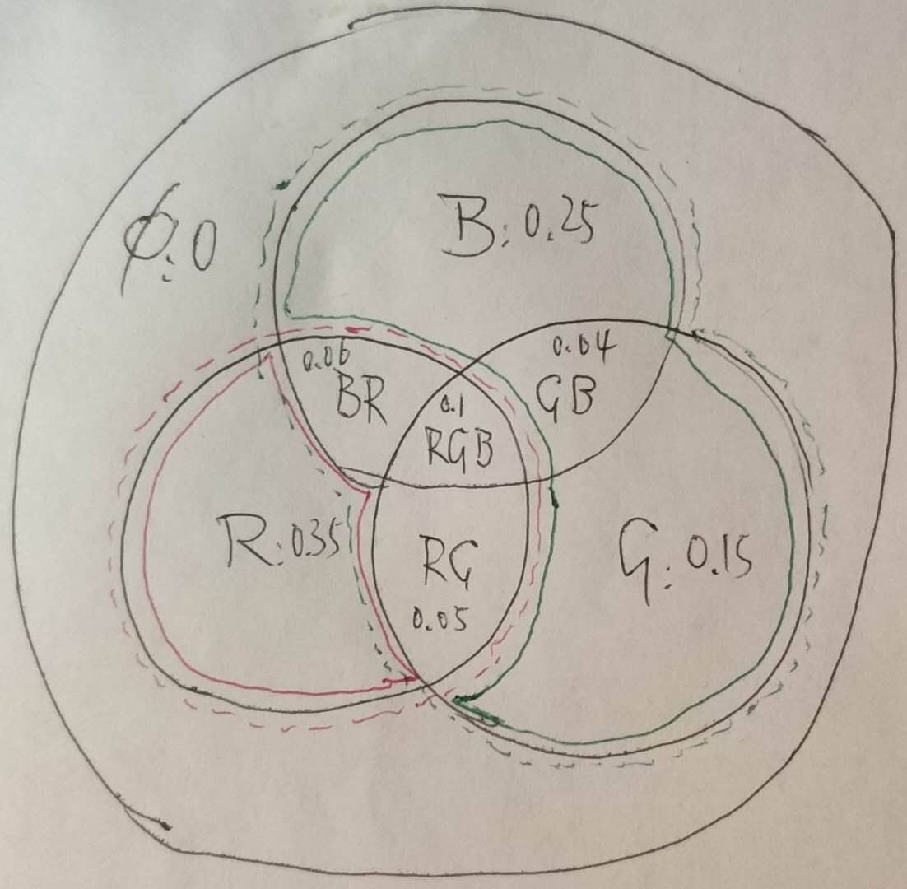

# DS证据理论与主观逻辑

## 基本概念

对于单一假设，引入不确定性（Uncertainty）后，产生信度（Belief）与似然（Plausibility）的概念。

对 N 个对立事件（要求其并必然发生），考虑不确定性可以有 $2^N$ 个假设，每个假设对应事件幂集中的一个元素，除空集元素必须分配为 0 以外，其它元素可分配一个和为一的概率，称为 Mass，表示该假设的可能性。

一个 N = 3 的例子：有灯能发出 R, G, B 三种颜色的光，于是有以下 8 个假设。观测者观测后对每个假设分配 mass 值：

| 假设        | mass | 含义           |
|-------------|------|----------------|
| $\emptyset$ | 0    | 不发光         |
| {R}         | 0.35 | 发 R 光        |
| {G}         | 0.15 | 发 G 光        |
| {B}         | 0.25 | 发 B 光        |
| {R, G}      | 0.05 | 发 R 光或 G 光 |
| {G, B}      | 0.04 | 发 G 光或 B 光 |
| {B, R}      | 0.06 | 发 B 光或 R 光 |
| {R, G, B}   | 0.1  | 发某光         |

* 例如 mass({RG) = 0.05 表示有 5% 可能确定要么发 R 光要么发 G 光，但不能确定具体发 R 光还是发 G 光。

根据每个假设的 Mass 值可以计算该假设的信度和似然。 

* 信度 = 该假设所有子集的 mass 之和
* 似然 = 所有与该假设相交非空的集合的 mass 之和
* 概率 $\in$ [信度, 似然] = 信任区间

如上图中

* Belief(R) = 红色实线部分 = 0.35
* Plausibility(R) = 红色虚线部分 = 0.56
* Belief(GB) = 绿色实线部分 = 0.44
* Plausibility(GB) = 绿色虚线部分 = 0.65

## 主观逻辑（Subjective Logic）

概率 = 信度 + 不确定性 * 先验概率

先验概率（Base rate）指无证据时假设成立的概率

例如对上面的例子，引入先验概率 (pri(R), pri(G), pri(B)) ~ (0.5, 0.3, 0.2)，则结合观测有

P(R) = mass(R) + mass(RG) * pri(R|RG) + mass(BR) * pri(R|BR) + mass(RGB) * pri(R) = 47.4%

同理可计算 P(G) = 22.3%, P(B) = 30.3%。

## Dempster-Shafer 证据合成

多个观测者各自给出不同的 mass 分配后可通过 DS 合成规则将其合并为一个新的 mass 分配，其中任一非空假设的新 mass 值与分属于不同观测者，但相交为该假设的原 mass 值乘积之和成正比。

| 假设        | 观测1 | 观测2 | 合并（未归一化） | 合并  |
|-------------|-------|-------|------------------|-------|
| $\emptyset$ | 0     | 0     | 0                | 0     |
| {R}         | 0.35  | 0.3   | 0.261            | 0.488 |
| {G}         | 0.15  | 0.2   | 0.11             | 0.206 |
| {B}         | 0.25  | 0.2   | 0.1575           | 0.295 |
| {R, G}      | 0.05  | 0.05  | 0.015            | 0.003 |
| {G, B}      | 0.04  | 0.05  | 0.013            | 0.002 |
| {B, R}      | 0.06  | 0.05  | 0.017            | 0.003 |
| {R, G, B}   | 0.1   | 0.15  | 0.015            | 0.003 |

例如 mass(RG) ∝ mass1(RG) * mass2(RG) + mass1(RG) * mass2(RGB) + mass1(RGB) * mass2(RG) = 0.015
