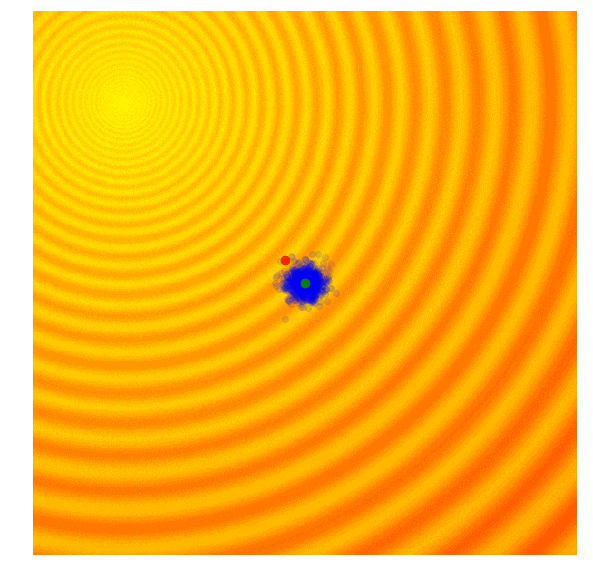

# 进化算法

> 与传统的基于微积分的方法和穷举方法等优化算法相比，进化计算是一种成熟的具有高鲁棒性和广泛适用性的全局优化方法，具有自组织、自适应、自学习的特性，能够不受问题性质的限制，有效地处理传统优化算法难以解决的复杂问题。

## 遗传算法（Genetic Algorithm, GA）

遗传算法是一个框架，包含以下循环的三步

1. 选择。最简单的一步，评估当前一代每个个体的表现，选取（或按概率选取）表现最好的一批作为父代
1. 交叉。最重要的一步，根据父代个体的性质生成新的子代，比如每一位特征都随机选一个父代进行继承
1. 变异。对子代随机变换，以保持多样性，避免陷入局部最优

比如[2021年的SHARE算法](https://cf020031308.github.io/papers/2021-share-shaping-data-distribution-at-edge-for-communication-efficient-hierarchical-federated-learning/)中搜索层次化联邦学习的分组结构时，就用到了遗传算法。
具体是定义了增加节点、删除节点和替换节点三种交叉变异的操作，既从父代继承基本的结构，又产生出新的变化。

## 差分进化算法（Differential Evolution, DE）

$$ X_i' = \text{better}(X_i, [ \text{random}(x_{ij}, x_{rj} + \alpha ( x_{sj} - x_{tj} )) ]) $$

1. 变异：$X_i' = X_r + \alpha (X_s - X_t)$。随机选择个体$X_s$和$X_t$计算，将差缩放后加到另一个随机个体$X_r$上，得到变异结果
1. 交叉：random($x_{ij}, x_{ij}'$)。对每一位，随机选择是否保留变异结果，产生新一代个体$X_i'$
1. 选择：better($X_i, X_i'$)。在上一代$X_i$和新一代$X_i'$之间选好的留下

比如[2017年的单像素攻击](https://arxiv.org/abs/1710.08864)中用差分进化算法搜索攻击像素点，可调用`scipy.optimize.differential_evolution`实现。

## 进化策略（Evolution Strategy, ES）

进化策略主要假设个体样本满足一个高斯分布，通过循环选择精英样本、更新分布、重新采样不断得到更好的样本。

最简单的情况就是方差固定，取最优样本作为下一代样本分布均值。
如图，其中蓝点为样本，绿点为样本均值，红点为最优样本。

ES的一个变形是**自然演化策略（Natural Evolution Strategy, NES）**，认为应该利用每个个体的表现信息寻求整体优化，而不是只保留精英个体鼓励个体优化。
因此提出更新分布时应该最大化表现的期望$\mathbb{E}_{x \sim p(\cdot \| \theta)} [f(x)]$。

最终导出的算法其实跟强化学习中策略梯度是一样的。

## 协方差矩阵自适应进化策略（Covariance Matrix Adaptation Evolution Strategy, CMA-ES）

CMA-ES对于ES的改进主要在于对分布方差的控制，其中协方差矩阵CM代表对方向的控制，自适应A代表对步长的控制。

公式比较多可参考[原论文](https://arxiv.org/pdf/1604.00772.pdf)，直观感受如图：

CMA-ES可以控制搜索空间的形状和大小，这样收敛快又不会错过最优点。

算法实现见[pycma](https://github.com/CMA-ES/pycma)这个库。
