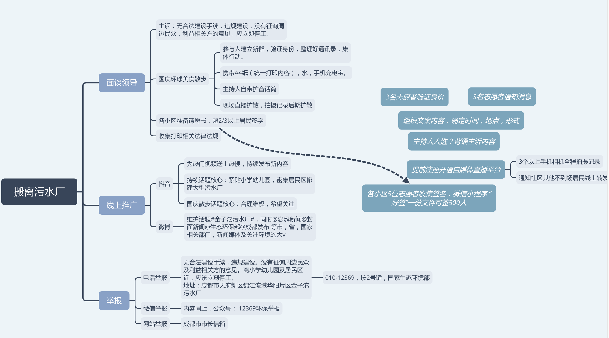

我年轻时以为，金钱是世界上最重要的东西，等老了才知道，原来真的是这样。

-- 王尔德。
___
我越来越常这么想（这种事如此显而易见，而我们却没发现），人只存在于他的具体年龄里，一切都随着年龄改变。了解另一个人，就是了解他正在跨越的年龄。

-- 米兰·昆德拉
___
做孩子的时候感到无聊，盼望着长大。长大后又向往着返回童年。我们浪费自己的健康去赢得个人财富，然后又浪费自己的财富去重建自身的健康。我们焦虑地憧憬未来，忘记了眼前的生活。活得既不是为了现在也不是为了将来。我们活得似乎永远不会死，我们死得也好像从来没活过。

-- 多丽丝·莱辛
___
时间很贪婪——有时候，它会独自吞噬所有的细节。

-- 《追风筝的人》卡勒德·胡赛尼
___
让懂的人懂，让不懂的人不懂。让世界是世界，我甘心是我的茧。

-- 《美丽的茧》简嫃
___
自然界就像我们的游乐场，但对于生活在里面的生物可以说是地狱。

-- 《关于莉莉周的一切》
___
书籍是一种逃避，它让你回避现实的失控，旅行也是。它经常是智力与情感上懒惰的标志，因为无力洞悉熟识生活的真相与动人之美，人们沉浸于浮光掠影的新鲜感，以为看到了一个新世界，不过是在重复着旧习惯。异质的声音、颜色与思想，没能进入他们的头脑与内心，不过是庸常生活的小点缀。

-- 《一个游荡者的世界》许知远
___
好了，总算处理了那些不净的纸条，它们既不能吃，又不能当衣服穿，却换来了一双美丽的新鞋。

-- 《幸福之路》罗素
___
你要做一个不动声色的大人了。不准情绪化，不准偷偷想念，不准回头看。去过自己另外的生活。你要听话，不是所有的鱼都会生活在同一片海里。

-- 《舞！舞！舞！》村上春树
___
我拍的每条片子，都包含着我喝过的每一杯咖啡，泡过的每一个女人，读过的每一本书，去过的每一个地方。 

-- 印度广告导演Tarsern
___
一个人想像自己不懂得的事很容易浪漫。 

-- 王小波
___
有次她恶狠狠地扔出这句话，像竭力往地上摔了个盘子。
___
他换了更好的车子，开起来舒服很多，可是他的世界像手动挡到自动挡一样更易于掌握了吗？未必。有一次我跟他去洗车，洗车师傅恭维他，他冷笑，自嘲说自己毫无本事，只有眼前这辆车听他的话。

-- 阿乙
___
也许有一天我会去写这种荒谬感，人的这种无可立足，整个时代一点声音都没有。简单的两个例子：一是雾霾，雾霾来了，这是会带来肺癌的东西，但大家还是继续生活。还有一个是我报考研究生，去研究生网注册，立刻收到不少“包你考中”的垃圾短信，每天平均三条。网上说一百三十万人报考，岂非一百三十万人资料全部被泄露了。这个时代的人有点像当年被赶进集中营的人，沉默地走进去。这可能又重新走到卡夫卡写作的老路上，我始终想看到一个交响乐式的向上的现代社会心灵史。路遥曾经干过这事，但那是虚假的。

-- 阿乙
___
他回家去，在厂区里遇不到一个生人，在街上看不到一家连锁店，这种被抛下的感觉他腻歪透了，不知道多少年才有真正的繁华，真正的复杂多态，真正的市井。  
在他的形容里，那里没有一股味道可供你走出去多年之后思念，没有乡音，像一切移民之地一样，人们的口音都是普通的发音，是个思乡都没有“抓手”的地方。悠久的山城水城，街巷的石板下是前朝的石板，每块石头都蒙着青苔，每扇木窗都有刻痕，人们的神情相像，家里有偌大的祠堂，喝茶和喝汤有世袭的姿势；在古都，你可以不记得，不造访，但历史仍在那里，城墙和老寺被拆毁了，阴影还能矗立一段时间；在五方杂处的城市，商贸发达，各色人等光怪陆离，贩卖稀罕违禁的货物。一座精彩的城，要有怪癖、有恩仇、有文学、有闲人、有传奇、有悲怆。
___
“两姓联姻，一堂缔约，良缘永结，匹配同称。看此日桃花灼灼，宜室宜家，卜他年瓜瓞绵绵，尔昌尔炽。谨以白头之约，书向鸿笺，好将红叶之盟，载明鸳谱。“此证。
___
不做不可及的梦，这使我的睡眠安恬。避开无事时过分热络的友谊，这使我少些负担和承诺。不说无谓的闲言，这使我觉得清畅。我尽可能不去缅怀往事，因为来时的路不可能回头。
___
“孩子们，今天十二岁的你们，在四十年之后，如果再度相聚，你们会发现，在你们五十个人之中，会有两个人患重度忧郁症，两个人因病或意外死亡，五个人还在为每天的温饱困难挣扎，三分之一的人觉得自己婚姻不很美满，一个人会因而自杀，两个人患了癌症。  
你们之中，今天最聪明、最优秀的四个孩子，两个人会成为医生或工程师或商人，另外两个人会终其一生落魄而艰辛。所有其它的人，会经历结婚、生育、工作、退休，人生由淡淡的悲伤和淡淡的幸福组成，在小小的期待、偶尔的兴奋和沉默的失望中过每一天，然后带着一种想说却又说不出来的‘懂’，作最后的转身离开。”

-- 《目送》龙应台
___
对于一部小说来说，有些人乐于丰富，而丰富其实掩盖着某种犹疑，而有些人敢于坚决，坚决带来的是一门心思把头撞进南墙去，且不说石墙是否因此碎裂倒退，便这一脑门的鲜血，似乎就有些意义。

-- 双雪涛
___
一本蓝皮笔记本、两支铅笔和一个卷笔刀（小刀太容易造成浪费了）、大理石台面的书桌、清晨的香气、许多汗水与用来擦拭的手绢，和运气。这就是所有你需要的东西。

-- 《流动的盛宴》海明威
___
我在其中找到各种版本的《和文汉读法》，尽管是影印的。“凡学日本文之法，其最浅而最要之第一着，当知其文法与中国相颠倒。实字必在上，虚字必在下”，梁启超在这本自编的日文字典中写道。

-- 《漫步日本》许知远
___
我们这一代，属于一出生就挨饿，一上学就停课的倒霉的一代。看齐邦媛的《巨流河》，感慨人家遭遇战乱，却受了完整的教育，而我们似乎没有遭遇过什么战乱，但是，教育却乱七八糟，小学和中学，都在斗争和劳作中渡过，上课和教材，都简化到可以省略。所谓的教育，不过是自己在全民烧书的环境中偷偷看了几本乱七八糟的书。

-- 张鸣
___
让她坐到镜中常坐的地方  
望着窗外，只要想起一生中后悔的事  
梅花便落满了南山  

-- 《镜中》张枣
___
假如你们愿意——  
我可以变成无可指摘的温情的人，  
不是男人，而是穿裤子的云！  

-- 《穿裤子的云》马雅可夫斯基，余振译
___
阅读一本书需要安静的环境、持久的专注力、理性批判的能力以及美学上的鉴赏力。  
文化的本质被简化为在柔美的射灯光照下，在富有韵律、与书店装潢相得彰益的精心陈列下的书籍的一幅幅图像，人们欣赏和赞叹着这些图像，并将这些图像收藏到相机、手机、IPad的内存中，分享到微博和朋友圈中，人们通过传播它们感到一种虚幻的文艺及优雅，却忘了这些知识和思想是要经过怎样的淬炼才能变成自己头脑中的一部分。
___
我微小的亲人 远在商山脚下  
他们有病 身体落满灰尘  
我的中年裁下多少  
他们的晚年就能延长多少  
我身体里有炸药三吨  
他们是引信部分  
就在昨夜  
我岩石一样 炸裂一地  

-- 《炸裂志》陈年喜
___
我咽下一枚铁做的月亮  
他们管它叫做螺丝  

我咽下这工业的废水，失业的订单  
那些低于机台的青春早早夭亡  

我咽下奔波，咽下流离失所  
咽下人行天桥，咽下长满水锈的生活  

我再咽不下了  
所有我曾经咽下的现在都从喉咙汹涌而出  

在祖国的领土上铺成一首  
耻辱的诗  

-- 《咽下一枚铁做的月亮》许立志
___
钱包里装着钱这个重要的朋友，所以不能被随便对待。回家后，不要把钱包放在低处。而是应该放在与家人的照片或纪念品相同的地方，或是像“要装饰自己重要的东西，就在这里自己庆幸拥有的东西，放在这个能看到的位置“之类的地方。这体现了对钱的重视。

-- 《100个基本：松浦弥太郎的人生信条》
___
对抗恶的最切实的办法，是极端的个人主义、独创性的思想、异想天开，甚至如果你愿意，怪癖。

-- 许知远
___
双雪涛在大学里真的有这么个同学，老家住在农村的泥屋里，读高中时全班只有一本习题册，长期缺水，很小就得了肾结石，在大学里经常走着走着就疼得停下。班里不少同学都家庭困难，大学入学时，30人的班级竞争9个特困名额，有18个人报名，只能上台PK，演讲得声泪俱下，相互揭发，这人，“有个手机，翻盖的”，那人，“昨天买了苹果，挺大的，一斤好几块呢。”
___
国家所给出的解决方案是等待上一代人，等待被定义为冗余又缺乏消费能力的人老死，下一代人成长起来承载新的结构、经济、文化。但双雪涛小说中的下一代人是刚硬而想逃离的青年，也是历史的遗留物，而不是凭空长起的一代新人。他们中一些人在离家出走、冥想、疯狂中停留在双雪涛回望的历史时刻，另一些通过教育一度走远的人发现自己被牵挂和罪孽感的链条一再拉回那些时刻，这里没有成功者。
___
与冬天共同定义此地的是工业。大多数中国当代城市文学让人厌烦，它们仅仅以城市为消费场所的聚合、攀爬社会阶梯的运动场、资本运作的场所（却对资本运作的具体形态和过程缺乏洞察或描述）、陌生人形成关系的空间（婚外情主题便成为其中一种亚文类）。如是，这些文学认定城市性的情绪是漂浮、暂时、破碎的情绪，城市性的知识是关于情感和消费的知识。城市作为资源集中的生产中心的性质（工厂与交通，资本与劳动）很少得到书写，关于劳动者的小说集中在农民工（移民工人）的个体命运上。在这方面，严肃文学和类型文学、青春文学并无区别。  
1933年，茅盾曾在《都市文学》一文中批评其时流行的新感觉派文学，“发展的不是工业的生产的上海，而是百货商店的跳舞场，电影院，咖啡馆的娱乐的消费的上海。” 这种批评适用于当时的殖民地文学，也适用于今天后殖民和后社会主义下的城市文学，然而，有其后人的是新感觉派，茅盾以自身创作所努力展现的多种劳动者和资本家的城市，所书写的“二十世纪机械工业时代的英雄骑士和王子”的吴荪甫式人物，则被自我否定的历史忘记。而今的城市文学往往是狭小格局与矫揉文艺，年轻的衰老阴茎和疲软乳房之间令人精疲力竭的交媾，读者与作者一样只能以精神自渎去观看，像扇自己一个响亮耳光。
___
王小妮、迟子建这些东北作家，不像池莉、方方、王安忆关心市井和市民生活，她们偏要写一些纯美严肃的东西，笔下没有那种很世俗的扎了根的长久平安，以算计和拌嘴作平安和繁荣杠杆的市民日常生活。整个东北，想不出一个写市民社会、家长里短、算计的作家，和北京天津上海武汉广州完全不一样，总是有点像萧红，有点悲悯，有古怪的宗教感，没烟火气息——也都不打扮，和张爱玲完全两路人。  
其写作行为本身也是浪漫的，在充满暴力和冷酷的世界里发掘花朵和小奇遇。其实沈阳正给人这种印象，漫长的冬天中突然会冒出来一点绿意。  
冬天在这里成为一种概念，是定义了这个地方性质的季节。春天是冬天之后道路泥泞的日子，夏天是与冬天相对的日子，秋天是迅疾的前奏，暖气上水，心里石头落地，冬天来了。
___
很少有人注意到几乎为东北作家和诗人所独有的一种明净。从萧红，到迟子建、王小妮、刘天昭，风格寒冷清澈逼人，“北国情调”有时纯净美丽、有童话性，有时寒冷逼人，诉说几乎暴虐的身体经验，但都是清澈的，仿佛宁愿待在冰雪中也要拒绝腐化，无论腐化人的力量是暧昧情绪、算计、还是消费主义。北方以北的人没有那么关心微细的权术与控制，一张饭桌上各怀鬼胎的暧昧那种世情。哪有一顿饭吃那么仔细的，不如打一架，不如想想关于树的事，比摆弄身边那几个活人有意思。门外冻土，自然严酷，自然比生活大，生活也没那么密密匝匝，而市民社会里那种琢磨人简直是变态的乐趣。又亲近又疏远的距离感，是拥挤的消费性市民城市里的关系，是远于北方的。  
在东北，有一类人很拼命地要与低俗相区分，努力走去更高更清澈的地方。这几乎是种地域性、文化性的特异追求，少数人硬要与周围的暴力、粗粝、和非理性相区分，培养自己的敏感，几乎以此为自我认同的部分。就仿佛因为见过泥泞也见过寒冷，自己心里想靠近一些理性而诗意的、清澈而思辨的东西，像在马蹄踩踏之前。煤灰搅拌之前的雪。这类人中的一些渐渐由于命运或者选择远离东北，但一辈子硬要执拗地不俗气。
___
元朝分蒙古人色目人汉人与南人四等，后两者地位极低，即使能力出众者想在京中谋得一官半职亦须贿赂蒙古或色目权贵，行贿礼品中以各种腊货最受欢迎，也因此汉人南人被讥为“腊鸡”。
___
所有的逝去都是值得哭泣的，但逝去本身也是自然的生命规律。在山中放马，草不会尽，在水上写字，河流不停。有的时候我坐在家里什么都不干，就看着日光从卧室走到客厅，经过床铺、沙发和几株植物的茎叶，最后在厨房的水槽里离开我的房间，仿佛亲眼见到了时间的本体。它掠过你，你却看不到任何改变。

-- 吴琦
___
“但当代已经没有革命了，哲学也没有。”阿拉贡插话进来，他拿起桌上的手机，“这东西和全球化毁掉了一切革命的可能。”通讯工具的普及取代了政治权威的必要，农民们只需一个电话就能和利马的供应商确定今年的产量和价格。普通人不再以机构作为他们的代理，一切组织似乎都失去了存在价值。农民都买了汽车，过上中产的生活，推翻或是不推翻，政治或是不政治，都是非常遥远的事了。

-- 《最后的秘鲁诗人》晓宇
___
墙上的电子屏滚动病人的名字。阿乙掏出手机拍照。那些病人的名字常被他用在小说里。“父母给他们孩子取的名字，一定比一个作家凭空想的要更好，更具有时代性。”他告诉我。
___
这就是心灵之路，铺满荆棘和萤火虫。

-- 纪伯伦
___
作为最后的海上传奇和最著名的民国女子，无数假她之名的金句在互联网上广为流传——然而多半连腔调都没有学像。每逢她的生辰忌日，各大网站也多推出图文并茂的纪念专题，里面却往往错夹了她母亲的照片。和她有关的文章不胜枚举，却只纠缠于那场著名的情爱官司，讨论男女攻防之道。他们并不认得她，却一直消费她，只因她是个名人、任人涂抹的偶像，鲜少有人肯把她还原成一位单纯的作家。

-- 《临水照花人的尤利西斯——谈张爱玲的后期写作》文珍
___
如果那时我选择忘却羞耻，现在或许就变成了一个恬不知耻的人，游荡在街头，以恃强凌弱来荒度时光。这是我一直困惑的地方——当你是个孩子的时候，你就要开始为命运负责了。而作为定西孩子，你要为外出务工的父母疏于管教而负责。你的父母也曾是孩子，他们要为年少时的饥饿与贫穷负责。命运是环环相扣的，然而你没有反驳的余地。

-- 《定西孩子》孙中伦
___
也许人只有在颠沛流离之后，才能重新印证时间在内心留下的痕迹。当我们开始对回忆着迷的时候，也许只是开始对时间着迷。站在一条河流之中，时间是水，回忆是水波中的容颜。看到的不是当时。而总是当时之前，或者当时之后。

-- 《二三事》庆山
___
沙伊达能迷住他的不过是情欲上的给予，而这个沙仑一定要将沙伊达的肉体，解释做他这一生所有缺乏的东西的代表，他要的是爱，是亲情，是家，是温暖。这么一个拘谨孤单年轻的心，碰到一点即使是假的爱情，也当然要不顾一切的去抓住了。

-- 《哭泣的骆驼》三毛
___
我们被挟持着向前飞奔  
既无从呼救  
又不肯放弃挣扎  

-- 《舒婷的诗》
___
今夜大概要下春雨  
我只为自己无能的安静而愧疚

-- 《春雨》高银
___
使用套话当然不是我们的本意，但是，从小生活在套话、官话甚至假话当中，受到裹挟的就不仅是话语方式，也包括思维方式。社会流行语也是一种套话，看似时髦，实际意味着放弃独立思考、盲目跟从。在写作上，几乎每个人都被套话污染过，甚至习焉不察，我将面临的是一个漫长而艰苦的清理过程。

-- 关军
___
The one who wants to wear a crown must bear the weight.
___
Feel bad for yourself, man. One day the AIs are gonna look back on us the same way we look at fossil skeletons in the plains of Africa. An upright ape, living in dust, with crude language and tools. All set for extinction.

-- Ex Machina
___
You are quotable. 

-- Ex Machina
___
青哥的房间有一种显见的匮乏。这一匮乏是属于个体生命的内向的而又舒展的东西，是作为一个人所应该拥有的悠闲、丰富。一盆花，一幅画，干净的地面，整齐的床铺桌椅，等等，都可以看作人对生活的信心和内心的某种光亮。青哥的房屋显示了他这一层面的枯燥、封闭和压抑。他被剥夺了，或者说自我剥夺了除挣钱之外人所应该拥有的一切，哪怕最微小的那一点。完完全全的枯燥。没有一点空间和亮光。他在这个城市，仿佛一个小偷，不光彩地偷一点钱，没羞没耻地生活。他的小屋就是这一不光彩的存在的表征。

-- 梁鸿《出梁庄记》
___
我被房间的简陋、粗糙和那种封闭的气息弄得诧异了。没有任何精神的意味，也没有任何放松、悠闲、丰富和湿润，就好象一条深海里的鱼，被死死地卡在石头缝里，不能动，也看不到任何事物，一任黑暗的、冰冷的水流过。

-- 梁鸿《出梁庄记》
___
开饭的时候几个盲流提着棍子维持秩序。用的是坑坑洼洼的小铝盆，一拨人吃完以后，由几个专管收盆子的小盲流捡过去，涮也不涮，让下一拨人接着吃。拿到铝盆的人，用力一甩将铝盒上面的剩菜甩掉，然后再去打菜。如此这般，直到三四百号人全吃完，打菜和分窝窝头的哑巴一摇三晃地推着饭车走了。于是，这顿饭也算是吃罢了。  
中午十点多吃顿饭，既是早餐，又是午饭，下午四点多再吃一顿，一天也就算过去了。  
天渐渐地暗了下来。几个值班的盲流拿着棍子将一群群人赶到号子内，一个挨一个紧侧着身子躺在冰冷的水泥地上，既没有被子，甚至连铺点儿稻草也没有，满屋子塞的满满的，盲流们怀着各种各样的心情躺下去。不一会儿，便一个个都打起了鼾声，尽管天寒地冷，尽管嘴边啃着别人的脚丫子。

-- 梁鸿《中国在梁庄》
___
我是对商业充满矛盾的一个人，有时需要借助它的力量，另外一些时候非常反感它所代表的喧闹，包括我们参加所有论坛中，大家大肆谈论创新、IP，以至于创新这个词变成了新的陈词滥调。我听到很多让我大开眼界的演讲，可能很多人和我有相似的感受，那些词汇的组合似乎都连接在一起，但是它们到底在表达什么，我们却不清楚。 这背后是一个非常深层的困境，是我们整个叙事能力的消失。当所有人在谈论搭建新的平台，连接人与人、物与物之间的关系，我们却经常发现没有真正的内容可连接，没有真正的内容可传播。 10多年前第一次去香港的时候，我在中环街头看到一些男男女女，他们在大的金融公司工作，穿衣服都很时髦，翻开的都是壹周刊的八卦。这是多么大的反差，在一个看起来如此高度流动性、向上性、信息开阔的世界，但他们的头脑却是狭隘的。这个问题可能发生在我们每个人身上，看上去我们每天都在谈论未来、在谈论AI，可我们每天刷的朋友圈的内容都是那些最糟糕的心灵鸡汤、最没有价值的伪知识，这是中国社会的一个现实。

-- 许知远
___
碎片形式的好处，在它以审美的陌生感（defamiliarization）挑战惯性思维。碎片因其质地各不同而丰富多样，唤回现代生活时常忘却的美学经验，又在美学思维的探索中将碎片接了起来。现代诗歌上最突出的碎片体，当属艾略特的《荒原》。

-- 童明
___
木心说过，耶稣是集中的艺术家，而各个艺术家又是分散的耶稣。
___
木心始终坚持：虚构的才是文学
___
我自己的创作就是一场积极反对令我厌恶的各种文学价值观的活动：包括感情用事、叙事薄弱、行文过于抒情、唯我独尊、自我放纵、仇视女性以及其他狭隘观念、毫无新意地玩文字游戏、明显地在那里说教、过于简单化了的道德观、毫无必要的晦涩难懂、信息拜物教等等。

-- 美国小说家弗兰岑
___
晚上的噩梦就会像架上的葡萄，一串接着一串。
___
齐白石有一枚闲章，“梨花小院思君”。
___
如果城市像地狱，那也是因为生活像地狱；如果城市令他焦躁，那也是因为生活令他焦躁。
___
平壤有一条统一大街，按导游的说法，这条大街连系了平壤和朝韩边境的非军事区，直指首尔。2000年，韩国总统金大中和金正日在平壤进行了首次南北双边会谈，同年，金大中获诺贝尔和平奖。为了纪念金大中来到平壤，朝鲜在统一大街上修了一座祖国统一三大宪章纪念塔，同时也在街道两边盖了很多楼，为了「等南朝鲜的人过来住」。
___
而当游客走出博物馆时，劳动党雕塑的射灯就又准时亮起。这是一个由一把镰刀、一把锤子和一支毛笔组成的雕像，代表着农民、工人和知识分子。
___
学习文史知识的目的在于“温故”，有文史修养的人生活在从过去到现代一个漫长的时间段里。学习科学知识的目的在于“知新”，有科学知识的人可以预见将来，他生活在从现在到广阔无垠的未来。假如你什么都不学习，那就只能生活在现时现世的一个小圈子里，狭窄得很。

-- 《思维的乐趣》王小波
___
不画漫画，但却“要成为漫画家”的人很多，他们只是“不想工作与学习而已”。

-- 大西巷一 《少女战争》
___
“当一个人痛苦的时候才会变得才华横溢。“菲茨杰拉德写下这句话的时候正面临婚姻危机，后来他写出了《了不起的盖茨比》。
___
“当我的生活步入正轨时，我开始跟你一样，像你忘记我那样忘记你，然后忘掉那些痛苦，开始变得平庸可耻。” 菲茨杰拉德写过这样的话。 “他的才气如蝴蝶翼上，由粉末形成的花纹一样的自然。有段时期，他却像蝴蝶一样对此全然不知。他更不知那图案何时被拂去，何时被搅乱。后来他逐渐意识到自己已被毁坏的羽翼，他学会了思考，但无法再度翱翔。因为他已不再热爱飞行，只能回忆当初轻松自如地展翼天空的日子。” 菲茨杰拉德又写过这样的话。
___
地上捡到一节树枝， 前后断裂，像一句没说完的话。

-- 王顷
___
进城就是进了洞，四壁都是纸条，仿佛停在空中的一场雪。

-- 王顷
___
关于职业女性，苏青说过这样的话：“我自己看看，房间里每一样东西，连一粒钉，也是我自己买的。可是，这又有什么快乐可言呢？”

-- 张爱玲
___
赚的钱虽不够用，我也还囤了点货，去年听见一个朋友预言说：近年来老是没有销路的乔琪绒，不久一定要入时了，因为今日的上海，女人的时装翻不出什么新花样来，势必向五年前的回忆里去找寻灵感。于是我省下几百元来买了一件乔琪绒衣料。囤到现在，在市面上看见有乔琪绒出现了，把它送到寄售店里去，却又希望卖不掉，可以自己留下它。

-- 张爱玲
___
墙上的电子屏滚动病人的名字。他掏出手机拍照。那些病人的名字常被他用在小说里。“父母给他们孩子取的名字，一定比一个作家凭空想的要更好，更具有时代性。”他告诉我。
___
就如格非在《博尔赫斯的面孔》中谈及，对于文本的语言，不要要求过于通顺易读，因为不通顺的语言才会让你思索。
___
斗蟋蟀在这场辩论中占有特殊的地位。虽然被赌博彻底污染了，但它引发了一种新的价值很高的商品：传统文化。暴富，加上目睹自然世界逐渐消失的晕眩感，使得城市中产阶级似乎被一种怀旧情绪笼罩了。老式建筑、古画、古董陶瓷、茶馆和其它历史文物被赋予了新的价值。一个迹象是假造皇家古董的交易非常热门。
___
如果使文学去适应把个人生活安排得更为舒适、富有的需要，这样的文学便是一种令人厌恶的勾当了。” 

-- 布尔加科夫
___
对于一部小说来说，有些人乐于丰富，而丰富其实掩盖着某种犹疑，而有些人敢于坚决，坚决带来的是一门心思把头撞进南墙去，且不说石墙是否因此碎裂倒退，便这一脑门的鲜血，似乎就有些意义。
___
文革时一年之间清华死了29个教授，全是自杀。
___
唐山大地震时，没有人去献血，全由政府组织；多少人就死在那儿了，没人去，大家都说这是国家的事。而汶川大地震，多少年轻人主动跑到汶川地区去帮忙。
___
咪阿子‘知啊知啊’地拼命叫
___
当你的工作在你心目中有意义，你就有成就感。当你的工作给你时间，不剥夺你的生活，你就有尊严。成就感和尊严，给你快乐。
___
我知道他爱我，但是，爱，不等于喜欢，爱，不等于认识。爱，其实是很多不喜欢、不认识、不沟通的借口。因为有爱，所以正常的沟通仿佛可以不必了。
___
汉族的坏蛋在天津，维吾尔的坏蛋在潘津。
___
马克·吐温说，习惯就是习惯，谁也不能将其扔出窗外，只能一步一步地引下楼。
___
我蓦然意识到
如果我走出自己的身体，我也会破蕊
盛开。
___
《绝句》王敖

让我们回头醒来的，让我们用十年二十年  
去风干晾晒，那鲨鱼咬断的颈椎一般散架的几句  
我们用来描绘，生死的黑白起伏如海豚，和世界  
跌倒在我们眼里的万分之一，并坚信呼救的人掌握了小概率
___
洛夫名作《湖南大雪》，其中最精彩的是这一段：

雪落无声  
街衢睡了而路灯醒着  
泥土睡了而树根醒着  
鸟雀睡了而翅膀醒着  
寺庙睡了而钟声醒着  
山河睡了而风景醒着  
春天睡了而种籽醒着  
肢体睡了而血液醒着  
书籍睡了而诗句醒着  
历史睡了而时间醒着  
世界睡了而你我醒着  
雪落无声

但如果交给我今天来写，我会把每句里相对的两个名词相置换，写一首“风景睡了而山河醒着／时间睡了而历史醒着”的诗，这就是我们这时代的状况，我们忠于我们的痛苦，而洛夫忠于洛夫的痛苦，诗人睡了，而隐喻醒着。
___
《香港的月光》那种 e. e. cummings 的轻盈：

香港的月光比猫轻  
比蛇冷  
比隔壁自来水管的漏滴  
还要虚无  
过海底隧道时尽想这些  
而且  
牙痛
___
我想起彼时在大陆身系深狱的诗人阿壠的名作《白色花》：“要开一支白色花，宣告：我们无罪，然后我们凋谢”这种决绝。
___
《泡沫以外》

听完了那人在既定河边钓云的故事  
他便从水中走来  
漂泊的年代  
河到哪里去找它的两岸？  
白日已尽  
岸边的那排柳树并不怎么快乐而一些月光  
浮贴在水面上  
眼泪便开始在我们体内  
涟漪起来  
战争是一回事  
不朽是另一回事  
旧炮弹与头额在高空互撞  
必然掀起一阵大大的崩溃之风  
于是乎  
这边一座铜像  
那边一座铜像  
而我们的确只是一堆  
不为什么而闪烁的  
泡沬
___
《金龙禅寺》

晚钟  
是游客下山的小路  
羊齿植物  
沿着白色的石阶  
一路嚼了下去  
如果此处降雪  
而只见  
一只惊起的灰蝉  
把山中的灯火  
一盏盏地  
点燃
___
读诗最好的方式是读空空的四壁  
读一个人早上起床，摊放膝头的晨曦
___
当时中文的站点比较少，我不懂英文，就看“橄榄树”，“新语丝”，“华夏文摘”，有时候会去“太阳升”，去“元元”去看黄色图片。但是也很悲催，这么多人要去看这个网站，所以很慢很慢。经常是，先看到一个高跟鞋，往下慢慢走慢慢走，走到膝盖要花个五毛钱。那时候《花花公子》也没有怎么见过。我买的《金瓶梅》里面有一万多字是删除的，人文社内部出版。我们已经成人了，这里还把我们当非成人。所以我那时的状态是窃喜。  -- 陈村
___
当花已不是花  
果尚不是果
___
有一次他们看雷诺阿的一幅画，艾莉森拉着他的手，轻轻靠在他身上。他忽然感觉到：如果艾莉森消失了，他会像失去半个自我一样。
___
追逐一位姑娘却抱住了一颗芦苇！
___
我小的时候，大概是六七岁时吧，见过一件有趣的事：当时的成年人都在忙着做一种叫做“超声波”的东西。比我年长的人一定记得更清楚：用一根铁管砸出个扁口来，再在扁口的尖上装上刀片。据说冷水从扁口里冲出来，射在刀片上，就能产生振荡，发出超声波来，而超声波不仅能蒸馒头，更能使冷水变热。  -- 王小波
___
另一件事情发生在二十多年前，当时我是个知青，从乡下回来，凌晨赶头一班电车回家。走到胡同口，那儿有家小医院。在曚昽的曙光里，看到好多人在医院门前排队。每个人都挎了个篮子，篮子盛着一只雄赳赳的大公鸡。当时我以为那家医院已经关了门，把房子让给了禽类加工站，这些人等着加工站的人帮他们宰鸡。谁知不是的，他们在等医院的人把鸡血抽出来，打进他们的血管里。据说打过鸡血之后，人会变得精神百倍，返老还童。  -- 王小波
___
有一阵子盛传甩手治百病，到处都是站着甩手的人，好像一些不倒翁。可能你也甩过，只是现在不记得了。忽然间就不让甩了，据说有个恶毒的反革命分子发明了这种动作，以此来传达一种恶毒的寓意：让全国人民都甩手不干了……现在最新的诀窍是：假如你得了癌症，不必去医院，找个大气功师来，他可以望空抓上一把，把这个癌抓出来。  -- 王小波
___
他晚年买东西都用支票，因为支票上有他的签名，店员都会留作纪念，不舍得兑现，所以毕加索的户头一分钱没被划走，相当于免费买了东西。
___
煤油也曾被当年的医学工作者认定为是医治慢性支气管炎的良方——1971年，《辽宁医药杂志》的一份实验报告称：某“攻克老年慢性气管炎协作组”使用民间单方煤油，“共治疗慢性气管炎182例，……有效率达91.0%。”具体实验方式是：“用抚顺市石油三厂生产的煤油。成人用量每次四至五毫升，每日一至二次，饭前二至三小时服用，十天为一疗程，可连续用三个疗程。”
___
日本人把赏樱叫做「花見」，却把赏红叶叫做「红叶狩」，一直觉得此种说法甚为有趣，有种狩猎秋天的生动。古代日本人等候群山尽染，需要像狩猎一样不骄不躁，它需要太多天时地利的叠加：首先要持续一段好天气，使树叶充分吸收阳光；其次也要有寒冷空气，低于8度的气温持续好几日；要有强烈的昼夜温差，不能下雨，气候干燥。一旦群山尽染之时，静候多时的古代日本人可不只是痴痴观望，定要采集山间草花，于手中把玩——这是对于秋天的一个态度：要守，也要狩。
___
北京过去有许多奇葩的职业，如卖黄土的、卖瞪眼肉、换取灯儿的、倒卖果子皮、二货茶的。卖黄土的人是找个板儿车，到城墙根儿去“上班”——找城墙上没砖的地方，拉一车黄土卖到煤厂里，摇煤球或做蜂窝煤。说不好听了是破坏公物。但一天拉两车黄土，起码能有饭吃。卖瞪眼肉的，是马路边上一大锅，里面筋头巴脑连骨头带肉什么都有，论块卖不能挑，先吃后数签子结账。买的人都把眼睛瞪得溜圆，好挑一块肉多的。换洋取灯儿（火柴）的多是妇女，你给她破烂，她给你取灯儿，等于是变相地收破烂。这样她能稍微多赚一点。  
再有是卖果子皮的、卖二货茶的。有的人家吃苹果的皮可以攒多了卖给这类小贩，小贩用糖浸了当零食卖。或有的人家茶叶只泡一货，晒干了接着卖。最底层的小贩们就用这各种零散的小玩意儿，三倒腾两倒腾，拼着缝赚出那点嚼谷，实在可怜。但小玩意没成本，起码能赚个仨瓜俩枣的。还有那些卖干劈柴的、卖布头儿的、卖梳头油的、卖草帘子带狗窝的、卖估衣的……都是能供穷人吃饭的营生。旧京有白面房子、有最下等的土窑暗娼，街边也有坑蒙拐骗，也有摆着桌子写着“吃馍当兵”的国民党征兵处。当了兵就给两块钱，不少一无所有的人以“当兵”为生，入了伍找机会就跑，换个地方继续当。
___
正所谓“游商不税”。旧京挑担子叫卖的人过去是不上税的。而摆摊儿的，都是由他在街面上摆摊儿的地方来管。比方在一家大药房面前有块地，有一修鞋的、一剃头的、一卖煮面条的。这三家要跟药铺打招呼，药铺伙计可由他们免费剃头、修鞋、和拿着面条白来煮。逢年过节时这仨摊位给药铺送礼物，药铺的还礼还得轻，那意思来年接茬儿干；还得比较重（如还了只烧鸡肉食），意思是我们这儿不合适，来年您在换地方吧。这一切没有什么地租或税收，一切是以礼物、互利互惠的方式来交易，赔赚计算并不明确。人情、面子、礼仪要远大于利益。
___
穷人家的女人们则去缝穷，一个挨一个坐成长蛇阵，每个人腿上堆满了破铺陈（破布），早上先去粥厂打粥，回来缝穷，多是缝袜子底儿。
___
都说北京城东福西贵南贫北贱，但此言并非绝对。自国民党北伐成功以后，北京有钱人少了。因为有钱人下台的去了天津，在台上的去了南京。南来北往讨生活的人，不论贫富与阶级，都生活在胡同里。
___
白送东西怕伤人面子，会低价给人东西，您瞅这外套您能穿？您给五块钱拿走吧。
___
乔治·奥威尔的六条基本规则：

1. 绝不要使用在印刷物里经常看到的隐喻、明喻和其他修辞方法。 
2. 如果一个字能说清，不要用两个字。 
3. 但凡一个字能删掉，一定要删掉。 
4. 只要能用主动语态，绝不要用被动语态。 
5. 能用常用词的时候，不要用外来词、科学术语和行话。
6. 绝不要用粗俗语言，为此可以打破上面任一规则。
___
我认为一神教，包括犹太教、基督教和伊斯兰教，这建立在以下几个基础之上：

1. 先知，穆罕穆德是唯一先知，在他之后再无先知。
2. 先知所传达的真理是终极真理，先知之后再无真理。
3. 如果你是宗教信徒，你不能背离宗教，命运就是被处死。
4. 连神灵都已经无话可说了，因为他把最终的话语对最后的先知说出来了。
所以按照这种理念，这个世界必定是完全封闭的世界，也必定是反对一切创造的世界。因为在阿拉伯语里，“创造”跟“异端”两个词拥有同一个词根，一切创造都意味着异端。所以你们可以理解我，为什么我说一切伟大的创作者必定是反对现实的。

-- 阿多尼斯
___
有一天朋友介绍我建了一个心理咨询师。我就和她谈了人性的这种困境。她说，因为他们是玩家。他们是婴儿。什么意思呢？当你把你自己从现实世界代入到一个虚拟空间中，特别是一个角色长的像成年人的虚拟空间，你不再保持现实世界中的那些道德规范了。你就像一个婴儿。婴儿只追求反馈。把一个人推上岩石没有任何反馈，但把一个人推死，会有动画，有血，有哭喊的声音，有一股压抑着的社交焦虑等待你去复活你的人物。这更多是关于回馈的。当然玩家想要做有更多回馈的事情。所以我学到了，道德并没有代入到虚拟世界中，为了控制玩家的行为，你要控制输入和输出。

-- 《风之旅人》陈星汉
___
1990年代，英国心理学家詹姆斯·里森提出了「瑞士奶酪模型」，来解释为什么灾难性的错误会逃过多重的防御机制而发生。他把瑞士奶酪切成5-6个薄片叠在一起，每片上面的小洞表示那些微不足道的潜在小漏洞。这种防御体系很少出错，但如果巧合下几片奶酪的小洞都重叠在了一起，整个系统就被突破了。
___
一项关于“意志力”的研究成果表明，在早晨，人们更容易完成那些需要个人自律才能做到的事情。 因为早晨时分，我们享受了一整夜的好觉，意志力相当充沛，此时我们在情绪上也更乐观，更容易对付那些消耗精力的事情。 而在晚上，人们比较容易失去自控力并做出糟糕的决定，这似乎已经成了司空见惯的现象。 减肥的戒律不是在早晨的时候打破的，而是在晚上； 冲动型犯罪主要在夜晚11点以后爆发； 吸毒、酗酒、不正当性行为、挥金豪赌等种种过错通常也都是在晚间发生的。
___
要对时间建立感觉，最简单的训练方法是在需要看时间之前，先问问自己现在几点钟了，然后再看表。

-- 《奇特的一生》
___
大量的书信为柳比歇夫节省了时间，他经常把书信的内容直接搬进著作中，或者从中找到文章的题目。

-- 《奇特的一生》
___
事实上，在设定的时间限制下，你会更有效的对待所有的事。设定时间限制并在规定的时间里完成设定的目标，是你这一生中应该学会的最重要的技能之一。
___
据最新发表在《国际心理健康与成瘾杂志》上的一项研究，自拍成瘾（即在手机上自拍的强迫性行为），已被证实是一种真正的精神障碍。 每天不停地自拍，且在社交媒体上晒照6次以上的，属于病入膏肓的慢性患者。
___
太古里旁边有大慈寺，是一千多年前唐僧出家的地方。
___
他找了北京回龙观医院的自杀研究者，研究表明，冲动型自杀的人想自杀的时间周期为13秒。「如果拖过了这13秒，他很可能就不会死。过了13秒，打死他也不会自杀。」
___
百草枯是一种极具革命性的农药。济南绿霸农药公司的经理张衡昌，学植物保护出身，研究的就是庄稼病虫害防治，他在《人物》记者的本子上细细画出了百草枯的分子结构，描述它是如何高效，如何环保——百草枯出现前，中国农民除草靠的是一把锄头、一双手。出现后，15块钱、600毫升的百草枯，1个小时喷1亩地，植物当场死亡，第二天可直接播种，极大解放了生产力。 百草枯的特性，还决定了它对环境友好。百草枯对植物有触杀作用，沾上百草枯，杂草迅速枯萎，但它遇到土壤立刻失活，因此不污染土地，反而因为植物的根留在了土里而保持了水土。 绿霸的董事长赵焱曾在一个论坛上抛出两个反问句：「哪家百草枯企业爆炸过？哪家草铵膦企业没爆炸过？」百草枯生产过程安全，是整个农药行业的共识。 百草枯大量应用的15年，正是中国国民经济结构转型的15年。农村大量青壮年劳动力进城，百草枯恰逢其时，免除了除草、耕地等繁重的体力劳动，使留守农村的老人、妇女的耕种成为可能。
___
他认为绝大多数的百草枯自杀者，都属于「一过性冲动」（一过性是指持续时间较短而消失）。「突然受到了很大的委屈，脑子里一片空白，我怎么去解决这个问题？不行干脆死了算了。一个矛盾无法解决，个别人会去攻击别人，但是绝大多数人，是消灭自己。」 精神医学界的研究者们也对人们自杀的原因孜孜以求。北京心理危机研究与干预中心发现，37％的人考虑自杀的时间不超过5分钟，60％的人考虑自杀的时间不超过2小时。人在极致绝望之时，他们靠近左眼上方的脑皮层和脑干部位，血清素系统会出现故障。血清素，专业名称为5-经色胺(5-HT)，这种调节人类情绪的神经传导物质，给人幸福感的物质，在那一刻失灵了。最后那个时刻，人们丢光了活着的理由。
___
本文主要从四个方面论述了文献综述高逼格之要义：

1. 引用要点  
   文献综述需要好的引用，从期刊、引用率、该领域核心作者三个方面来考量。  
   要与自己的研究有相关性，不能为了逼格而逼格。
2. 写作套路
   1. 把相同观点以及相互竞争的观点分别讨论
   2. 叙述理论发展的历程(和线性时间不一定吻合)
   3. 把观点按照主题分类
   4. 以理论/经验/方法三个部分论述观点
   5. 把理论从一般到特定来加以组织
3. 批判性思维  
   文献综述不要写成读书摘抄的拼凑，要体现出批判性思维。至于怎么体现，具体可以参考本文列出来的语句格式。值得注意的是，它们只是一个形式。核心还是需要你自己的「思考」与「批判」。
4. 创新点  
   需要论述一下你论文的原创贡献，通常是在文献综述结尾，（当然，不同学科情况不同，可以参考对应学科的大佬文献）。
___
框架效应的分类

1. 风险选择框架，当某一冒险行动的潜在结果用积极或消极的框架呈现时会产生不同的风险偏好，例如“亚洲疾病问题”。
2. 特性框架，它会影响对于事物特征的评价，当某一事物被置于积极框架下时，就会产生特性框架效应。一般而言，人们更喜爱用积极框架描述的事物。例如，将牛肉分别用７５％瘦肉和２５％肥肉来描述时，人们更喜爱有７５％瘦肉的牛肉（即用积极框架描述的牛肉）。
3. 目的框架，它会影响交流信息的说服力，个人为了达到自己的目的，而采用积极或消极框架，从而产生了目的框架效应。

研究表明，老年人更容易受到语言框架的影响，表现出比年轻人更强烈的框架效应。女性也更容易受到框架效应的影响。
___
1. 除了按照学科来分类知识外，按照思维模型来分类知识同样重要甚至更重要。因为思维模型是将不同学科连接起来的底层基础。
2. 大部分学习都是在学校之外完成的，在获得成功的过程中，自主学习能力是比成绩和学位更重要的因素。
3. 在当前的知识经济中，学习掌握了至少三个领域的知识并能将它们整合到一个技能组合中的现代型通才将会有更大的优势，这能够使他们成为自己所在领域中前1%的顶尖人才。
___
群体不善推理，却急于采取行动。
___
《重来》里有这样一段话让我印象深刻: “如果你要从一堆人中决定出一个职位的合适人选，雇那个写作最厉害的人。这个人不在乎是不是营销人员、推销员、设计师、程序员，无论是谁；他们的写作技巧会对此有益。 因为一个好的写手不单是有根好的笔杆子。清晰的写作体现其清晰的思路。优秀的写手懂得沟通。他们让事情易于理解。他们会站在别人的立场想事情。他们知道什么该省略。那是你在任何求职者中都想看到的品质。”
___
火车铁轨的间距是 1435 毫米，这一数值继承于电车车轨，而电车车轨复用了马车的轮距，马车则起始于罗马帝国的战车，战车的轮距取决于两马并驾时马屁股的距离，据说这个距离会继续被使用在航天火箭的推进器上。这就是路径依赖。
___
在做读书笔记时，不该以做出「全书内容梳理列表」为目的，而应该主要记录自己学到了什么。
___
读书不必读完。

读书要读完，是大多数人的执念。但如果不是为了丰富自己而读书，大可不必把书从头到尾地读完。 这与前面的选书理由也颇一致，作者写道： 閱讀商業書就像在挖掘鑽石，只要挖到鑽石，其他砂石都不重要。 而读一些技巧性更强的书（比如本书），则完全可以把它当成工具书去读。你想知道作者眼中选书的 11 个方法？直接跳到那个位置看就可以了。 一些书甚至可以翻了目录，知道里面大概内容之后就放下，等到用得到的时候再看不迟。
___
学习方法

1. 知识面覆盖
2. 快速反馈的练习
3. 自省：费曼技巧建立联系（类比、可视化、简化）
___
Learning comes from repetition, but books are long and verbose and not designed with this in mind.
___
Always reading books interactively with a pen to underline, mark, rephrase, annotate, question and summarize.
___
读书时要注重交互性，例如时常拿笔批注。

需要符号：
1. 五角星与下划线，要加入 anki 的材料
2. 雪花与下划线，用于总结的材料
3. X，标记打断，帮助下次快速开始，再阅读时打断处应连贯阅读
4. 下划线，其它

页旁批注
1. 圆圈，原文用自己语言重组
2. 惊叹号，想法
3. 问号，疑问。但不需立即开始思考，有可能后面会解答。在一本书看完后可以再花时间解决疑问。

每一章节后浏览笔记，总结大意。
看完后完整整理：总结，引用（含页码），想法，问题。

可以考虑实践在软件上，以不同颜色代替不同符号。
___
雪球速读法的核心思想就是： 利用极短的时间快速“看”完一本书，积累这本书的杂学资料库，然后再重复阅读一遍，这样又在短时间内积累了更多资料，然后再重复阅读，周而复始。
___
Long-term memory, the Bjorks said, can be characterized by two components, which they named retrieval strength and storage strength.  
One of the problems is that the amount of storage strength you gain from practice is inversely correlated with the current retrieval strength.
___
I find myself thinking of a checklist Wozniak wrote a few years ago describing how to become a genius. His advice was straightforward yet strangely terrible: You must clarify your goals, gain knowledge through spaced repetition, preserve health, work steadily, minimize stress, refuse interruption, and never resist sleep when tired. This should lead to radically improved intelligence and creativity. The only cost: turning your back on every convention of social life.
___
开发者在海外推广自己的产品，我认为以下几点比较重要：

* 软件内部对英文和其它语言的良好支持；
* 学会在各种新产品社区发布自己的产品，并通过邮件联系新闻媒体进行报导；
* 建立新用户邀请奖励以及社交网络分享机制，能够对产品首发后用户的自然增长带来良好的效应。

-- Knotes 专访
___
耶鲁大学的 Lisa Kahn 的研究表明，在一个人的职业生涯早期，劳动力市场的状况具有惊人的重要性。简而言之，假设有两名同等水平的大学毕业生，一个在经济衰退期毕业，一个在经济繁荣期毕业，平均来说，第一个毕业生直到二十年后,他的工资仍会更低一些。
___


-- 《中国当代社会阶层分析》
___
每次给孩子玩具不超过2个
___
看电视最好有家长的陪伴，在观看后和孩子一起讨论电视内容，这样有利于孩子对电视内容进行加工，增加思维活动。
___
My research depicts how the present reading brain enables the development of some of our most important intellectual and affective processes: internalized knowledge, analogical reasoning, and inference; perspective-taking and empathy; critical analysis and the generation of insight.
___
正如美国养育革命先锋人物、斯坦福大学前新生教务长朱莉•利思科特－海姆斯指出的，孩子的问题根源不在孩子身上，而在于父母错误的养育方式。 无论我们是否意识到，孩子的问题、亲子关系问题根本上都是父母的问题，需要检讨的是父母。
___
父母之所以需要孩子惧怕自己，无非是为了便于管理。我们想象，因为孩子惧怕自己，就容易做到令行禁止，无须花时间了解孩子“不正确的”想法、体会孩子“幼稚的”情绪，不需要解释、沟通、协商以至于达成共识，甚至根本不需要达成共识；如果孩子犯了“错误”，也就是说言行不符合家长的意志，施以言语打压、暴力处罚，就可以达到纠正的目的。 这是一种专制主义的养育方式。
___
“叛逆”之说弄错了亲子冲突的根源，打错了板子，误导了父母，是典型的父母生病，孩子吃药。实际上，没有叛逆，只有父母不适当地对孩子空间的介入、干扰，不尊重孩子的主体性，压抑孩子的权利、压制自由、天性，不讲公平、正义，孩子才会不服从，进而反抗。
___
view Anki as triggering thoughts, awakening whole networks of experiences and associations
___
工作日志的主要作用就是安放杂念，只要写下来，就不致于主动中断自己正在进行的任务。
___
就算不读，单单是纸质书的存在，都有意义。  
美国的研究者曾连续三个假期给贫穷家庭里的孩子发放免费的书籍，结果，收到书的孩子的阅读能力要优于没收到书的孩子。研究者并没有调查收到书的孩子有没有真的读那些书。是否拥有书是研究者唯一考虑的变量。  
另一项在27个国家进行、涉及7万名以上观察对象的研究显示，相比家里有藏书的孩子，家里没有藏书的孩子会较早走入社会；家中的藏书量越高，父母本身的受教育程度对孩子的受教育水平影响越小；家里有500本藏书的孩子待在学校念书的时间要比没书的孩子平均长出三年。无论是在资本主义国家，还是在种族隔离的国家，结论一致。而家庭是否拥有藏书对孩子影响最明显的国家，是中国。  
同样，这个研究没有调查学生是否读过家里的藏书。当然，不是说阅读一本书不重要，关键在于，有书——甚至都不用读——会让孩子产生一种自我认知，让孩子认为自己也是一个“读书人”。
___
“剧场效应”，当前排观众站起来的时候后排观众也不得不这样做。
___
They found that the principal requirement for what is called "global cascades" - the widespread propagation of influence through networks - is the presence not of a few influentials but, rather, of a critical mass of easily influenced people.
___
个人知识如何分类管理：把对职业生涯有帮助的分为一类，出于好奇的分为一类。严格控制时间的分配，尽量减少好奇心阅读。在有帮助的中间把来源靠谱的分为一类，来源不明的分为一类。显然靠谱品牌渠道，筛选成本更低。在来源靠谱的中间把切实可行的分为一类，高端大气的分为一类。可能性再美也没有可行性重要。在切实可行的中间把近期会用的分为一类，暂时不用的分为一类。未来远着呢，到时候怎么样谁知道。从长期来看，我们都会死。在近期会用的中间，找到看完明天就能把活干的更好的。从看完明天就能把活干的，就是知识，其他都是信息。
___
管理学的每一股新潮流都会引起人们对一种或另一种美德的关注——首先是效率，然后是质量，接着是客户满意度，然后是供应商满意度，再就是自我满意度，最后，在某种程度上，又从效率重来一遍。如果这让你联想起鸡汤文学里老掉牙的句子，那是因为管理理论很大程度上也是鸡汤文学的一个子类型。
___
员工效率监测公司DeskTime通过对用户数量分析之后，发现了一个工作时间和休息时间的黄金分割比例，即高效能者一般工作52分钟，休息17分钟。
-- 《时机管理》
___
1. 生产胜于管理
2. 搜索胜于分类
___
什么是时间？如果没有人问我，我知道。如果我要向发问者解释，我则一无所知。

-- 奥古斯丁，《忏悔录》，卷十一
___
每个人都有自己的优点，但是在这个社会上或者说在这个舞台上，聪明这个优点被我们放大了，聪明这件事情好像比别的优点都高级。你以后每次有这种想法的时候，你就告诉自己黄执中聪明有什么了不起的，我就是比他会交朋友，比他活泼。
___
在柏拉图的《斐多篇》里，苏格拉底哀叹了书写的发展。他担心当人们会逐渐依赖书写下来的文字，取代此前存于脑中的知识，他们将会 “停止记忆，变得容易遗忘。”而且，由于他们将会“接受大量信息却没有得到适当的引导，”所以他们将“被认为知识丰富，实际上非常无知。”他们将会“自负智慧，却不拥有真正的智慧。”
___
一棵树摇动一棵树，一朵云推动一朵云，一个灵魂唤醒一个灵魂。

——亚蒂斯贝尔《什么是教育》
___
开花的蝴蝶， 公鸡的啼叫和石匠们的敲打。
___
《前世》  
陈先发

要逃，就干脆逃到蝴蝶的体内去  
不必再咬着牙，打翻父母的阴谋和药汁  
不必等到血都吐尽了。  
要为敌，就干脆与整个人类为敌。  
他哗地一下脱掉了蘸墨的青袍  
脱掉了一层皮  
脱掉了内心朝飞暮倦的长亭短亭。  
脱掉了云和水  
这情节确实令人震悚：他如此轻易地  
又脱掉了自已的骨头！  
我无限眷恋的最后一幕是：他们纵身一跃  
在枝头等了亿年的蝴蝶浑身一颤  
暗叫道：来了！  
这一夜明月低于屋檐  
碧溪潮生两岸  
只有一句尚未忘记  
她忍住百感交集的泪水  
把左翅朝下压了压，往前一伸  
说：梁兄，请了  
请了——
___
一想到为人父母居然不用经过考试,就觉得真是太可怕了。

——日本作家伊坂幸太郎
___
曾为临摹一组记忆，从方块、锥体  
之间拂过
___
"如夏目漱石在小说《心》写：“往日跪在其人脚前的记忆，必使你下一步骑在其人头上。”或许网络狂欢只因为我们跪了太久。"
___
杂诗三首·其二

[ 唐·王维 ]

君自故乡来，应知故乡事。  
来日绮窗前，寒梅著花未？
___
四愁诗

两汉：张衡

我所思兮在太山。  
欲往从之梁父艰，侧身东望涕沾翰。  
美人赠我金错刀，何以报之英琼瑶。  
路远莫致倚逍遥，何为怀忧心烦劳。  

我所思兮在桂林。  
欲往从之湘水深，侧身南望涕沾襟。  
美人赠我琴琅玕，何以报之双玉盘。  
路远莫致倚惆怅，何为怀忧心烦伤。  

我所思兮在汉阳。  
欲往从之陇阪长，侧身西望涕沾裳。  
美人赠我貂襜褕，何以报之明月珠。  
路远莫致倚踟蹰，何为怀忧心烦纡。  

我所思兮在雁门。  
欲往从之雪雰雰，侧身北望涕沾巾。  
美人赠我锦绣段，何以报之青玉案。  
路远莫致倚增叹，何为怀忧心烦惋。
___
问刘十九

[ 唐·白居易 ]

绿蚁新醅酒，红泥小火炉。  
晚来天欲雪，能饮一杯无？
___
《纽约客》作家亚当·戈普尼克（Adam Gopnik），他说你觉得自己写不出来，要把它变成体力活：换算成坐多少个钟头、看多少材料、写多少个字，努力完成它，你会发现脑子比你聪明，到时就写出来了。
___
国际泡面组织WINA(一个听起来很无厘头，实际上致力于用泡面消除饥饿的正经组织)
___
A witty saying proves nothing.

-- Voltaire
___
Doctors and lawyers must go to school for years and years, often with little sleep and with great sacrifice to their first wives.

-- Roy G. Blount, Jr.
___
Murphy's Laws:

1. If anything can go wrong, it will.
2. Nothing is as easy as it looks.
3. Everything takes longer than you think it will.
___
Tart words make no friends; a spoonful of honey will catch more flies than a gallon of vinegar.

-- B. Franklin
___
Love thy neighbor as thyself, but choose your neighborhood.

-- Louise Beal
___
If I should see you，after long year.  
How should I greet, with tears, with silence.

—— George Gordon Byron
___
If rabbits' feet are so lucky, what happened to the rabbit?
___
Give a man a fish, and you feed him for a day.  
Teach a man to fish, and he'll invite himself over for dinner.

-- Calvin Keegan
___
Arguing that you don't care about the right to privacy because you have nothing to hide is no different from saying you don't care about free speech because you have nothing to say.

-– Edward Snowden
___
We are what we pretend to be.

-- Kurt Vonnegut, Jr.
___
I don’t even know what I am accused of, but I must accept their judgment. I have no choice. Where there is no freedom, there is tension. Where there is tension there are incidents. Where there are incidents there are police. Where there are police there is no freedom.
___
If he must know the ebb of your tide, let him know its flood also.

-- On Friendship
___
Rome. By all means, Rome.

-- Roman Holiday
___
The best things in life are free. The second best are very expensive.
___
You are the bows from which your children as living arrows are sent forth.  
The archer sees the mark upon the path of the infinite, and He bends you with His might that His arrows may go swift and far.  
Let your bending in the archer's hand be for gladness; For even as He loves the arrow that flies, so He loves also the bow that is stable.

-- On Children
___
这里面的原因，大概是因为我还没能从「学习者」的心态转换成「研究者」的心态。我总是想着把基础打扎实，从而在理解和复现已有的技术上花了太多的时间。 
___
最终作用于印度劳动力身上的力量不是印度富人的阶级藐视，而是全球消费主义的逻辑：新、快、廉价。这种逻辑是无情的，并对人类劳动充满了无限渴求。
___
我头顶来自父母的庇护，有一半坍塌了，死神可以直接击打在我的头顶。
___
用三十年的耐心剪开日常的铁网
___
杜洛瓦踌躇满志，把杯内的酒一饮而尽。他觉得，如果现在有一桶酒，他也能喝干。他甚至可以吃掉一头牛，杀死一头狮子。他感到浑身有一股非凡的力气，胸中充满必胜的信念和无限的希望。他觉得自己现在在这些人中已完全自如，他已在他们当中赢得一席之地，占据了自己的位置。 -- 莫泊桑《漂亮朋友》
___
这世间最折磨人的，是站在原地以为还回得去。 -- 村上春树
___
绿波带就是在指定的交通线路上，当规定好路段的车速后，要求信号控制机根据路段距离，把该车流所经过的各路口绿灯起始时间，做相应的调整，这样一来，以确保该车流到达每个路口时，正好遇到绿灯。 与之相对的，如果你一开始遇到的是红灯，那么之后在整条交通线路上也就只能遇到红灯了。所以，当你遇到第一个红灯以后，其实就应该做好心理准备，没必要抢时间。
___
《遮蔽的天空》里有一句台词，你会看到满月升起几次呢？也许20次，然而这些都看似无穷。
___
导演蔡明亮说过，他觉得世界上最伟大的艺术品就是月亮。
___
职业作家像小卖店老板，你每天早上要做的事是把门打开，有可能客人络绎不绝，也有可能一个客人也没有——他认可爱尔兰作家科尔姆·托宾的这个比喻。
___
结果在 Literary Review 上发现了一篇文章（Where Does It All Go? by Helen Pearson），里面讲到 BBC 为了更好地安排他们的广播和视频节目，曾经对英国人使用时间的情况做了一些采集，最新的一次采集完成于 2015 年，针对这些数据，一些学者做了相关的分析。在其中一个分析当中，作者把时间使用情况分成了九种不同的类别，原文为英文，我试译如下：

1. 带薪工作及教育
2. 无偿的烹饪工作、清洁工作及DIY
3. 外出休闲及娱乐
4. 锻炼
5. 电视、音频节目及阅读
6. 居家休闲
7. 购物
8. 照顾孩子
9. 睡觉、个人护理及吃饭
___
隐居在瓦尔登湖旁的梭罗，他怎么可能告诉你，每周都会穿过小树林回妈妈家吃饼干，以及每周也都会有穿过小树林的姐姐来帮他洗衣服。
___
一名自由职业者，必须掌握以下技能才能很好的生存下去：

* 写作
* 营销
* 连接（网络）
* 英语
* 财务管理
* 精力管理
___
弗雷德里克·赫茨伯格的双因素理论也对工作场景下人的满意度影响因素有着深入的研究，这虽然属于人力资源管理的范畴，但对我们找到工作中不开心的源头非常有帮助。下图是相关调查结果的数据统计，下半部分为「保健」因素，上半部分为「激励」因素。


___
三名话聊透管理

* 自我提升
  1. 以身作则，传递企业价值观
  2. 提升领导技能
     * 培养胜任新职位所需要的能力，千万不要出现管理错位！
       1. 经理级别需要实现从管理自我到管理他人的跨越，这一层级管理者要克服自己攻坚的冲动，需要开始担任普通员工的职业教练
       2. 总监级别需要实现从管理他人到管理经理人员的跨越，这一层级管理者要开始具备更广阔的视野，要对业务有更深入的理解，并且要肩负培养和教练一线经理的职责
       3. 高级总监/事业部总经理需要实现从管理经理人员到管理职能部门的跨越，这一层级的管理者要开始关注商业/业务/财务，并培养制定长期战略的能力
       4. VP/CXO需要拥有优秀跨部门沟通整合能力，优秀的战略洞察能力以及对商业/业务/财务的深度理解
     * 管理者共同的领导技能：
       1. 充分的授权和关键节点的检查
       2. 能担任下属的职业教练
       3. 制定团队计划的能力
       4. 目标管理的能力
       5. 优秀的沟通协调能力
  3. 学会时间管理。各个管理层级的时间分配：
     1. 经理级别需要将更多的时间放到管理人上面，帮助他人完成任务。这个阶段可以有个人贡献，但不能分配大量时间
     2. 总监级别需要将大部分时间用于管理、沟通、协调资源，同时需要花时间深度理解业务，并且要开始学习更多新知识
     3. 高级总监/事业部总经理需要花更多的时间分析、思考、平衡长期目标和短期目标，并要开始具备一定的战略规划能力
     4. VP/CXO需要花大量时间和事业部班子成员沟通，花大量时间学习新领域，规划新业务，参与制定公司战略
* 向上管理
  1. 影响老板而不是服从老板
     * 理解业务，理解老板意图；
     * 取得老板信任，多沟通多汇报让信息变得透明。
  2. 管理好老板的预期
     * 反复跟老板确认他对你的期望是什么，达成共识。
  3. 只提建设性意见，不要单纯的只反对。
  4. 及时反馈
     * 推动老板去完成目标，不必担心提交的版本不够完美。
     * 能用数据做反馈的一定带上数据。
  5. 尽最大努力争取资源
     * 包括人、钱、时间，甚至老板的时间。
* 向下负责
  1. 对下属的成长负责
     * 发现下属的短板并想办法提升。
  2. 对下属的工作结果负责
     * 检查过程、点拨关键节点、协调资源
     * 关注下属的产出和你的预期是否一致，上下对齐
     * 出事故首先反思自己的团队管理，建立机制和措施避免再犯
  3. 对团队目标负责
     * 给团队提供清晰的目标和努力的方向
     * 时刻审视检查，确保团队朝着目标坚定前行
  4. 对团队文化负责
     * 正直、诚信是基本
     * 打造透明、开放、包容、学习型组织
     * 仪式感的庆祝活动非常必要
     * 组织定期内部分享和外部专家分享，让大家养成学习成长的习惯
     * 团队成员之间不是冷冰冰的工作关系，也是战友，好朋友关系
___
练习需要走出舒适区。练习要有目的，有针对性。练习需要得到反馈，要能够客观的评价练习的成绩。练习需要保持专注。刻意练习推荐最快捷的方法是向领域的杰出人物学习。
___
那《乌合之众》到底是怎样一本书呢？这本作品，和《狂热分子》《群氓之族》，成为了解群体心理学三部曲。三部曲中，评价相对高的是探讨群众运动共有特征（尤其是陷入狂热的乌合之众人格）的《狂热分子》。 放在今日看，《乌合之众》这部作品里头有的观点不免偏颇，作者的叙述也有重复唠叨之处，但仍不失其闪光之处，不过时。
___
1943年，作家秦牧便写过一篇题为《私刑·人市·血的赏玩》的文章，抨击私刑的普遍存在，指出“中国民间的私刑真多”。他举例说，有的地方在捉到通奸的男女后，把两人绑在一起，装入竹笼，和石头一起沉到河底。这种惩罚和雷明远的枪杀，并没有什么实质的区别。在某些偏僻地方，甚至还有吃仇敌心肝之风俗。秦牧幼年时，曾亲眼看见乡民杀了强盗，把他的心肝炒熟下酒。他还讲了其他一些例子，有的地方捉到深夜在菜园偷菜的人，便割断其脚筋，使之终身残废。其实偷菜的多是饿极了的穷人，但是遭窃的也是穷人，承受不了损失，不得不下狠手。在北方的妓院，惩罚犯事的女孩时，用所谓“雨打梨花”的刑罚，即把猫放进稚妓的裤裆里，束住裤管，然后鞭打，让猫儿抓破稚妓的周身皮肉。
___
The one thing I do try to follow is to go on streaks of reading a lot of books on a particular topic around the same time. Doing this is useful because it means I don’t have to just trust one author’s perspective on a particular topic — and helps me connect a lot of facts together, so I can understand things better.
___
XXX（我的名字），研究生阶段最重要的任务是科研。科研会有产出，比如paper。我跟你讲几个原则。

第一，凡是项目中的数据，你在使用之前，需要跟我商量，因为这不是你个人的数据；  
第二，如果你发论文，凡是我没有作出实质贡献的，不能署我的名——因为这对你不公平；  
第三，我俩合作的论文，如何署名，我俩商量着来，按贡献的大小署名。  
第四，学术需要合作。我鼓励你与不同的人合作，这些论文发表不需要经过我同意，但必须遵守学术道德！
___
我们的注意力系统，可以大致分为三个网络，分别叫做「警觉网络」「定向网络」和「执行网络」。这其中，前两者和后者，起着互相拮抗的作用。
警觉网络让我们「注意」到外部刺激，并转移注意力；而执行网络「抑制」外部刺激，让我们得以专注在眼前的任务上。
___
纽约摄影杂志中定义的关于一张好照片具有的三个特点：

1. 需要一个鲜明的主题
2. 必须要能够把注意力引向被摄主体
3. 必须简洁
___
我爸爸下巴垂着一团饭粒，饭粒粘在他黄泥一般的脸上，我大伯觉得，这些饭粒很像是直接从他脸上长出来的，秧苗插在他脸上相同的这抹黄泥上，稻子在他脸上这抹黄泥地上长了稻穗，稻谷曝晒在他脸上这抹黄泥地上，稻米在他脸上这抹黄泥地上去壳，米饭在这抹黄泥所砌成的灶上闷熟，他们一家人吃了下去，然后再在这抹黄泥地上插秧，我大伯这样想着，然后他招招手，唤我爸爸进来。  -- 童伟格《王考》
___
白天压着我们工作，夜里压着我们睡觉。
___
有个朋友说如果他染上这病而又没有地方收治的话，他就自杀，据我对他的了解，他是很有可能说到做到的，当年 SARS 流行期间，我也有过这样的想法，我明白对于长期抑郁的人来说，一场不需要自担责任的意外意味着什么。但问题是，自我的女儿出生之后，我不再抑郁了，我想看我的孩子一天天长大，有一天夜里失眠，我忽然意识到我可能再也不会有自杀的念头了，就在那一瞬间，我感到我获得了某种新生。养育孩子是自我消解的过程，没有那么多“自我”之后，反而感觉松了一口气。  -- 远子《黄冈封城之后》
___
They that sow in tears shall reap in joy.
___
《没有你》宇向

``` 
没有你
阳光照旧
向日葵从不随处见
造物歇息。柏树是柏树。燃烧是燃烧
世态炎凉。众生也方便
即使狂风扭曲每根枝叶       
丝柏仍安于树的秩序
不溅出一滴星火        
没什么要离开什么
我只是，走出我的黄房子
像我未曾拥有你那样没有你
像从未有过你那样没有你

没有你
星月当空是完美无瑕夜
无情是从善如流的教育
紫色不蓝。田野不蓝。万物从不像海洋
黄金稀释于空，流落世间
乌鸦善变“黑”（好极。坏极。坏极。好极。）
狂风扬起这群死鸟看它们飞
我曾埋下无名，不断埋着
它止不住的形容词
独自，退向黄房子
像我未曾见过你那样没有你
像什么也没有留下那样没有你   

没有你
我自把阵风引入星空
用视力，用挥手。引入
不安之外的不安撼动之余的撼动
被其他被大意被麻木被落下的   
别的橙、黄别的硫磺
绿的墨。以及关于相系的分辨
我埋着“我也”
躲闪着那些指认疯癫的指头
但你是，选中的你装点出发点
一座现实街角的黄房子
 
那时我沿山路落泪
走回我们的黄房子
没有你
没有你
我有确切的感受：
你曾与我一起
沿路哭
               
*纪念18900729。
```

20190729
___
《如何》张定浩 

```
如何可以在，无人走过的深雪之上
轻快奔跑，如你一般，被来自天空的
洁白晶体托住，轻盈得无须翅膀的帮助。
如何可以不
通过写诗就摆脱那些重负，
如你一般，
回头看着泥足深陷的我大笑，
并一再怂恿我，努力向上跃起。
我因此一层层地坠入
你所不知道的，被掩盖的冬天。
在雪中漂浮的异乡的枫树和杉树
裹住我，将我指认成它们中的一员。
我伸手把你举起来，像树枝举起鸟儿。
```
___
布鲁姆一生打过四次笔仗。第一次是反对“新批评主义”，第二次反对解构主义，第三次是反对女权主义，第四次是反对哈利·波特文学。因为挑起一次次的论争，他被称为“抬杠批评家”。但是，四次战争他都失败了。他现在不想跟任何人打仗。
为什么反对哈利·波特文学和斯蒂芬·金？哈罗德·布鲁姆的理由是，你读了这些三流作品，就没有时间读一流作品了。劣书会挤占好书的时间。在他眼里，厄普代克、卡佛、门罗都是二流作家。
___
南方周末：你说，你一生有四个敌人，打过四次仗。为什么要打这四次仗？现在你又为什么不打算争论了？  
哈罗德·布鲁姆：没有什么可争的了。我已经打了半个世纪的仗，输了。我不想再和任何人争执，不想再挑起任何辩论。我只想教书，写书，感谢那些最富想象力的文学作品。我已经对争论不感兴趣了，我太老了，也累了。我觉得过去那些争论大多都是个错误，因为这些事情你拦不住，人们就像旅鼠，它们冲进海里。据我所知，是有些赞同我的人的，包括世界各地的一些学生。西方世界基本上已经毁掉了对伟大文学作品在人性、美学及认知意义上的研究，转向一种不成熟的社会学，我对那些东西没有兴趣。

南方周末：要是打第五仗，你会反对谁？  
哈罗德·布鲁姆：无知、物质主义、以及简化主义。我们站在荷马、但丁、莎士比亚、弥尔顿、托尔斯泰、李白、杜甫、孔子、孟子的这一边战斗。
___
尽管讨论政治或社会问题可能有助我们理解和欣赏但丁、品达、埃斯库罗斯、歌德、陀思妥耶夫斯基或李白，但这又有什么意义？政治和社会问题不会像莎士比亚那样长存。谁关心政治呢？我们关心的是那些能扩充人生的，能让我们更聪明的东西。
___
有氧运动必须做，低强度长时间运动耗时又耗肌肉，高强度间歇训练（通常称为HIIT），就更加适合时间不多，想要提升体力人士。  
冲刺，快速骑自行车，跑楼梯…只要很强烈，就都是HIIT。  
同样可锻炼心肺，但和慢跑不同，HIIT通过短时间高耗能运动加上短暂歇息来进行减脂，高强度运动会让身体肌肉感到疲惫，耗氧量达到运动时可以消耗的氧气量最大值，即便停下来，身体还在继续耗氧，发挥「后燃效应」，运动后热量开始消耗。  
而在这时主要消耗脂肪，避免了长时间有氧运动损耗肌肉。

HIIT在多个方面都很有效，它会提高耐力，并补充力量。  
给无数名人当过私教的健身专家Rob Sulaver说，「运动都可以通过燃烧卡路里燃烧脂肪，但更激烈的运动会燃烧更多脂肪，这也是HIIT受欢迎的部分原因。」  
与许多其他有氧运动相比，HIIT可以成为更有效的锻炼方式。例如壶铃，药球或哑铃，将在刺激心率时调整肌肉。

对初学者而言，运动与休息比例为1:2，随着进步，转换到1:1。  
为了保住肌肉，做HIIT时每次最好不要超过30分钟。  
每周做两次HIIT，放在无氧运动以后，这时身体会优先消耗脂肪。每两次HIIT最好隔一段时间，有利于肌糖原恢复，更能保住肌肉。

举个例子，假如要用跑步做HIIT，可以这样：  
先从从轻快步行开始，一路轻松慢跑10分钟，然后快跑1分钟，走2分钟，快跑1分钟，走2分钟…这样进行7个循环，如果觉得挑战不够，就让跑步机向上倾斜，做爬坡，最后走5分钟，做拉伸并和大量喝水。
___
应季水果时间表


___
幸福的共同特点之一是与当地当时的价值观基本匹配。
___
好的亲子关系基本具有三个特点：

* 从内心感受上来看，是稳定安全且灵活开放的；
* 从相处模式上看，是和善又界限分明的；
* 从对外界的态度上看，是富有启发性又能共同成长的。
___
一个简单的原则是，会麻烦到他人、给他人带来不快、给自己带来危险的行为是越界的行为，应该被规范。
___
为什么其他人带都挺好，去幼儿园也很好，回家后妈妈带就不好了呢？因为孩子在“惩罚”我们的离开。
___
根据著名心理学家、哈佛大学医学博士丹尼尔·西格尔在《全脑教养法》中的理论：3岁以前的孩子，主要是由右脑，即主管感性情绪的大脑控制。故孩子情绪很强烈、很敏感，但做事情仍旧缺乏逻辑性。在孩子年龄较小的时候，因其左脑发育尚不成熟，讲道理其实是一种无用的行为。

第一步，积极地倾听和共情；
第二步，帮助孩子冷静下来；
第三步，引导他们关注解决方案。
___
这段夸奖之所以夸得好，是因为它遵循了三个原则，描述性夸奖、夸可改变的品质和总结成一个词
___
当人们正在做一件对他来说有一定乐趣的事情的时候，给他提供奖励反而会减少他对这项活动对他的内在动力。这就是所谓的“德西效应”。

德西推荐了一个三步法来解决怎么让孩子投入到没兴趣做的事情上：
第一步，坦诚地承认这件事情确实无聊、或者看起来没意思。
第二步，和孩子聊聊做这件事长期的意义。
第三步，在具体怎么完成这件事情上，尽可能地给孩子一些自主权。

当这种奖励是惊喜的时候，对孩子而言，是没有负面作用的。
___
On Marriage

You were born together, and together you shall be forevermore. You shall be together when white wings of death scatter your days Aye, you shall be together even in the silent memory of God. But let there be spaces in your togetherness,  
And let the winds of the heavens dance between you.  
Love one another but make not a bond of love:  
Let it rather be a moving sea between the shores of your souls. Fill each other's cup but drink not from one cup.  
Give one another of your bread but eat not from the same loaf. Sing and dance together and be joyous, but let each one of you be alone,  
Even as the strings of a lute are alone though they quiver with the same music.  
Give your hearts, but not into each other's keeping.  
For only the hand of Life can contain your hearts.  
And stand together, yet not too near together:  
For the pillars of the temple stand apart,  
And the oak tree and the cypress grow not in each other's shadow
___
Our deepest fear is not that we are inadequate.  
Our deepest fear is that we are powerful beyond measure.  
It is our light, not our darkness that most frightens us.  
Your playing small does not serve the world.  
There's nothing enlightened about shrinking so that other people won't feel insecure around you.  
We are all meant to shine, as children do.  
It's not just in some of us; it's in everyone.  
And as we let our own light shine we unconsciously give other people permission to do the same.  
As we're liberated from our own fear, our presence automatically liberates others.
___
On Children

And a woman who held a babe against her bosom said, Speak to us of children.  
And he said:  
Your children are not your children.  
They are the sons and daughters of Life's longing for itself.  
They come through you but not from you,  
And though they are with you yet they belong not to you.  
You may give them your love but not your thoughts,  
For they have their own thoughts.  
You may house their bodies but not their souls,  
For their souls dwell in the house of tomorrow,  
which you cannot visit, not even in your dreams.  
You may strive to be like them,  
but seek not to make them like you.  
For life goes not backward nor tarries with yesterday.  
You are the bows from which your children  
as living arrows are sent forth.  
The archer sees the mark upon the path of the infinite,  
and He bends you with His might  
that His arrows may go swift and far.  
Let your bending in the archer's hand be for gladness;  
For even as He loves the arrow that flies,  
so He loves also the bow that is stable.
___
Long-term memory, the Bjorks said, can be characterized by two components, which they named retrieval strength and storage strength.

One of the problems is that the amount of storage strength you gain from practice is inversely correlated with the current retrieval strength.

I find myself thinking of a checklist Wozniak wrote a few years ago describing how to become a genius. His advice was straightforward yet strangely terrible: You must clarify your goals, gain knowledge through spaced repetition, preserve health, work steadily, minimize stress, refuse interruption, and never resist sleep when tired. This should lead to radically improved intelligence and creativity. The only cost: turning your back on every convention of social life.
___
DevOps信条：越是困难的事，越要更频繁地进行。

1. 小块拆解后相对容易；
2. 反馈频率更高，利于学习调整；
3. 推动自动化。
___
Roguelike 的 Berlin Interpretation ：

1. 随机生成的环境，游戏世界是以某种方式随机生成的，或者世界中的某些部分是随机生成的。这里可以包括地形，物品和怪物出现的位置等。随机生成物品和怪物如果有的话当然更好啦。随机生成的好处就是可以提高重复游戏性，所以显然的固定的谜题和剧情在这方面不是太管用。
2. 永久死亡，一个游戏角色只有一条命。如果死掉的话这个角色就到此为止了，你只能以另一个角色的身份来重新开始游戏。对应的思路就是你必须为你的选择和失误付出代价，就像现实生活一样，哟。
3. 回合制，与回合制相对的应该就是实时制了。回合制的游戏不应该对现实时间的流逝有反应，游戏中的世界是按照一回合一回合来运转的。这样再回合之间你可以有无限的时间进行思考。事实上，需要你停下来想上个一会儿的情况在优秀的 Roguelike 中是会经常出现的。
4. 统一的游戏模式 (Non Modal) ，这个也是从反面讲比较容易理解。像最终幻想那样在大地图上走，遇敌切换到战斗界面的游戏就是 "Modal" 的。Roguelike 要求所有操作都是在统一的一个界面上完成的，这个界面一般就是一个 2D 的地图。
5. 复杂度，游戏允许以多种多样的方式来完成同一个目标。一个例子就是你不论选择近战或者远程还是法术路线，都可以玩的下去。
6. 打怪练级，探索世界每个人都喜欢这一套。我猜这里想表达的应该是游戏还是得有一个能够承载上面那些特性的主体内容。显然大部分情况下打怪练级，探索世界都是最管用的一套。
___
Getting Things Done (GTD): 把所有事情都从你的脑袋里弄出来。在事情出现就做好相关行动的一系列决定，而不是在事情爆发的时候。以合适的类别组织好你的项目的各种提醒以及下一步行动。保持你的系统更新和完整，及时进行回顾，使你在任何时候都能信任你的系统和对任务的处理。


___
新闻值得阅读，但是只读新闻的标题就够了。大多数新闻的确毫无用处，过眼即忘。但是，大量的新闻之中，往往会隐藏着一些不起眼的趋势，它们可能不会现身在热门内容或你的社交时间流上，它们也不会自行串联起来，它们甚至是你无法理性描述的一种洞见。你的大脑可能会捕获到它们，也可能完全忽略了它们，但是它们真的就藏在不起眼的新闻里。

所有的阅读，尽量都收集到一处再开始，这样以后找寻资料时，能够很方便地搜索。对我来说，这个地方就是 Instapaper。

阅读电子书的工作流，其实非常简单，就是勤标注。标例子更重要，并且就随心所欲地大段大段地标。
___
贩夫走卒，引车卖浆，是古已有之的正当职业。  
我的当事人来到城市，被生活所迫，从事这样一份卑微贫贱的工作，生活窘困，收入微薄，但他始终善良纯朴，没有偷盗，没有抢劫，没有以伤害他人的方式生存。  
我在法庭上庄严地向各位发问：当一个人赖以谋生的饭碗被打碎，被逼上走投无路的绝境，将心比心，你们会不会比我的当事人更加冷静和忍耐？我们的法律、我们城市管理制度，究竟是要使我们的公民更幸福还是要使他们更困苦？我们作为法律人的使命是要使这个社会更和谐还是要让它更惨烈？  
我们已经失去了李志强，申凯，张旭东（相关事件中死亡的城管人员）是否还要失去崔英杰，夏俊峰？  
作为夏俊峰的辩护人，我首先向被害者家属表示同情，不管夏俊峰有罪与否，两个公民的死亡总是让人非常遗憾，我也将向法庭表明，两名城市管理者和夏俊峰一样，都是城市管理者制度的受害者，今天的法庭注定是一场没有赢家的战争。
___
“我听说做任何事情有三个准则：首先，你要懂得游戏规则，如果不懂游戏规则只能是瞎玩，一辈子都玩不出什么成绩；其次，按游戏规则玩，这样才不会被踢出局；然后，你要比别人玩得更好，这样你就会很成功。”  
何先生（哈佛大学终身教授何毓琦）的话道出了学术领域的游戏规则和比别人玩得更好的方法。
___
何先生（哈佛大学终身教授何毓琦）总结出做科研的两条黄金法则。第一，尽早建立你的国际学术声誉。第二，擅长写作和演讲，了解什么是最前沿的课题，也就是所谓的“时势造英雄”。何先生说，这两条黄金法则“意味着你必须让全世界知道你是谁。  
怎么才能做到这一点呢？在优秀的学术期刊上发表文章，在学术会议上好好介绍你的研究。很多科学家以为搞科研是最最重要的，相比之下，写论文和做报告不那么重要。但是实际上，除非你提出了相对论或者搞定了人类基因图谱，你的研究要跟成千上万和你一样聪明的人竞争。  
实际上，我个人认为，有个好想法，写篇好文章和给个好报告是三项独立的而且同等重要的工作。

...

一个好的报告应该能够让一般听众听懂，同时又给专家同行留下非常深刻的印象。统计数据表明，一篇普通发表的科技论文的读者只有5位，其中还包括了论文的编辑和审稿人。但是，一次优秀的讲座的听众可能多达数十人、数百人甚至数千人。  
大多数听众一个月后大概都不记得你讲座的具体内容了，但是多年以后他们可能还会记得，你的那次讲座非常成功，这种针对听众的讲座能给你带来许多意想不到的好处。
___
One thing you might have noticed is that the habit is tied up to a specific behavior. That’s the best thing you could do when building a new one because that’s how you guarantee you won’t forget it.
___
At 3 pm every day, I take an hour-long break from work. I go to Costa coffee, which is about a 10m walk away from where I live, and get myself a black Americano. I don’t take an iPad with me, only my phone. I open the first book sample from the Want to Read folder and begin reading. In my Drafts app on my phone, I create a new note with the book’s name that I’m reviewing. I usually start from the book description to understand what it’s about, and write down a couple sentences, trying to guess what’s coming up. Then I go straight to the table of contents and see if anything catches my attention there. If something does, then I jump ahead and begin reading the thing. If not, I start glancing through the book. I don’t speed read but glance at the first sentence of the paragraph and then skim through the rest of it. You might be wondering that when I’m reading like that, I don’t understand much. You’re right. But the purpose of this “picture walk” reading is different; it’s to catch my curiosity. And curiosity is different from understanding because it’s either happens or not. It’s like you’re seeing a pretty girl; you don’t really sit and reason, “well, do I really like her?” It takes me about 10-15 minutes to understand if the book worth reading in its entirety. Note that it’s tempting to list all books as “worth” reading. Don’t do that. If you’re not sure, delete the sample. As with girls, there will always be another one tomorrow and you will know when it’s really interesting. If the book is worth reading, I go ahead and buy it right now. If I’m not sure, then I delete it from the sample folder and forget about it.
___

___
《外版书编辑对翻译的9个建议》

1. 学习翻译技巧关于提高外语能力的基本功就不多说了，除此之外，第一条建议是，你需要学习一些翻译技巧。随着对外交流的增多和外语教育的普及，当下很多人的外语水平比起先人来说有了很大提高，但是很多时候，这种提高并不能直接反映在译文水平上，有时甚至会造成反效果，因为翻译并不仅仅是懂外语就行。外语专业上过翻译课的同学都知道，翻译有一些简单实用的技巧，可以使译文更符合中文的阅读习惯。最简单的例子，中文习惯用短句子，而西方语言（包括受到西方句式影响很大的日语）的文章往往有很长的从句，因此在翻译的时候，用断句、换序、缩合、补译等方式，把外文长句转换“看起来不累”的中文，很有必要。推荐余光中《怎样改进英式中文？》
2. 磨练中文。有一个比较简便又有效的办法，就是找一本你自己喜欢的书和一个经典译本，和原文匹对一字一句顺一遍。特别想要规劝一句的是，不要把精力放在挑老译本的毛病上，而应该学习前人如何组织语言，如何变换句式、让文本表达流畅。
3. 自我展现
4. 找到出版方。个人比较反感翻译公司中间插一道的做法，原本翻译稿费就很低，还有各种对译者不利的条件，所以一直希望译者能直接找到出版社编辑合作。在当今的信息社会，通过网络找到出版社和编辑毛遂自荐，操作起来也并不困难。去给出版社或者公司的公众号下面留言、微博私信，或者上豆瓣找到外版书的编辑直接联系，都是可行的。特别是最后一个渠道，很多编辑都会在豆瓣用自己的账号推广新书，留心找找书评里有编辑手记之类的文章，或者多关注一些转发赠书的活动，就很容易能找到相应的编辑。
5. 尽量选择你感兴趣的书。对一个想要做出影响力的译者来说，有所选择还是很有必要的。因为翻译是个需要长时间投入的苦力活，一个人的精力有限，选择自己感兴趣的作品，既是对自己劳动的尊重，也是对翻译作品负责。
6. 做好前期功课。通读全书。还可以再去找一些专业背景知识了解，特别是社科、人文类的书，涉及到大量术语，对于专业基础不足的译者来说，尤其需要一些功课来补足。这里还有一个小小的窍门，就是多读同品类的原创作品，这也是上文反复提到的外语专业学生中文语言能力差的问题。林少华曾经提到他在翻译村上春树作品时候，也总是拿一本散文放在案头煲语感，这是一种很有效的方法。此前曾听筑摩书房前社长熊泽敏之先生谈关于日本人文书的翻译，也是强调译者应该确立译者自己的语言风格，比如渡边二郎翻译海德格尔的作品，让人感觉译者在形成文字之前，已经把整篇文字通达消化在脑海中，甚至能背诵出来，才会写出如此漂亮的译文。正因为有这些漂亮的翻译文体的确立，才有了人文类译书热销的盛况。但是当下国内有一种奇怪的翻译评价标准，把“干涩”认为是“准确”，对于文笔流畅的译文反而多加贬低，甚至形成了一种“政治正确”，导致于市面上许多味同嚼蜡的译版流通，很是遗憾。
7. 合理安排进度。图书都有拟定时间的出版计划，对于外版书尤甚。外版书签订合同都有出版期限，一般是18个月内必须出版，除去翻译时间外，出版社内部三审三校、申请书号CIP都需要漫长的时间，如果是民营公司，这个时间就更不可控，对于编辑来说，相对能够把控的只有翻译和初审的时间。因此译者严守合约期限，是非常重要的。图书行业很小，一个译者的好坏，圈子里相互打听一下都会知道，而出过一次这种事故，很容易被传开，因此也是职业大忌。
8. 自校。自校有三个要点，就是看是否有漏译、错译以及梳理中文。
9. 写译后记。特别是对于有心打造个人翻译品牌的译者。其中最重要的一项是写译后记。有些出版方会邀请译者写译后记附在书后，有些不一定。但是对于译者来说，译后记是在这一翻译过程的经验总结，也体现了你对文稿内容的理解，不论是否有被要求都值得撰写。即使不附在书后出版，也可以作为单独的文章在媒体上发表，既有利于书的营销推广，也有助于打开自身的知名度，因此是不可忽略的一个重要步骤。 
___
我常常惊诧于汉口老租界里那些近代精致大气的老建筑，犹如成片的街头博物馆。我特别留恋的是冬日阳光下，穿过各式老街道和老房子，晨曦或夕阳不断从头顶闪过，红花夹道的深邃老巷，厚实台阶前的青草，陡峭灰屋顶上的小树，多彩的英式窗户玻璃以及探入房室中的海棠枝朵。  -- 《从工厂到大学》晨星
