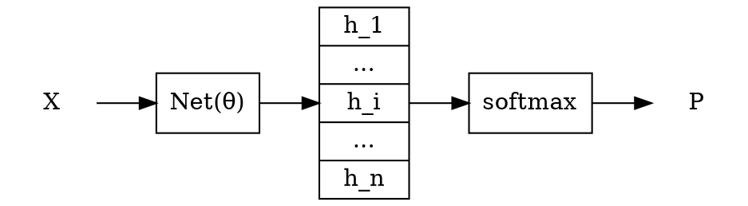
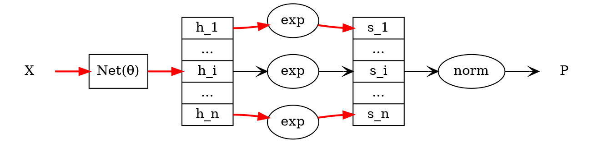

# 重要性采样（Importance Sampling）

众所周知，如果要估算 f(X) 在分布 p 上的期望 $E_{X \sim p}[f(x)]$，可以采样一组 x 后计算 f(x) 的均值。

## 较难采样时

但如果分布 p 采样较困难，可以采样另一个较易采样的分布 q（称为提议分布）：

$$\begin{aligned}
E_{X \sim p}[f(x)]
&= \int_x p(x) f(x) dx\\\\
&= \int_x q(x) \cdot \frac{p(x)}{q(x)} \cdot f(x) dx\\\\
&= E_{X \sim q}[\frac{p(x)}{q(x)} f(x)]
\end{aligned}$$

然后计算 $\frac{p(x)}{q(x)} f(x)$ 的均值作为 $E_{X \sim p}[f(x)]$ 的估计，即 f(x) 在重要性权重 $\frac{p(x)}{q(x)}$ 下的加权平均。

## 分布未归一化时

只知道未归一化分布 $\hat{p} \propto p$ 时：

$$\begin{aligned}
E_{X \sim p}[f(x)]
&= \int_x p(x) \cdot f(x) dx\\\\
&= \int_x \frac{\hat{p}(x)}{\sum \hat{p}(x)} \cdot f(x) dx\\\\
&= \frac{\int_x \hat{p}(x) \cdot f(x) dx}{\int_x \hat{p}(x) dx}\\\\
&= \frac{E_{X \sim q_1}[\frac{\hat{p}(x)}{q_1(x)} \cdot f(x)]}{E_{X \sim q_2}[\frac{\hat{p}(x)}{q_2(x)}]}\\\\
\end{aligned}$$

可以从分布 $q_1, q_2$ 采样（通常 $q_1 = q_2$）后计算 $\frac{\hat{p}(x)}{q_1(x)} \cdot f(x)$ 和 $\frac{\hat{p}(x)}{q_2(x)}$ 的均值相除作为 $E_{X \sim p}[f(x)]$ 的估计。

## 估算 softmax

> Yoshua Bengio and Jean-S{\'{e}}bastien Senecal. Adaptive Importance Sampling to Accelerate Training of a Neural Probabilistic Language Model. {IEEE} Trans. Neural Networks 713--722  2008

Softmax 层通常放在一个网络的后面，使输出的向量各分量在 (0, 1) 内且和为 1，这样就能视为一个分布。即：$$P_i = \text{softmax}(h_i) = \frac{e^{h_i}}{\sum\limits_{j} e^{h_j}}$$

当监督数据为 i 时用最大似然估计就是要最大化对数似然 $\log P_i$，使用梯度上升法进行训练就是要求 $$\begin{aligned}
\triangledown_\theta \log P_i
&= \triangledown_\theta \log \frac{e^{h_i}}{\sum\limits_{j} e^{h_j}}
= \triangledown_\theta h_i - \triangledown_\theta log \sum\limits_{j} e^{h_j} 
= \triangledown_\theta h_i - \frac{\triangledown_\theta \sum\limits_{j} e^{h_j}}{\sum\limits_{j} e^{h_j}}\\\\
&= \triangledown_\theta h_i - \sum\limits_{j} \frac{\triangledown_\theta e^{h_j}}{\sum\limits_{k} e^{h_k}}
= \triangledown_\theta h_i - \sum\limits_{j} \frac{e^{h_j} \triangledown_\theta h_j}{\sum\limits_{k} e^{h_k}}
= \triangledown_\theta h_i - \sum\limits_{j} \frac{e^{h_j}}{\sum\limits_{k} e^{h_k}} \triangledown_\theta h_j
= \triangledown_\theta h_i - \sum\limits_{j} P_j \triangledown_\theta h_j\\\\
&= \triangledown_\theta h_i - E_{i \sim P}(\triangledown_\theta h_i)
\end{aligned}$$

当 n 特别大时（比如 NLP 问题中候选词库很大时），softmax(h) 的计算相当耗时，不适合直接计算 P。因此既无法计算左边的 $\triangledown_\theta \log P_i$，也无法采样右边的 $E_{i \sim P}(\triangledown_\theta h_i)$。

不过 softmax 可以看作是函数 $\exp(x) = e^x$ 后接一个归一化操作 $\text{norm}(x) = \frac{x_i}{\sum\limits_{j} x_j}$

显然，$\\{ s_i = e^{h_i} \\}$ 就是 P 的未归一化分布。因此可以根据下式采样：

$$E_{i \sim P}(\triangledown_\theta h_i)
= \frac{E_{i \sim q}(\frac{s_i}{q_i} \cdot \triangledown_\theta h_i)}{E_{i \sim r}(\frac{s_i}{r_i})}
= \frac{E_{i \sim q}(\frac{\triangledown_\theta s_i}{q_i})}{E_{i \sim r}(\frac{s_i}{r_i})}$$

比如在 q = r 为均匀分布中采样出了两个样本 1 和 n，则 $$\triangledown_\theta log P_i \approx \triangledown_\theta h_i - \frac{\triangledown_\theta s_1 + \triangledown_\theta s_n}{s_1 + s_n}$$
按图中加红加粗的路径反向微分（Automatic Differentiation）即可得式中所需的导数。
