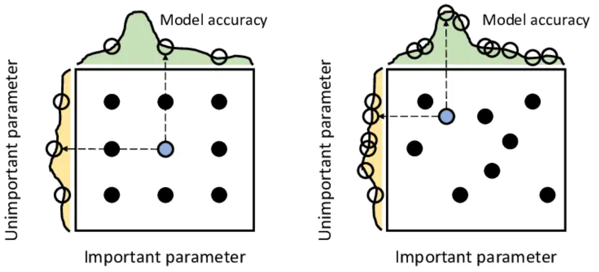
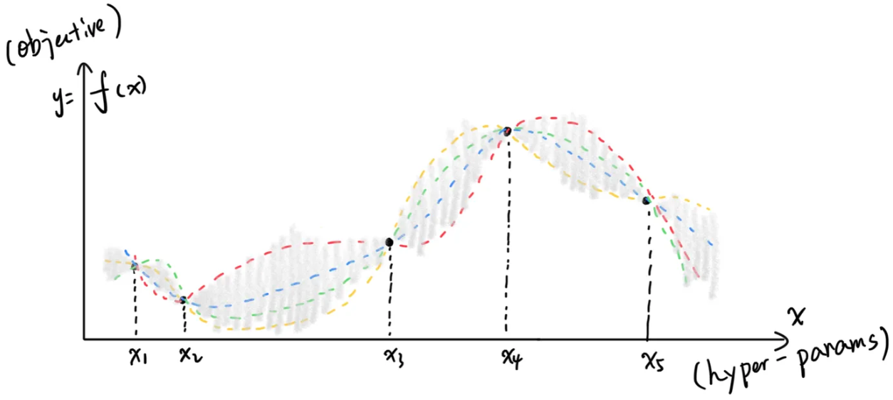

# Optuna：超参优化框架


## 概述

[Optuna](https://github.com/optuna/optuna) (KDD19) 是一个超参搜索工具，通过在代码中定义超参空间，然后执行一定次数的实验寻找最优组合。  
搜索过程的实验数据会保存到数据库里（如sqlite），支持并行调参，支持数据可视化。


## 相关内容

目前在比较多的科研代码中可见到一些实验数据管理工具，如CometML、Wandb和Neptune。  
这些工具可在代码中上传实验数据到云，并在云端对提供实验数据管理、可视化和协作等功能，也提供超参搜索功能。

Optuna强在超参搜索，弱在数据管理、可视化，不上云所以没有协作，因此也有将Optuna和Wandb搭配使用的。


## 超参优化方法


### 1. 人工调参（manual tuning）


### 2. 网格搜索（grid search）

```bash
for alpha in 0.3 0.5 0.7; do
    for beta in 0 0.1 0.5 0.9; do
        python3 main.py --alpha $alpha --beta $beta | tee -a main.log
    done
done
```

好写脚本，顺便做了ablation study。


### 3. 随机搜索（random search）



比grid search覆盖空间更广（同一超参在每个trial中值都不一样）


### 4. 贝叶斯优化（Bayesian Optimization, NIPS11）



对历史数据建模（常用GPR或TPE），兼顾好优化（Exploitation）和大方差（Exploration）。


### Optuna的其它改进

可以在实验中，根据报告的中间值进行pruning，因此速度较快。


## 用法


在脚本中定义本次study，其中objective是每次测试都调用获取优化指标的函数。

```python
# 只要study_name和storage一样，就可以多个脚本一起并行调参
study = optuna.create_study(study_name='test1', storage='sqlite:///xx.db', load_if_exists=True)
# 可以存储自定义数据
study.set_user_attr('contributors', ['Yi', 'Luo'])
# 也可以先跑n_trials次测试，视情况重复运行脚本、接着再跑n_trials次
study.optimize(objective, direction='minimize', n_trials=3)
```


一个study中每次测试都叫一个trial。  
通过trial获取本次测试超参的值，进行测试，然后返回优化指标。

```python
def objective(trial):
    # 常用3种限定超参的方法，其它的也都可以用这三种表示
    dist = trial.suggest_categorical('dist', [1, False, 'opt'])
    # step是步长，在suggest_float中也可以用
    epochs = trial.suggest_int('epoch', low=100, high=200, step=10)
    # log指在对数域采样
    lr = trial.suggest_float('lr', low=0.0001, high=0.1, log=True)
    # 每个trial可以存储自定义数据
    trial.set_user_attr('acc', 0.98)
    # 自定义数据可以调用
    print(trial.study.user_attr('contributors'))
    # 如果自己本来的脚本不好搭配optuna，可以写成子进程
    p = subprocess.Popen(
        'python3 main.py --dist %s --epochs %d --lr %.3f' % (dist, epochs, lr),
        shell=True, stdout=subprocess.PIPE, stderr=subprocess.STDOUT)
    # 这种方法需要从标准输出中解析出指标（如果报告中间值还可以激活pruning）
    while 1:
        lines = p.stdout.readlines()
        for line in lines:
            line = line.strip().decode()
            if line.startswith('score: '):
                acc = float(line.split('score: ', 1)[1])
        if (not lines) and type(p.poll()) == int:
            break
    # 需要返回一个评估指标，多个也支持，外面direction换成directions（列表）
    return accuracy
```


## 可视化

需要`python3 -m pip install optuna-dashboard`，然后`optuna-dashboard --storage sqlite:///xx.db`就可以运行一个前端服务，查看实验状态、每个实验的数据、各个参数的重要性等等。  
另外还有个[纯前端页面](https://optuna.github.io/optuna-dashboard/)，将sqlite数据库丢上去就可以可视化，但功能比本地服务少。
