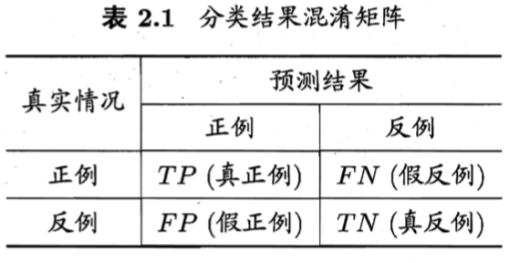

# 常用性能度量

## 混淆矩阵（Confusion Matrix）

> 图片来自[周志华《机器学习》](https://cs.nju.edu.cn/zhouzh/zhouzh.files/publication/MLbook2016.htm)

* True Positive, TP
* False Positive, FP
* True Negative, TN
* False Negative, FN

## 度量指标

### 二分类

* 召回率 $$\text{Recall} = \frac{\text{TP}}{\text{TP} + \text{FN}}$$
* 精确度 $$\text{Precision} = \frac{\text{TP}}{\text{TP} + \text{FP}}$$
* 准确率 $$\text{Accuracy} = \frac{\text{TP} + \text{TN}}{\text{total}}$$
* F1 度量：Recall 与 Precision 的调和平均数 $$\text{F-measure} = \frac{2}{\frac{1}{\text{Recall}} + \frac{1}{\text{Precision}}}$$

### 多分类

* Micro F1：正确分类数占比
* Macro F1：各类 F1 的均值
