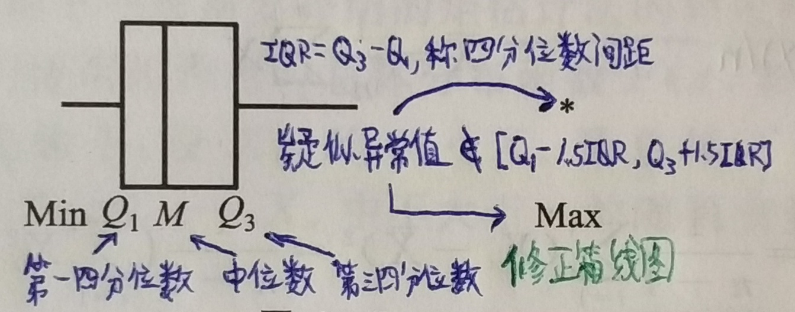
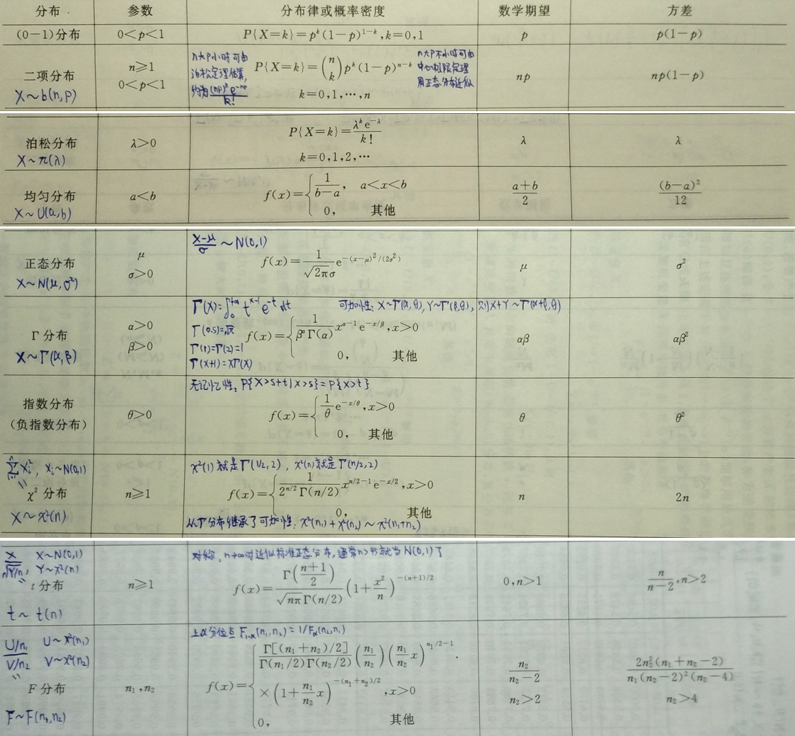
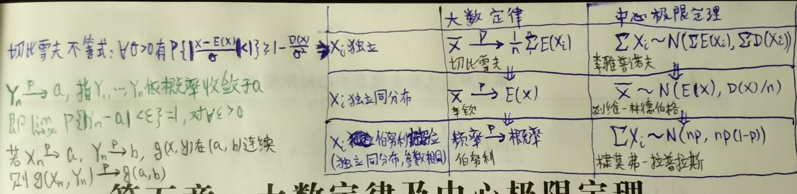
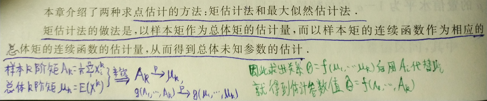
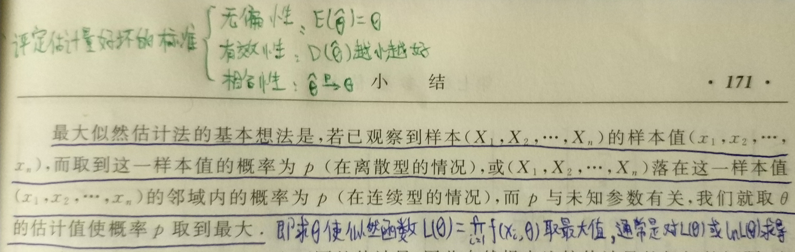
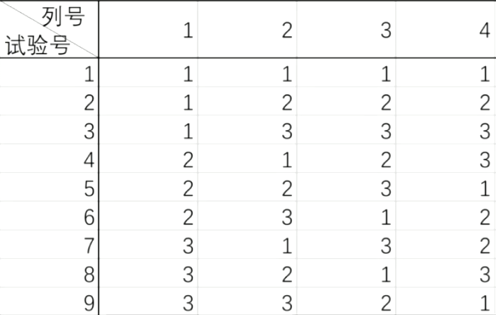

# 概率论与数理统计

联合分布函数，条件概率，乘法定理，全概率公式，贝叶斯公式，边缘分布，条件分布，随机变量的函数的分布，相互独立，期望，方差，协方差，标准化变量，相关系数，切比雪夫不等式，柯西-施瓦茨不等式，协方差矩阵，n维正态分布

* 顺序统计量：抽象一组数据后按值排序作为各分量的值，显然就不相互独立。
* 中位数：顺序统计量里正中靠右那个值。
* 极差：最大的 - 最小的

## 常用概率分布表

(0, 1)分布，两点分布，二项分布，泊松分布，均匀分布，正态分布，高斯分布，伽马分布，Γ分布，指数分布，X2分布，t分布，F分布

## 大数定律与中心极限定理

切比雪夫不等式，依概率收敛，
大数定律，切比雪夫大数定理，辛钦大数定理，弱大数定理，伯努利大数定理，
中心极限定理，李雅普诺夫定理，列维-林德伯格定理，棣莫弗-拉普拉斯定理，

## 参数估计

### 点估计

1. 矩估计  
   
   * 正态母体中用子样中位数和子样极差估计参数比较好计算。比如子样中位数近似服从 $N(\mu, \frac{\pi}{2n})$
2. 最大似然估计  
   

#### 评定估计量好坏的标准

1. 无偏性
2. 相合性：对估计量的基本要求
3. 有效性
   * 优效估计
     * 满足正规条件的无偏估计量的方差满足罗-克拉美不等式$$D\hat\theta \ge \frac{1}{nE(\frac{\partial{\ln f(x; \theta)}}{\partial{\theta}})^2} $$ 如果是离散母体，把 f 改为 P。
     * 上面不等式右边称罗-克拉美下界，能达到且无偏的估计量就称优效估计；$n \rightarrow \infty$ 时能达到就是渐近优效估计
   * 优效估计必是最小方差无偏估计量

### 区间估计

* 置信区间：随机区间覆盖估计量的可能性 $P\\{u_1 < U < u_2\\} = 1 - \alpha$，$u_1$、$u_2$ 分别为上、下侧分位数。
* “弃真”的错误为第一类错误，“取伪”的错误为第二类错误。样本量一定时无法同时减小两类错误，显著性检验只对第一类错误的概率加以控制。

大子样（比如超过 50）时可以有一些近似估计：

* 用子样的方差近似母体的方差
* 母体均值近似服从正态分布
* 由中心极限定理，n 很大时 $x^2(n)$ 近似于 N(n, 2n)，所以 n > 45 时 $x^2$ 表里查不到上侧分位数，可以去查标准正态分布的表，然后乘以 $\sqrt{2n}$ 再加 n。
* t 分布是对称的，且随 n 增大趋近于标准正态分布，所以也可以查标准正态分布的表确定上侧分位数。

图中所示为常用的置信水平 95% 时两侧分位数：$z_{\alpha / 2} \approx 1.96$

## 假设检验

### 参数假设检验

1. 在母体上做关于参数的原假设 $H_0$，例如均值大于某值、两个母体的方差之比等于 1（对立的假设称备择假设 $H_1$）；
2. 找统计量，在原假设成立的前提下导出该统计量的概率分布，如 $N, x^2, t, F$；
3. 根据给定的显著性水平 $\alpha$ 与直观意义划分出拒绝域（按原假设这应是小概率事件）和接受域（单侧或两侧，对应区间估计中的置信区间）；
4. 根据子样的统计量的值落入的区域，接受或拒绝原假设；
5. 如果拒绝假设，可以再对参数做区间估计。

> p-value：当原假设为真时，比所得到的样本观察结果更极端的结果出现的概率。

### 分布假设检验：$x^2$ 检验法

#### 假设 $H_0$：服从形式已知但参数未知的分布 $F(x) = F_0(x; \theta), \theta = (\theta_1, \theta_2, \cdots, \theta_k)$

1. 抽取大子样（$n \ge 50$）后通过极大似然估计出 $\hat\theta$
2. 顺序取 l + 1 个点 $\alpha_0 < \alpha_1 < \cdots < \alpha_l$ 把子样分成 l 个组，区间 $(\alpha_{i-1}, \alpha_i]$ 中的理论频数如下（实际分组时各组理论频数不少于 5）：$$np_i = n(F_0(\alpha_i, \hat\theta) - F_0(\alpha_{i-1}, \hat\theta))$$
3. 实际频数 $m_i$

则频数的实际与理论的偏差渐近服从卡方分布 $$x^2 = \sum\limits_{i=1}^{l} \frac{(m_i - n p_i)^2}{np_i} \sim x^2(l - k - 1)$$
又因为偏差越小越应该接受 $H_0$，因此可以按 $P\\{x^2 \ge x_\alpha^2(l - k - 1)\\} \approx \alpha$ 查上侧分位数拒绝假设，反之接受假设。

l 与 n 的关系有如下经验：

| n         | l       |
|-----------|---------|
| 50 ~ 100  | 6 ~ 8   |
| 100 ~ 200 | 9 ~ 12  |
| 200+      | 15 ~ 20 |

#### 假设 $H_0$：服从已知的 l 项的离散分布 $P(A_i) = p_i, i = 1, 2, \cdots, l$

也就是 k = 0 的情形  
做 n 次（至少 50 次）独立重复试验，$m_i$ 是 $A_i$ 的频数。  
按 $P\\{x^2 \ge x_\alpha^2(l - 1)\\} \approx \alpha$ 拒绝假设。

### 独立性假设检验：$x^2$ 检验法

假设 $H_0: P(x, y) = P_1(x) P_2(y)$

有 n 组观测值 $(x_1, y_1), (x_2, y_2), \cdots, (x_n, y_n)$

将二维平面分为 r 行 s 列，设 $m_{ij}, m_i, m_j$ 分别为第 i 列第 j 行的矩形范围内的频数、第 i 列的频数和第 j 行的频数，并记 $n_{ij} = \frac{n_{i*}n_{*j}}{n}$，则在原假设成立时有
$$x^2 = \sum\limits_{i=1}^{s} \sum\limits_{k=1}^{r} \frac{(m_{ij} - n_{ij})^2}{n_{ij}} \sim x^2((r-1)(s-1))$$

### 独立性假设检验：离差分析法

**分解定理**：设

* $X_1, X_2, \cdots, X_n$ 相互独立且 $X_i \sim N(0, 1)$
* $\sum\limits_{i=1}^{n} X_i^2 = \sum\limits_{i=1}^{k} Q_i$，$Q_i$ 是 $X_1, X_2, \cdots, X_n$ 的非负定二次型（线性组合的平方和）且自由度为 $f_i$

则 $\sum\limits_{i=1}^{k} f_i = n$ 等价于 $Q_1, Q_2, \cdots, Q_k$ 相互独立且 $Q_i \sim x^2(f_i)$

#### 一元方差分析

因子 A 有 r 种水平：$A_1, A_2, \cdots, A_r$，在水平 $A_i$ 时实验结果服从正态分布：$X_i \sim N(\mu_i, \sigma^2)$（假定不同水平的方差都相等）。现在想知道该因子的不同水平是否对实验结果有显著影响（而不通过两两做检验进行比较）。

每种水平分别实验，$A_i$ 对应子样 {$X_{ij}, j = 1, 2, \cdots, n_i$}。设

* 组内均值 $\bar X_i = \frac1{n_i} \sum\limits_{j=1}^{n_i} X_{ij}$
* 总均值 $\bar X = \frac{\sum\limits_{i=1}^{r} \sum\limits_{j=1}^{n_i} X_{ij}}{\sum\limits_{i=1}^{r} n_i}$

| 单一因子 | 离差平方和                                                                  | 均方离差                 | 原假设                                     | 假设成立时的分布                       | 检验分布                                     |
|----------|-----------------------------------------------------------------------------|--------------------------|--------------------------------------------|----------------------------------------|----------------------------------------------|
| 组间     | $Q_A = \sum\limits_{i=1}^{r} n_i (\bar X_i - \bar X)^2$                     | $S_A = \frac{Q_A}{r-1} $ | 无显著影响 $\mu_1=\mu_2=\cdots=\mu_r$ | $\frac{Q_A}{\sigma^2} \sim x^2(r - 1)$ | $F_A = \frac{S_A}{S_E} \sim F(r - 1, n - r)$ |
| 组内     | $Q_E = \sum\limits_{i=1}^{r} \sum\limits_{j=1}^{n_i} (X_{ij} - \bar X_i)^2$ | $S_E=\frac{Q_E}{n-r}$    | -                                          | $\frac{Q_E}{\sigma^2} \sim x^2(n - r)$ | -                                            |

* $S_A \ge S_E$，等号成立当且仅当假设成立
* 直观上都是根据显著性水平取 F 分布的右侧分位数划分接受域与拒绝域（组间均方离差越大说明影响越显著）
* 如果原假设被拒绝，可以根据 $\frac{\bar X_i - \bar X_j - (\mu_i - \mu_j)}{\sqrt{\frac1{n_i} + \frac1{n_j}} \frac{Q_E}{n - r}} \sim t(n - r)$ 对两个水平之间的差异 $\mu_i - \mu_j$ 做区间估计。

#### 二元方差分析

因子 A、B 分别有 r、s 种水平，在每组 $(A_i, B_j) \in A \times B$ 上各做 c 次实验，母体 $X_{ij}$ 服从方差为 $\sigma^2$ 的正态分布。子样为 {$X_{ijk}, k = 1, 2, \cdots, c$}。设

* 组内均值 $\bar X_{ij} = \frac1c \sum\limits_{k=1}^{c} X_{ijk}$
* 条件均值（A）$\bar X_{i*} = \frac1s \sum\limits_{j=1}^{s} \bar X_{ij}$
* 条件均值（B）$\bar X_{*j} = \frac1r \sum\limits_{i=1}^{r} \bar X_{ij}$
* 总均值 $\bar X = \frac1{sr} \sum\limits_{i=1}^{r} \sum\limits_{j=1}^{s} \bar X_{ij}$

| 两个因子 | 离差平方和                                                                                                 | 均方离差                     | 原假设                     | 假设成立时的分布                            | 检验分布（c > 1）                                         | 检验分布（c = 1）                                     |
|----------|------------------------------------------------------------------------------------------------------------|------------------------------|----------------------------|---------------------------------------------|-----------------------------------------------------------|-------------------------------------------------------|
| 因子 A   | $Q_A = sc \sum\limits_{i=1}^{r} (\bar X_{i*} - \bar X)^2$                                                  | $S_A=\frac{Q_A}{r-1}$        | 因子 A 无显著影响          | $\frac{Q_A}{\sigma^2} \sim x^2(r-1)$        | $F_A = \frac{S_A}{S_E} \sim F(r - 1, rs(c - 1))$          | $F_A = \frac{S_A}{S_I} \sim F(r - 1, (r - 1)(s - 1))$ |
| 因子 B   | $Q_B = rc \sum\limits_{j=1}^{s} (\bar X_{*j} - \bar X)^2$                                                  | $S_B=\frac{Q_B}{s-1}$        | 因子 B 无显著影响          | $\frac{Q_B}{\sigma^2} \sim x^2(s-1)$        | $F_B = \frac{S_B}{S_E} \sim F(s - 1, rs(c - 1))$          | $F_B = \frac{S_B}{S_I} \sim F(s - 1, (r - 1)(s - 1))$ |
| 交互作用 | $Q_I = c \sum\limits_{i=1}^{r} \sum\limits_{j=1}^{s} (\bar X_{ij} - \bar X_{i*} - \bar X_{*j} + \bar X)^2$ | $S_I=\frac{Q_I}{(r-1)(s-1)}$ | 因子 A、B 无显著的交互作用 | $\frac{Q_I}{\sigma^2} \sim x^2((r-1)(s-1))$ | $F_I = \frac{S_I}{S_E} \sim F((r - 1)(s - 1), rs(c - 1))$ | -                                                     |
| 误差     | $Q_E = \sum\limits_{i=1}^{r} \sum\limits_{j=1}^{s} \sum\limits_{k=1}^{c} (X_{ijk} - \bar X_{ij})^2$        | $S_E=\frac{Q_E}{rs(c-1)}$    | -                          | $\frac{Q_E}{\sigma^2} \sim x^2(rs(c-1))$    | -                                                         | -                                                     |

* $\\{S_A, S_B\\} \ge S_I \ge S_E$，等号成立当且仅当对应的假设成立
* 直观上都是根据显著性水平取 F 分布的右侧分位数划分接受域与拒绝域（越大说明检验的因素影响越显著）

#### 多个因子：正交试验设计

按照 $L_n(s^r)$ 正交表安排 n 次试验，希望能替代 $s^r$ 次试验检验 r 个（或略少于 r 个）各有 s 种水平的因子是否对试验结果有显著影响。

例如如下是 $L_9(3^4)$ 表，通过 9 次实验检验 4 个各有 3 种水平的因子的影响是否显著：

正交表的安排满足：

1. 任一列各水平出现的个数相同
2. 任意两列各组合水平出现的个数相同

按照正交表进行试验后，仅用已有结果求平均近似得到总均值与各个因子的条件均值，进一步得

1. 因子的离差平方和：(n / s) * 该因子各个水平时的 (条件均值 - 总均值) 的平方和，自由度为 r - 1
2. 总离差：各次试验 (结果 - 总均值) 的平方和，自由度为 n - 1
3. 误差：总离差减去各个因子的离差平方和，自由度为 (n - 1) - r * (s - 1)

于是由 1 式 / 3 式应服从 F(r - 1, (n - 1) - r * (s - 1)) 去检验相应因子对试验结果是否有显著影响。

如果要考虑因子间两丙交互作用，就按照正交表附带的交互作用表，将因子对附加或新增到试验表的某些列上，计算与检验过程不变。

## 线性回归模型：$y = \alpha + \vec\beta \cdot \vec x + \epsilon$

其中 $\epsilon \sim N(0, \sigma^2)$，$\alpha, \vec\beta = (\beta_1, \beta_2, \cdots, \beta_p), \sigma^2$ 是待估计的参数。

### 参数的点估计

最小化 $$Q=\sum\limits_{i=1}^{n} (y - \alpha - \vec\beta \cdot \vec x)^2 = \\| Y - \begin{pmatrix} 1 & X \end{pmatrix} \begin{pmatrix} \alpha \\\\ \vec\beta \end{pmatrix} \\|^2 = \\| Y - \tilde{X} \tilde \beta \\|^2$$

令 Q 对 $\tilde \beta$ 各分量的偏导为 0 得最小二乘估计
$$\begin{cases}
\hat\beta &= (\tilde{X}^T \tilde{X})^{-1} \tilde{X}^T Y \\\\
\hat\sigma^2 &= \frac1{n - p - 1} \sum\limits_{i=1}^{n} \hat\epsilon_i^2
\end{cases}$$
且有相互独立的
$$\begin{cases}
\hat\beta & \sim N(\tilde \beta, \sigma^2 (\tilde{X}^T \tilde{X})^{-1}) \\\\
\frac1{\sigma^2}\sum\limits_{i=1}^{n} \hat\epsilon_i^2 & \sim x^2(n - p - 1)
\end{cases}$$

### 线性回归的显著性检验

设 $\bar Y$为所有 y 的试验值的均值。用离差分析法，假设 $H_0: \vec\beta = 0 $ 成立，则有
$$F = \frac{n - p - 1}{p} \cdot (\frac{\sum\limits_{i=1}^{n}(Y_i - \bar Y)^2}{\sum\limits_{i=1}^{n} \hat\epsilon_i^2} - 1) \sim F(p, n - p - 1)$$
F 值大于分位数时则拒绝假设，认为线性回归显著。

### 回归系数的显著性检验

$\hat\beta$ 的第 i 个分量可由
$$ T_i = \frac{\hat\beta_i - \tilde\beta_i}{\sqrt{\frac{c_{ii}}{n - p - 1} \sum\limits_{i=1}^{n} \hat\epsilon_i^2}} \sim t(n - p - 1)$$
单独检验是否显著地等于 $\tilde\beta_i$，其中 $c_{ij}$ 是协方差矩阵 $(\tilde X^T \tilde X)^{-1}$ 中元素。特别地

* 取 $\tilde\beta_i = 0$ 可以检验相应的自变量分量是否重要；
* 取 $\tilde\beta_i = 0$ 且 p = 1 时也可以用这个分布检验线性回归是否显著。

### 因变量的区间估计 

对任一点 $\vec x$ 做估计 $\hat y = \hat\beta \cdot (1, \vec x)$ 有
$$T = \frac{y - \hat y}{\sqrt{\frac{d}{n - p - 1} \sum\limits_{i=1}^{n} \hat\epsilon_i^2}} \sim t(n - p - 1)$$
其中
$$d = 1 + \frac1n + \sum\limits_{i=1}^{p} \sum\limits_{i=1}^{p} c_{ij} (x_i - \bar x_i)(x_j - \bar x_j)$$
可导出该估计的置信区间

### 古典假定的违背

| 违背方式 | 多重共线性 (1, x, u) 线性相关 | 异方差  $\sigma = \sigma(x)$ | 自相关 Cov $\epsilon$ 非对角|
|-|-|-|-|
|后果| $c_{ii}$ 过大：  * t 检验被接受  * 预测区间趋于无穷 | $c_{ii}$ 不精确：  * t 检验不精确  * 预测失效| $D\hat\beta$ 被低估：  * t 检验不精确  * 预测失效|
|检验法| 1. 部分 $x_i, x_j$ 的相关系数的绝对值接近  2. 增加或删除一个解释变量导致回归系数的估计发生较大变化  3. 重要解释变量的系数没有通过 t 检验  4. 回归系数的符号与理论相反 | 1. 图示法：绘出 $\hat\epsilon_i^2$ 与 $x_i$ 的图形  2. Goldfeld-Quanad 法：将 $Y_i$ 从小到大排列，删除中间 1/4 数据，对两边各 k 个数据分别回归，残差平方和的商应服从 F(k - p - 1, k - p - 1)  3. white 检验：将残差平方和与 x 做 2 次多项式回归（可化为线性回归），通过回归的显著性进行判断| DW 检验法：DW = $\frac{\sum (e_i - e_{i-1})^2}{\sum e_i^2} \approx 2(1 - \hat\rho)$ 即 $\hat\rho \approx 1 - DW / 2$|
|补救法| 1. 增加样本容量  2. 剔除相关系数大的变量  3. 变换模型形式（如将模型差分）  4. 利用先验信息合并变量  5. 使用面板数据 （时间序列数据与截面数据结合）  6. 数据处理  7. 逐步回归法 | 1. 模型变换法：假设 $D \epsilon_i = f(x) \sigma^2$，f(x) 是二次式，则模型两边同除以 f(x) 消去异方差（配合 white 检验法）  2. 加权最小二乘法：设 Cov $\epsilon$ = A $\sigma^2$，因 A 对称得正交矩阵 Q 使 A 与单位矩阵合同，模型两边同时乘以 Q 可消去异方差  3. 对数变换法：用 (ln x, ln y) 替代 (x, y)| 1. 加权最小二乘法  2. 广义差分法：设 $\epsilon_t = \rho \epsilon_{t-1} + v_t$，其中 v 满足古典假定，于是模型换成 $y' = Y_t - \rho Y_{t-1}$ 可消去自相关|
