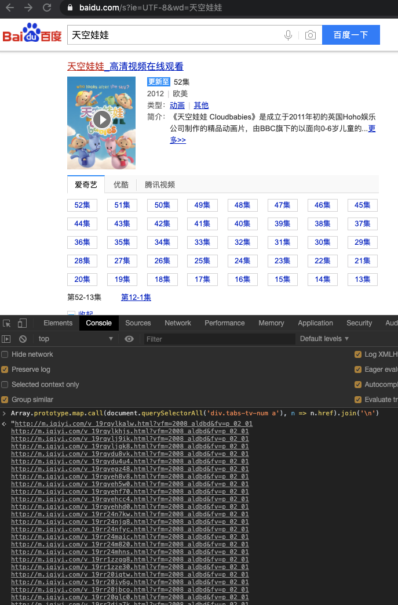

# 如何下载电视剧



1. 百度搜索，一般会有视频网站的视频列表；
2. 在 Chrome Console 中解析链接  
   ```javascript
   Array.prototype.map.call(document.querySelectorAll('div.tabs-tv-num a'), n => n.href).join('\n')
   ```
3. 把输出的地址收集到一个文件如 urls 中；
4. 通过 docker 使用 [you-get](https://github.com/soimort/you-get) 下载  
   ```bash
   cat urls | xargs docker run --rm -v $PWD:/download kmdgeek/you-get
   ```
