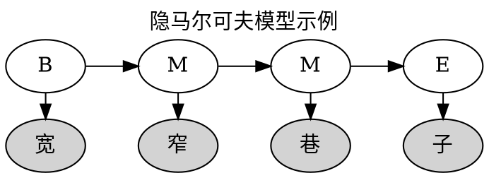
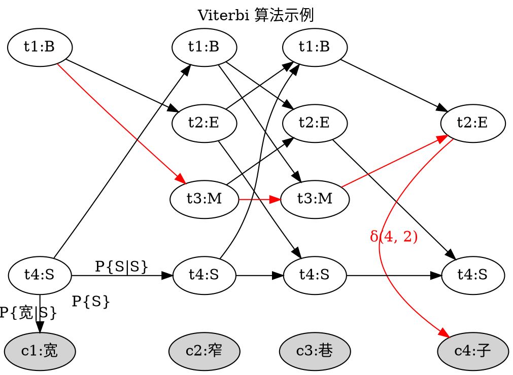
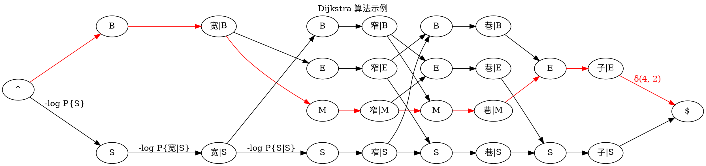

# Viterbi 算法

## 隐马尔可夫模型

隐马尔可夫模型（Hidden Markov Model, HMM）是含有隐状态与观测状态的马尔可夫过程。

在基于隐马尔可夫模型的中文分词（或词性标注）任务中，已知的字符（或词语）是观测状态，该字符（或词语）的状态（或词性）为隐状态。

比如[结巴分词][jieba]在没有词典可供参考时就使用了隐马尔可夫模型, 将中文词语中的字符标注为 B、E、M、S 四个隐状态之一，分别表示开始字符、结束字符、中间字符以及独立成词的字符。例如：“熊猫”可标注为 BE, 表示“熊”是一个词语的开始字符, “猫”是该词语的结束位置, “宽窄巷子”可标注为 BMME, 表示开始、中间、中间和结束。

隐马尔可夫模型由三组概率决定：

1. 初始分布：该过程最初的状态分布；
2. 转移概率：隐状态之间可以相互转换，从一个隐状态转移到另一个隐状态的概率；
3. 输出概率：在某个隐状态时，观测到特定观测状态的概率。

结巴分词中隐状态的初始分布为：

| B                  | S                  |
|--------------------|--------------------|
| 0.7689828525554734 | 0.2310171474445266 |

隐状态之间的转移概率为：

|   | B                   | E                  | M                   | S                   |
|---|---------------------|--------------------|---------------------|---------------------|
| B | 0                   | 0.8518218565181658 | 0.14817814348183422 | 0                   |
| E | 0.5544853051164425  | 0                  | 0                   | 0.44551469488355755 |
| M | 0                   | 0.7164487459986911 | 0.2835512540013088  | 0                   |
| S | 0.48617017333894563 | 0                  | 0                   | 0.5138298266610544  |

由以上概率可以计算双字词的概率为 $$P\\{BE\\} = P\\{B\\} * P\\{E|B\\} = 0.6550364010944383$$

于是中文文本中词语按长度分类的占比（%）如下：

| 单字词 | 双字词 | 多字词 |
|--------|--------|--------|
| 23.1   | 65.5   | 11.4   |

也就是说大多数中文词语是双字的，仅一成词语包含了 3 个或 3 个以上字符，这符合我们对于中文词语的印象。  
但用于分词时，这样的模型会造成多字词难于被识别，通常会被分得更小的情况。例如将“戈尔巴乔夫”分为“戈尔巴”和“乔夫”两个词。

## Viterbi 算法

[Viterbi 算法][viterbi]基于最大似然估计的思想，使用动态规划找出一串文本 s 的标注方案（共 N 种标注可选），使在该组标注的情况下，输出该文本的概率最大。

Viterbi 变量 $\delta(m, i) = P^{\ast}\\{C_m=c_m | T_m=t_i\\}$ 为 s 的第 m 个字符 $C_m$ 在该处标注 $T_m=t_i$ 时的最大似然，显然它是这个动态规划问题的最优子结构。

因此有最优 Bellman 方程 $$\delta(m, i) = \begin{cases}
P\\{t_i\\} \cdot P\\{c_m|t_i\\} &\text{if } m = 1\\\\
\max\limits_{1 \le j \le N} \\{ \delta(m - 1, j) \cdot P\\{t_i|t_j\\} \\} &\text{if } m > 1
\end{cases}$$

其中 $P\\{t_i\\}$ 为标注的初始分布，$P\\{c_m|t_i\\}$ 为标注 $t_i$ 时输出字符 $c_m$ 的输出概率，$P\\{t_i|t_j\\}$ 为当前标注 $t_j$ 时下一个标注为 $t_i$ 的转移概率。

在迭代计算最优 Bellman 方程时，记录相应的最优方案，就可以得到最优的标注方案。

在前面的例子里，待标注文本 s = "宽窄巷子"，标注集合为 {B, E, M, S}。

## 归约为 Dijkstra 算法

Dijkstra 算法是经典的单源最短路径算法，用于求解图中一个节点到其它所以节点的最短路径。

Viterbi 算法与 Dijkstra 算法有相同的思想，都是以起始点向外层层扩展直到终点，在这过程中不断更新最优的路径。

可以将 Viterbi 算法涉及的几组概率转换为自信息
$$I(x) = -\log P(x)$$
并作为权重赋给标注之间的转移边以及标注与字符之间的输出边。

这些自信息权重之和就等于对应概率之积，具有最大似然的路径就具有最小的权重。

同样以前面 Viterbi 算法的示例“宽窄巷子”为例：

因此，在词性标注问题上（中文分词是词性标注的一个应用）Viterbi 算法可以归约到 Dijkstra 算法，工程中如果已有 Dijkstra 算法的实现，将相应概率转换为自信息后调用即可，不需要再额外实现 Viterbi 算法。

[jieba]: <https://github.com/fxsjy/jieba> "结巴中文分词"
[viterbi]: <http://zh.wikipedia.org/wiki/维特比算法> "维特比算法"
