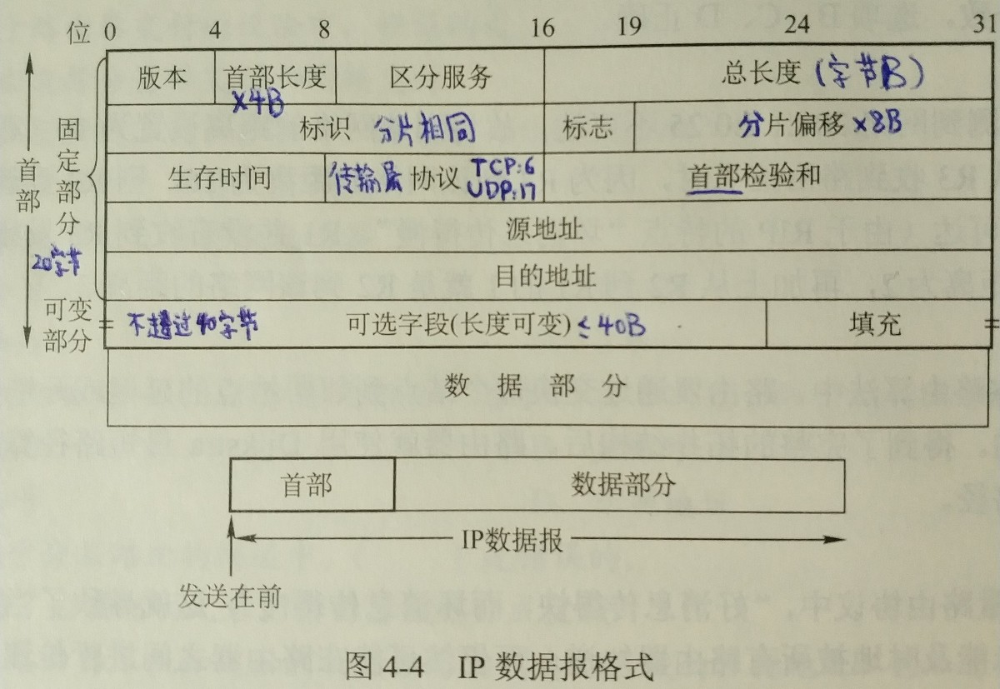

# 计算机网络

  * 疑点
    * 最大传送单元 MTU
    * 网桥
    * PPP
    * 广域网中的分组不必分片，因为广域网能够通过的分组的最大长度是该广域网中所有结点都事先知道的。
  * 计算机网络体系结构
    * 各种 RFC 之间的关系

    * 协议、接口、服务三者之间的关系

    * TCP/IP模型与OSI模型的层次对应关系

    * 交换机隔离冲突域，路由器隔离广播域
    * 传输层提供应用进程之间的逻辑通信，即端到端的通信。网络层提供主机之间的逻辑通信即点对点的通信。
    * 服务访问点 SAP
      * 数据链路层 MAC地址
      * 网络层 IP地址
      * 传输层 端口
  * 物理层
  * 数据链路层
    * 纲要

    * 功能
      * 将物理层提供的可能出错的物理连接改造成逻辑上无差错的数据链路。
      * 链路管理：数据链路层连接的建立、维持和释放过程。
    * 组帧：帧定界、帧同步、透明传输
      * 字符计数法：脆弱，一旦出错将失去同步
      * 字符填充的首尾定界符法：实现复杂、不兼容
      * 比特填充的首尾标志法：容易由硬件实现
      * 违规编码法：常用于物理层比特编码
    * 差错控制
      * 随机热噪声、冲击噪声
      * 检错编码 Error Detecting Code + 自动重传请求 Automatic Retransmission Request
        * 奇偶校验码
        * 循环冗余码 Cyclic Redundancy Code

      * 纠错编码 Error Correcting Code + 前向纠错 Forward Error Correction
        * 海明码

    * 流量控制与可靠传输：滑动窗口协议
      * 流量控制实际上就是限制发送方的数据流量，使其发送速率不致超过接收方的接受能力。
      * 确认机制
        * 无数据的控制帧
        * 回复帧：捎带确认
      * 超时重传机制
        * 自动重传请求 Auto Request reQuest
          * 停等 Stop-and-Wait
            * 发送窗口大小 1，接收窗口大小 1
            * 发送帧用 0 和 1 交替编号，确认帧分别回复 ACK1 和 ACK0
          * 后退 N 帧 Go-Back-N
            * 发送窗口大小 (1, 2^n-1]，接收窗口大小 1  
n 为帧编号的位长

          * 选择性重传 Selective Repeat
            * 发送窗口大小 >1，接收窗口大小 >1，加起来不大于 2^n
            * 否定帧 NAK
      * 信道效率
        * 信道利用率 = 周期发送比特数 / 数据传输率 / 发送周期
      * 信道吞吐量 = 信道利用率 * 发送速率
    * 介质访问控制 Medium Access Control 子层
      * 信道划分
        * 频分多路复用 FDM
          * 波分多路复用 WDM：就是光的频分多路复用，可以实现很多路
        * 时分多路复用 TDM
          * 统计时分多路复用 STDM：按需动态分配时间片
        * 码分多路复用 CDM
          * 码分多址 Code Division Multiple Access
          * 频谱利用率高、抗干扰能力强、保密性强、语音质量好，减少投资、降低运行成本。
      * 随机访问：争用型协议
        * ALOHA 协议
          * Additive Link On-line HAwaii system
          * 随机等待再重传
          * 时隙 ALOHA协议：每个时隙开始时才能发送一个帧
        * CSMA 协议
          * 载波侦听多路访问 Carrier Sense Multiple Access
          * 比 ALOHA 多了一个载波侦听装置
            * 1-坚持型
            * 非坚持型
            * p-坚持型
        * CSMA/CD 协议
          * 载波侦听多路访问/碰撞检测 Carrier Sense Multiple Access with Collision Detection
          * 适用于总线型网络或半双工网络环境
          * 应用于有线连接的局域网
          * 边发送边侦听，冲突即随机等待
          * 为了确保发送站在发送数据的同时能检测到可能存在的冲突，帧的传输时延至少要两倍于信号在总线中的传播时延。所以数据帧必须大于最小帧长 = 总线传播时延 * 数据传输速率 * 2，否则就是由于冲突而异常中止的无效帧。
          * 二进制指数退避算法
        * CSMA/CA 协议
          * 载波侦听多路访问/碰撞避免 Carrier Sense Multiple Access with Collision Avoidance
          * 广泛应用于无线局域网
          * 碰撞避免
            * 预约信道：先广播自己传输数据需要的时间长度
            * ACK 帧
            * RTS/CTS 帧
      * 轮询访问
        * 令牌传递协议
        * 一个集中控制的监控站允许每个结点决定信道的分配
        * 主要使用在令牌环局域网中
    * 局域网
      * 以太网
        * 逻辑拓朴是总线型结构，物理拓扑是星形或拓展星形结构。
      * 令牌环网
        * 逻辑拓扑是环形结构，物理拓扑是星形结构。
      * 光纤分布数字接口 FDDI
        * 逻辑拓扑是环形结构，物理拓扑是双环结构。
    * 广域网
      * IEEE802 协议层与 OSI 模型的比较

      * 以太网 V2 标准的 MAC 帧格式

      * PPP (Point-to-Point Protocol) 是使用串行线路通信的面向字节的协议。有三个组成部分：
        * 链路控制协议 LCP
        * 网络控制协议 NCP
        * 一个将IP数据报封装到串行链路的方法
        * PPP帧的格式

      * 高级数据链路控制(High-level Data Link Control, HDLC)协议是ISO制定的面向比特的数据链路层协议。
    * 数据链路层设备
      * 网桥工作在链路层的MAC子层
        * 透明网桥
        * 源路由网桥
      * 局域网交换机又称以太网交换机，本质上就是一个工作在数据链路层的多端口的网桥。
        * 直通式
        * 存储转发式
    * 广域网和局域网的区别与联系

  * 网络层
    * 纲要

    * 异构网络互联
      * 通常是指用路由器进行网络互联和路由选择。
      * 中继系统
        * 物理层：中继器、集线器
        * 数据链路层：网桥、交换机
        * 网络层：路由器
          * 具有多个输入输出端口的专用计算机
          * 任务是连接异构网络并完成路由转发
          * 隔离了广播域，多个逻辑网络互联时必须用路由器
          * 路由器体系结构

        * 网络层之上：网关
    * 拥塞控制：不能靠单一的增加资源解决
      * 开环控制
      * 闭环控制
    * IPv4
      * IP 数据报格式

      * NAT与IP地址结构：分类（二级与三级）与无分类

      * 地址解析协议(Address Resolution Protocol, ARP)
        * 完成IP地址到MAC地址的映射
        * 用到了IP地址，所以是工作在网络层
      * 网络地址转换(Network Address Translation, NAT)
        * 将专用网络地址转换为公用地址
        * 用到了端口，所以说工作在传输层
      * 动态主机配置协议(Dynamic Host Configuration Protocol, DHCP)
        * 给主机动态地分配IP地址
        * 只有应用层的协议有C/S和P2P两种工作方式，DHCP是C/S模式，因此工作在应用层
      * 网际控制报文协议(Internet Control Message Protocol, ICMP)
        * 允许主机或路由器报告差错和异常情况，IP层协议
          * ICMP 差错报告报文
            * 终点不可达
            * 源点抑制
            * 时间超过
            * 参数问题
            * 改变路由（重定向）
          * ICMP 询问报文
            * 回送请求和回答报文
            * 时间戳请求和回答报文
            * 掩码地址请求和回答报文
            * 路由器询问和通告报文
        * 应用
          * 分组网间探测 PING，应用层
          * traceroute，网络层
    * IPv6
      * 优点
        * 地址够用
        * 简化了IP分组头，改善吞吐率
        * 更好地支持选项
      * 三种基本类型地址
        * 单播
        * 多播
        * 任播
      * 过渡策略
        * 双协议栈
        * 隧道技术
    * 层次路由：自治系统(Autonomous System, AS)-区域
      * 域内路由选择-内部网关协议(Interior Gateway Protocol, IGP)
        * 路由信息协议(Routing Information Protocol, RIP)
          * 应用层协议，使用UDP520端口
          * 距离向量路由算法
          * 每30秒广播整个路由选择表给相邻路由器，路由表项包括：目的网络，距离，下一跳路由器。
          * 用跳数度量距离，最多15跳，16表示不可达，防止数据报不断循环在环路上，减少网络拥塞的可能性，但因此限制了网络的规模
          * 实现简单，但子网掩码必须相同（RIP2才支持变长子网掩码和CIDR）
          * 开销小，但规模扩大时开销迅速增大
          * 收敛过程快，但网络故障时出现慢收敛
        * 开放最短路径优先(OSPF)协议
          * 网络层协议
          * 分布式链路状态路由算法
          * 相邻链路状态变化时以洪泛法发给域内所有路由器，链路状态包括相邻路由器及其度量（或代价）
          * OSPF 的基本操作与五种分组类型

          * 链路的代价可灵活设置
          * 负载平衡：多路径间代价相同时可分摊通信量
          * 分组可鉴权
          * 支持变长的子网划分和无分类编址CIDR
      * 域间路由选择-外部网关协议(External Gateway Protocol, EGP)
        * 边界网关协议(Border Gateway Protocol, BGP)
          * BGP-4
          * 应用层协议，基于 TCP 之上的 BGP 会话
          * 路由表项：目的网络前缀，下一跳路由器，自治系统序列
          * 四种报文：Open, Update, Keepalive, Notification
      * RIP、OSPF 与 BGP 的比较

      * 路由算法
        * 静态路由算法
        * 动态路由算法
          * 距离向量协议，RIP
          * 链路状态协议，OSPF协议
    * IP 组播
      * 因特网组管理协议（Internet Group Management Protocol, IGMP）
    * 移动 IP
      * 移动结点
      * 移动代理
        * 归属代理（本地代理）
        * 外埠代理（外部代理）
      * 移动绑定
        * 本地地址
        * 转交地址：隧道技术
  * 传输层
    * 纲要

    * 端口号
      * 服务端
        * 熟知端口号 0-1023
        * 登记端口号 1024-49151
      * 客户端，短暂端口号 49152-65535
    * IP、UDP、TCP 校验和的算法

    * 用户数据报协议UDP
      * 复用分用和差错检测
      * UDP 数据报格式和伪首部

    * 传输控制协议TCP
      * 特点
        * 面向连接
          * 连接的端口叫做插口或套接字
          * Socket = （主机 IP 地址，端口号）
        * 一对一
          * 不提供广播或组播服务
        * 可靠交付
          * 校验：同 UDP
          * 序号
          * 确认
          * 重传
            * 超时
              * 往返时间 Round-Trip Time
              * 超时重传时间 Retransmission Time-Out
            * 冗余 ACK
              * 每收到比期望序号大的报文段，缓存起来并发送一个期望序号的冗余 ACK
              * 快重传：收到3个冗余ACK时确认该序号报文段丢失，立即重传
        * 全双工通信
        * 面向字节流
      * TCP报文的结构

      * 建立TCP连接的“三次握手”

      * 释放TCP连接的“四次挥手”

      * TCP拥塞控制

  * 应用层
    * 网络应用模型
      * C/S
      * P2P
    * 域名系统（Domain Name System, DNS）
      * C/S，UDP 53，分布式数据库
      * 层次域名空间
      * 域名服务器

      * 解析器
        * 正向解析
        * 反向解析
    * 文件传输协议（File Transfer Protocol, FTP）

    * 电子邮件

      * 多用途网络邮件扩充（Multipurpose Internet Mail Extensions, MIME）
      * 简单邮件传输协议（Simple Mail Transfer Protocol, SMTP）
      * 邮局协议（Post Office Protocol, POP）
      * 网际报文存取协议 IMAP
    * 万维网（World Wide Web, WWW）
      * 统一资源定位符（Uniform Resource Locator, URL）
        * <协议>://<主机>:<端口>/<路径>,
      * 超文本传输协议（HyperText Transfer Protocol, HTTP）

      * 超文本标记语言（HyperText Markup Language, HTML）

